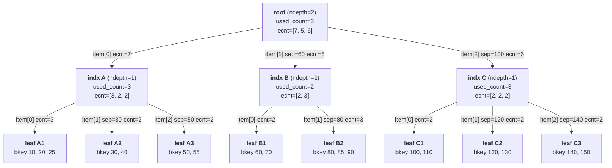

# arcus-memcached Collection: B+tree

---

## 배경: B-tree와 B+tree

### B-tree

이진 탐색 트리는 노드 하나가 자식을 최대 2개까지만 가질 수 있다. B-tree는 이 제약을 없애서, 노드 하나가 여러 개의 키와 여러 개의 자식 포인터를 함께 가질 수 있도록 일반화한 자료구조다.

B-tree의 가장 큰 특징은 **모든 노드에 실제 데이터가 저장될 수 있다**는 점이다. 내부 노드든 리프 노드든 관계없이 키를 찾으면 그 자리에서 바로 데이터를 꺼낼 수 있다.

```
B-tree:

              [20 | 50]
             /    |    \
        [5|10]  [30|40]  [60|70]
         data    data     data    <- 내부 노드에도 데이터 있음
```

그런데 이 구조는 range query가 비효율적이다. "key 10부터 50까지의 데이터를 모두 가져와라"는 요청을 처리하려면, 트리를 여러 번 위아래로 오가며 순회해야 한다. 연속된 키들이 트리 안에 흩어져 있기 때문이다.

### B+tree

B+tree는 B-tree에서 내부 노드와 리프 노드의 역할을 엄격하게 분리한 변형이다.

- **내부 노드(인덱스 노드)**: 탐색 경로를 안내하는 키만 가진다. 실제 데이터는 없다.
- **리프 노드**: 실제 데이터를 저장한다. 그리고 리프 노드끼리는 연결 리스트로 이어진다.

```
B+tree:

                 [10 | 30 | 50]           <- internal: keys only, no data
                /    |    |    \
          [leaf] [leaf] [leaf] [leaf]     <- leaf: actual data stored here
          [1,5,9]<->[10,20]<->[30,40]<->[50,60]
                     (leaf nodes linked in order)
```

내부 노드에 데이터가 없기 때문에, 단일 키를 찾으려면 항상 리프까지 내려가야 한다. B-tree에 비해 단일 탐색은 조금 더 걸릴 수 있다.

반면 range query는 훨씬 효율적이다. 시작 키를 트리에서 한 번 찾은 뒤, 리프 연결 리스트를 따라가기만 하면 끝 키까지 순차적으로 읽을 수 있다. 트리를 반복해서 오갈 필요가 없다.

| | B-tree | B+tree |
|---|---|---|
| 데이터 위치 | 내부 노드 포함 모든 노드 | 리프 노드에만 |
| 리프 연결 | 없음 | 연결 리스트로 순서대로 이어짐 |
| 단일 키 탐색 | 내부 노드에서 바로 끝날 수 있음 | 항상 리프까지 내려가야 함 |
| range query | 비효율적 (트리 반복 순회 필요) | 효율적 (리프 순차 탐색) |

---

## arcus B+tree 개요

list/set/map과 달리 B+tree는 **bkey(binary key)를 기준으로 정렬된 상태를 유지**한다. bkey는 사용자가 각 elem에 직접 지정하는 키로, 이 값을 기준으로 트리 안에서 정렬 순서가 결정된다. 단순히 값을 넣고 빼는 게 아니라, 정렬 순서에 맞는 위치를 찾아 삽입하고 range query(범위 조회)도 지원한다.

B+tree가 list/set과 가장 다른 점은, elem이 meta_info에 직접 연결되는 게 아니라 **트리 노드를 거쳐서** 저장된다는 것이다.

---

## 노드 구조: `btree_leaf_node` / `btree_indx_node`

> `engines/default/item_base.h:283`

```c
#define BTREE_MAX_DEPTH  7
#define BTREE_ITEM_COUNT 32

typedef struct _btree_leaf_node {
    uint16_t refcount;                  // 이 노드를 참조 중인 곳의 수
    uint8_t  slabs_clsid;               // 할당된 slab class ID
    uint8_t  ndepth;                    // 항상 0 (leaf임을 나타냄)
    uint16_t used_count;                // item[] 중 실제로 사용 중인 슬롯 수
    uint16_t reserved;                  // 정렬 패딩
    struct _btree_indx_node *prev;      // 이전 leaf 노드 (range scan용 연결 리스트)
    struct _btree_indx_node *next;      // 다음 leaf 노드 (range scan용 연결 리스트)
    void    *item[BTREE_ITEM_COUNT];    // btree_elem_item 포인터 배열 (실제 elem)
} btree_leaf_node;

typedef struct _btree_indx_node {
    uint16_t refcount;                  // 이 노드를 참조 중인 곳의 수
    uint8_t  slabs_clsid;               // 할당된 slab class ID
    uint8_t  ndepth;                    // 트리에서의 깊이 (1 이상)
    uint16_t used_count;                // item[] 중 실제로 사용 중인 슬롯 수
    uint16_t reserved;                  // 정렬 패딩
    struct _btree_indx_node *prev;      // 같은 depth의 이전 인덱스 노드
    struct _btree_indx_node *next;      // 같은 depth의 다음 인덱스 노드
    void    *item[BTREE_ITEM_COUNT];    // 자식 노드 포인터 배열 (leaf 또는 indx 노드)
    uint32_t ecnt[BTREE_ITEM_COUNT];    // 각 자식 노드 아래에 있는 elem의 총 개수
} btree_indx_node;
```

두 구조체의 앞부분 레이아웃이 완전히 같고, `btree_indx_node`에만 `ecnt[]`가 추가된 형태다. 앞부분 레이아웃이 같기 때문에 코드에서 두 타입을 서로 캐스팅해서 쓸 수 있다.

### 메모리 레이아웃

```
btree_leaf_node (64비트 기준)

 offset  size
 +0      2B    refcount
 +2      1B    slabs_clsid
 +3      1B    ndepth        <- 0 고정 (leaf 식별자)
 +4      2B    used_count
 +6      2B    reserved      <- 패딩: 뒤의 포인터를 8바이트 경계에 맞춤
 +8      8B    *prev
 +16     8B    *next
 +24    256B   *item[32]     <- 32 * 8B
------
 총 280B


btree_indx_node (64비트 기준)

 offset  size
 +0      2B    refcount
 +2      1B    slabs_clsid
 +3      1B    ndepth        <- 1 이상 (depth 식별자)
 +4      2B    used_count
 +6      2B    reserved      <- 패딩
 +8      8B    *prev
 +16     8B    *next
 +24    256B   *item[32]     <- leaf와 동일한 위치
 +280   128B   ecnt[32]      <- 32 * 4B, leaf에는 없음
------
 총 408B
```

### 각 필드 설명

**`ndepth`**: 노드 타입을 구별하는 핵심 필드다. 중요한 점은 루트가 0이 아니라 **리프가 0**이라는 것이다. ndepth는 "루트까지의 거리"가 아니라 **"리프까지 남은 거리"**를 의미한다. 0이면 leaf 노드, 1 이상이면 indx 노드다. 트리 높이가 달라져도 이 값만 보면 현재 노드의 타입을 알 수 있다.

**`used_count`**: `item[]` 배열은 항상 32슬롯으로 고정 크기지만, 실제로 채워진 슬롯은 그보다 적을 수 있다. `used_count`가 현재 사용 중인 슬롯 수를 추적한다. 노드가 꽉 차면(`used_count == BTREE_ITEM_COUNT`) 분할(split)이 일어난다. B+tree는 항상 균형 트리라 모든 리프가 같은 depth에 있지만, 노드마다 `used_count`는 다를 수 있다.

**`reserved`**: 패딩 필드다. `refcount(2) + slabs_clsid(1) + ndepth(1) + used_count(2) + reserved(2) = 8바이트`로 맞춰서, 뒤에 오는 포인터들(`*prev`, `*next`)이 8바이트 경계에 정렬되도록 한다.

**`prev` / `next`**: 같은 depth에 있는 노드끼리 횡으로 연결하는 포인터다. 리프 노드에서는 range scan 시 노드 경계를 넘어 연속으로 읽을 수 있게 해주는 핵심 구조다. 인덱스 노드에서는 split/merge 시 parent를 거치지 않고 형제 노드에 바로 접근하기 위해 사용한다.

**`item[]`**: leaf에서는 `btree_elem_item *` 배열, indx에서는 자식 노드 포인터 배열이다. 타입은 `void *`로 선언되어 있고 실제 타입은 `ndepth`를 보고 판단해서 캐스팅해 쓴다.

```c
#define BTREE_GET_ELEM_ITEM(node, indx) ((btree_elem_item *)((node)->item[indx]))
#define BTREE_GET_NODE_ITEM(node, indx) ((btree_indx_node *)((node)->item[indx]))
```

`item[]`을 연결 리스트가 아닌 **고정 크기 배열(32슬롯)** 로 둔 이유는 두 가지다.

첫째, **이진탐색을 위해서**다. `item[]`은 bkey 기준으로 정렬된 상태를 유지한다. 이진탐색은 `left`, `right` 범위를 임의로 좁혀가며 중간(`mid`) 인덱스에 바로 접근하는 방식이라, 인덱스로 임의 접근이 가능한 배열이어야 한다. 연결 리스트는 `item[mid]`처럼 임의 위치에 바로 접근할 수 없어서 이진탐색 자체가 불가능하다.

둘째, **캐시 효율**이다. 배열은 메모리에 연속으로 배치되어 있어서 `item[0]`, `item[1]`, `item[2]`... 를 순서대로 읽을 때 CPU 캐시에 한 번에 올라온다. 연결 리스트는 포인터를 따라가며 메모리 여기저기를 읽어야 해서 캐시 미스가 잦다.

슬롯이 32개로 제한되어 있으니, 삽입 시 슬롯을 오른쪽으로 미는 비용이 최대 32번이라 사실상 상수에 가깝다. 노드가 꽉 차면(`used_count == 32`) split을 해서 두 노드에 나눠 담는다.

**`ecnt[]`** (indx 전용): `item[i]` 자식 노드 아래에 있는 elem의 총 개수다. 이게 있으면 "n번째 elem이 어느 자식 아래 있는지"를 트리를 내려가기 전에 위에서 바로 계산할 수 있다.

```
btree_indx_node (root)
  item[0] -> child A    ecnt[0] = 5   (5 elems under child A)
  item[1] -> child B    ecnt[1] = 3   (3 elems under child B)
  item[2] -> child C    ecnt[2] = 4   (4 elems under child C)

"find the 7th elem (0-based index 6)"

  6 < ecnt[0](5)?  NO  -> 6 - 5 = 1, not in child A
  1 < ecnt[1](3)?  YES -> go into child B, find elem at position 1
```

`ecnt[]`가 없으면 child A에 직접 내려가서 elem을 세고 나서야 "여기 아니네"를 알 수 있다. `ecnt[]`가 있으면 루트에서 덧셈/뺄셈만으로 어느 자식으로 가야 할지 결정하고 한 번에 내려간다. 트리 높이만큼만 내려가면 되므로 O(depth)다.

### 트리 구조 전체 그림

depth=2인 트리의 예시. 노드마다 `used_count`와 `ecnt`가 다를 수 있다.



화살표(item[])는 부모→자식 방향의 포인터다. 이와 별개로, 같은 depth의 노드끼리는 `prev`/`next`로 횡으로 연결되어 있다.

```
depth=1:  indxA ↔ indxB ↔ indxC
depth=0:  lA1 ↔ lA2 ↔ lA3 ↔ lB1 ↔ lB2 ↔ lC1 ↔ lC2 ↔ lC3
```

### separator — 별도 저장 없이 첫 번째 elem으로 대체

인덱스 노드에 separator(범위 경계 키)를 별도로 저장하지 않는다. 대신 각 `item[i]` 서브트리의 **첫 번째 elem**이 separator 역할을 한다. B+tree는 정렬 상태를 항상 유지하므로 서브트리 안의 모든 elem은 그 서브트리의 첫 번째 elem 이상임이 보장된다.

```
탐색 bkey=85 일 때:
  root:  sep(item[1])=60  → 85 >= 60
         sep(item[2])=100 → 85 <  100 → indxB로 하강
  indxB: sep(item[1])=80  → 85 >= 80  → lB2로 하강
  lB2:   binary search → bkey 80, 85, 90 중 85 발견 → ELEM_EEXISTS
```

---

## meta_info 구조: `btree_meta_info`

> `engines/default/item_base.h:306`

```c
typedef struct _btree_meta_info {
    int32_t  mcnt;          // 최대 elem 개수 (-1이면 동적으로 결정)
    int32_t  ccnt;          // 현재 elem 개수
    uint8_t  ovflact;       // overflow 발생 시 처리 방식 (trim / error)
    uint8_t  mflags;        // sticky, readable, trimmed 플래그
    uint16_t itdist;        // hash_item까지의 거리 (sizeof(size_t) 단위, 역참조용)
    uint32_t stotal;        // 이 collection이 사용하는 전체 메모리 (elem 포함)
    uint8_t  bktype;        // bkey 타입: BKEY_TYPE_UINT64 또는 BKEY_TYPE_BINARY
    uint8_t  dummy[7];      // 정렬 패딩 (bktype 1B + dummy 7B = 8B)
    bkey_t   maxbkeyrange;  // 트리 안에서 허용되는 bkey 값의 최대 범위 폭
    btree_indx_node *root;  // 트리의 루트 노드
} btree_meta_info;
```

앞의 6개 필드(`mcnt`, `ccnt`, `ovflact`, `mflags`, `itdist`, `stotal`)는 list/set/map의 meta_info와 완전히 같은 역할이다. B+tree만 추가로 갖는 필드를 보면:

### `bktype` — bkey 비교 방식 결정

B+tree는 bkey 순서대로 정렬된 상태를 유지해야 하기 때문에, "어떤 bkey가 더 큰가"를 판단하는 비교 함수가 반드시 있어야 한다. 그런데 bkey가 숫자인지 바이너리인지에 따라 비교 방식이 완전히 달라진다.

**`BKEY_TYPE_UINT64`**: bkey를 8바이트 부호 없는 정수로 취급해서 크기 비교를 한다. `50 < 100 < 200` 이런 방식이다.

**`BKEY_TYPE_BINARY`**: bkey를 바이트 배열로 취급해서 사전식(lexicographic) 비교를 한다. 앞 바이트부터 하나씩 비교하고, 앞부분이 같으면 길이가 짧은 쪽이 작은 것으로 처리한다.

bktype은 첫 번째 elem이 삽입될 때 결정되고, 그 이후로는 변경할 수 없다. uint64 bkey가 이미 들어간 트리에 binary bkey를 삽입하려고 하면 거부된다.

왜 binary bkey가 필요할까? uint64는 8바이트 정수 하나밖에 안 되는데, 실제로는 `user_id(4B) + timestamp(8B)` 같은 복합 키를 bkey로 쓰고 싶은 경우가 있다. 이런 걸 바이너리 형태로 직접 표현할 수 있는 것이다.

### `bkey_t` — bkey 저장 구조

```c
// include/memcached/types.h:308
typedef struct {
    unsigned char val[MAX_BKEY_LENG];  // MAX_BKEY_LENG = 31
    uint8_t       len;
} bkey_t;  // 총 32바이트
```

`val[]`은 최대 31바이트 공간을 갖고 있고, `len`은 그 중 실제로 사용된 바이트 수를 1바이트에 따로 저장하는 구조다. uint64든 binary든 동일한 구조체로 표현하고, `len`으로 실제 길이를 구분한다.

```
bkey_t (32 bytes)

 +0                            +30  +31
 ┌─────────────────────────────┬────┐
 │          val[31]            │len │
 │   actual bkey bytes here    │    │
 └─────────────────────────────┴────┘

uint64 bkey = 12345 (0x0000000000003039):
 ┌────┬────┬────┬────┬────┬────┬────┬────┬──────────────────────┬──────┐
 │ 00 │ 00 │ 00 │ 00 │ 00 │ 00 │ 30 │ 39 │    zeros (23 bytes)  │  8   │
 └────┴────┴────┴────┴────┴────┴────┴────┴──────────────────────┴──────┘
  |<--------- val[0..7], used ---------->|        unused          len

binary bkey = "hello" (68 65 6C 6C 6F):
 ┌────┬────┬────┬────┬────┬──────────────────────────────────┬──────┐
 │ 68 │ 65 │ 6C │ 6C │ 6F │         zeros (26 bytes)         │  5   │
 └────┴────┴────┴────┴────┴──────────────────────────────────┴──────┘
  |<-- val[0..4], used -->|             unused                 len
```

`len`을 별도 필드로 두는 이유는 bkey가 임의 바이너리 데이터이기 때문이다. 일반 문자열이라면 끝에 null(`0x00`)을 넣어서 "여기서 끝"을 표시할 수 있다. 그런데 bkey는 `0x00`이 값 자체의 일부일 수 있다. 예를 들어 `[00 01 02]`라는 3바이트 binary bkey는 첫 바이트가 `0x00`이지만, 이건 종료 신호가 아니라 데이터다. null termination을 쓸 수 없으니 `len` 필드로 길이를 명시적으로 저장하는 것이다.

> [!NOTE]
> 코드에 주석 처리된 `bkey_t` 정의가 하나 더 있다. `uint64_t`와 `unsigned char[31]`을 union으로 묶어서, uint64 bkey는 정수로, binary bkey는 바이트 배열로 각각 접근하려는 설계였다. union은 같은 메모리를 여러 타입으로 해석할 수 있게 해주는 C 구조로, 두 필드가 메모리를 공유하기 때문에 크기는 둘 중 큰 것(31바이트) 하나만 쓴다. 결국 uint64든 binary든 `unsigned char val[31]`로 통일하는 쪽이 더 단순하다고 판단해서 현재 구조로 바뀐 것으로 보인다.

### `dummy[7]` — 정렬 패딩

`bktype(1B) + dummy[7](7B) = 8바이트`로 맞춰서, 바로 뒤에 오는 `bkey_t maxbkeyrange`가 8바이트 경계에 정렬되도록 한 것이다. list/set/map의 `reserved`와 같은 이유지만 이름만 다르게 지어진 것이고 역할은 동일하다.

### `maxbkeyrange` — bkey 범위 제한

단순히 "최대 몇 개까지"가 아니라 "bkey 값의 범위를 얼마나 허용할 것인가"를 제한하는 필드다. 트리 안에서 가장 작은 bkey와 가장 큰 bkey의 차이가 이 값을 넘으면 overflow가 발생한다.

예를 들어 `maxbkeyrange=100`으로 설정했다고 하면:

```
현재 트리: bkey 50, 70, 80, 90
           min=50, max=90, range=40 -> OK (40 <= 100)

새 elem 삽입: bkey=160
           range = 160 - 50 = 110 -> maxbkeyrange(100) 초과
```

이때 `ovflact`(overflow action)에 따라 처리가 달라진다:
- **SMALLEST_TRIM**: 범위를 맞추기 위해 bkey가 가장 작은 elem부터 잘라냄
- **LARGEST_TRIM**: bkey가 가장 큰 elem부터 잘라냄
- **ERROR**: 삽입 자체를 거부

이 기능을 실제 사용 예시로 이해해보자. "최근 N시간 이내의 데이터만 유지"하는 sliding window를 가정한다. 예를 들어 사용자별 최근 접속 이력을 B+tree로 관리한다면:

```
key: "user:1001:access_log"
bkey: timestamp (unix time, 초 단위)
maxbkeyrange: 3600 (1시간 = 3600초)
ovflact: SMALLEST_TRIM

bkey=1000 insert -> [1000]                          range=0    OK
bkey=1800 insert -> [1000, 1800]                    range=800  OK
bkey=4200 insert -> [1000, 1800, 4200]              range=3200 > 3600
                 -> trim bkey=1000
                 -> [1800, 4200]                    range=2400 OK
```

새 데이터가 들어올 때마다 1시간 이전 데이터가 자동으로 잘려나간다. 클라이언트가 만료된 데이터를 직접 삭제하는 코드를 짤 필요가 없어진다.

elem이 trim됐을 때 `mflags`에 trimmed 비트가 세팅된다. 클라이언트가 조회 결과를 받았을 때 "이 결과가 잘려나간 상태에서 나온 것인지" 알 수 있게 해주는 플래그다.

### `root` — 트리 루트 노드

트리의 루트 노드를 가리킨다. 비어있으면 NULL이고, 첫 elem이 삽입되면 leaf 노드가 루트가 되고, 노드가 가득 차서 분할이 일어나면 indx 노드가 루트가 된다.

타입이 `btree_indx_node *`로 선언되어 있지만, 실제로는 leaf 노드가 루트일 수도 있다. 두 구조체가 레이아웃을 공유하기 때문에 캐스팅해서 쓰고, `root->ndepth`가 0이면 leaf, 1 이상이면 indx 노드다.

---

## elem 구조: `btree_elem_item`

> `engines/default/item_base.h:208`

```c
typedef struct _btree_elem_item {
    uint16_t refcount;       // 이 elem을 참조 중인 곳의 수
    uint8_t  slabs_clsid;    // 할당된 slab class ID
    uint8_t  status;         // elem의 상태: 2=used, 1=unlink, 0=free
    uint8_t  nbkey;          // bkey의 길이 (바이트)
    uint8_t  neflag;         // eflag의 길이 (바이트, 0이면 eflag 없음)
    uint16_t nbytes;         // value의 크기 (바이트)
    unsigned char data[1];   // bkey + [eflag +] value 순서로 연속 저장
} btree_elem_item;
```

### `status` 필드

list/set/map elem에는 없는 필드다. list elem은 `next` 포인터에 `ADDR_MEANS_UNLINKED` 센티넬 값을 박아서 "연결 해제됨"을 표시했는데, btree elem은 leaf 노드의 `item[]` 배열 슬롯에 포인터로 꽂혀서 저장되는 구조라 재활용할 `next`/`prev` 포인터가 없다. 그래서 명시적인 `status` 필드를 따로 뒀다.

역할은 list의 `ADDR_MEANS_UNLINKED`와 같다 — refcount 기반 lifecycle 관리다.

```c
// engines/default/coll_btree.c:66
#define BTREE_ITEM_STATUS_USED   2
#define BTREE_ITEM_STATUS_UNLINK 1
#define BTREE_ITEM_STATUS_FREE   0
```

- elem이 트리에서 분리되면 → `UNLINK (1)`
- refcount가 0이면 → `FREE (0)`로 바꾸고 메모리 해제
- refcount가 0이 아니면 → `UNLINK` 상태로 두고, refcount가 나중에 0이 되면 그때 해제

누군가 refcount를 들고 읽는 중에 elem이 삭제됐을 때, 메모리를 바로 해제하지 않고 안전하게 해제하기 위한 구조다.

참고로 `item_base.h`의 주석에는 `3(used), 2(insert mark), 1(delete_mark), 0(free)`라고 적혀 있는데, 실제 코드에서 쓰이는 값은 위의 세 가지뿐이다. 헤더 주석이 업데이트되지 않은 것이다.

### `data[1]` 레이아웃

`data[]` 안에 bkey + eflag(선택) + value가 순서대로 붙어서 저장된다.

```
data[]:  [ bkey (nbkey bytes) | eflag (neflag bytes, optional) | value (nbytes) ]
```

`nbkey`, `neflag`, `nbytes` 세 값으로 각 부분의 시작 위치와 끝을 바로 계산할 수 있다. `neflag=0`이면 eflag 공간 없이 bkey 바로 뒤에 value가 온다.

### eflag란?

element flag의 줄임말이다. B+tree에만 있는 기능으로, elem마다 최대 31바이트짜리 플래그를 붙일 수 있다. range query할 때 eflag 조건으로 필터링도 할 수 있다. 예를 들어 특정 카테고리의 데이터만 조회하거나, 특정 상태값을 가진 elem만 걸러낼 때 쓴다. 선택 사항이라 `neflag=0`이면 `data[]`에 eflag 공간은 없고 bkey 바로 뒤에 value가 온다.

---

## 삽입 흐름

### parent 포인터가 없는 대신 path[]를 쓴다

일반적인 트리 구현은 parent 포인터를 두어서, 삽입/삭제 후 부모 노드를 바로 찾아 올라갈 수 있다. arcus B+tree는 parent 포인터가 없는 대신, 루트에서 리프까지 내려오는 동안 지나온 경로를 `path[]`에 기록해둔다.

```c
typedef struct _btree_elem_posi {
    btree_indx_node *node;  // 어느 노드인지
    uint16_t         indx;  // 그 노드의 몇 번째 슬롯인지
    bool             bkeq;  // range 탐색 시 bkey 일치 여부
} btree_elem_posi;

btree_elem_posi path[BTREE_MAX_DEPTH];
```

path[]는 노드의 `ndepth` 값을 배열 인덱스로 사용한다.

```
루트 (ndepth=2)              → path[2] = {루트 노드, 내려간 슬롯 번호}
중간 인덱스 노드 (ndepth=1)  → path[1] = {해당 노드, 내려간 슬롯 번호}
리프 (ndepth=0)              → path[0] = {리프 노드, 삽입할 슬롯 번호}
```

삽입 후 path[]를 역방향으로 읽으면 각 상위 노드에 바로 접근할 수 있다.

### 1단계: 탐색 — `do_btree_find_insposi`

```
do_btree_elem_link
  └── do_btree_find_insposi(root, bkey, path)
        └── do_btree_find_leaf(root, bkey, path, ...)
```

**`do_btree_find_leaf`** 에서는 `ndepth > 0`인 동안(인덱스 노드인 동안) 각 레벨에서 이진탐색을 반복한다.

- `item[1]` ~ `item[used_count-1]`에 대해 이진탐색
- 각 `item[i]`의 separator = `do_btree_get_first_elem(item[i])` (서브트리의 최솟값 bkey)
- 탐색 bkey와 separator를 비교해서 어느 방향으로 내려갈지 결정
- 내려가기 전에 `path[node->ndepth] = {node, right}` 기록

리프에 도달하면 루프가 끝나고 리프 노드를 반환한다.

**`do_btree_find_insposi`** 에서는 돌려받은 리프 안에서 다시 이진탐색을 한다.

```c
left  = 0;
right = node->used_count - 1;

while (left <= right) {
    mid  = (left + right) / 2;
    elem = BTREE_GET_ELEM_ITEM(node, mid);
    comp = BKEY_COMP(ins_bkey, ins_nbkey, elem->data, elem->nbkey);
    if (comp == 0) break;
    if (comp <  0) right = mid - 1;
    else           left  = mid + 1;
}

path[0].node = node;
path[0].indx = left;   // ins_bkey보다 큰 첫 번째 원소의 인덱스 = 삽입 위치
```

이진탐색이 끝난 시점에서 `left`는 "ins_bkey보다 큰 첫 번째 원소의 인덱스"가 된다. 이 위치에 삽입하면 정렬 순서가 유지된다.

```
리프 안: [10, 30, 50, 70]  ins_bkey=45를 삽입하는 경우

이진탐색 결과: left=2 (50의 인덱스)
삽입 후:      [10, 30, 45, 50, 70]  ← 정렬 유지됨
```

bkey가 이미 있으면 `ENGINE_ELEM_EEXISTS`를 반환한다.

### 2단계: 리프가 꽉 찼으면 split

```c
if (path[0].node->used_count >= BTREE_ITEM_COUNT) {
    res = do_btree_node_split(info, path, cookie);
}
```

리프가 가득 차있으면(`used_count == 32`) 삽입 전에 split을 먼저 한다.

#### sbalance — 핵심 연산

split의 핵심은 `do_btree_node_sbalance`다. 꽉 찬 노드의 item 일부를 형제 노드로 옮겨서 두 노드 간 균형을 맞추는 연산이다.

방향 결정:
- next, prev 형제가 모두 있으면 → 더 비어있는 쪽으로
- 한쪽만 있으면 → 있는 쪽으로

이동할 개수 결정:
- 형제에 기존 item이 있으면: `(현재 - 형제) / 2` 개 이동 (균등 분배)
- 형제가 새로 만들어진 빈 노드면: 현재 노드 절반(`/ 2`) 이동 (단, 맨 끝 노드면 10%만 이동해서 한쪽 쏠림 방지)

실제 이동은 `do_btree_node_item_move`가 수행한다. NEXT 방향이면 현재 노드의 뒤쪽 슬롯들을 형제의 앞으로 밀어넣고, PREV 방향이면 현재 노드의 앞쪽 슬롯들을 형제의 뒤에 붙인다.

```
sbalance 예시 (NEXT 방향, move_count=3):

before:
  current: [A B C D E F ... 32개]  (꽉 참)
  next:    [X Y Z ...]

after:
  current: [A B C D E ... 29개]
  next:    [30번째 31번째 32번째 X Y Z ...]
```

sbalance 후에는 path[]도 갱신한다. 삽입 위치(`path[0].indx`)가 이동한 슬롯 범위에 해당하면 `path[0].node`를 형제 노드로 바꾸고 `indx`도 보정한다. 그래야 실제 삽입이 올바른 위치에 일어난다.

상위 노드의 ecnt도 갱신해야 한다. item들이 이동했으니 부모 인덱스 노드 기준으로 현재 노드 쪽 ecnt는 줄고, 형제 노드 쪽 ecnt는 늘어야 한다. 이걸 `do_btree_ecnt_move_split`이 처리한다.

#### 인덱스 노드의 item[]은 언제 증가하는가

데이터(elem) 삽입은 항상 리프에서만 일어난다. 그런데 인덱스 노드의 `item[]`도 증가하는 경우가 있다 — 바로 split이 전파될 때다.

split으로 새 노드가 생기면 그 노드를 부모 인덱스 노드의 `item[]`에 추가해야 한다. "내 자식이 둘로 쪼개졌으니 나도 자식 포인터를 하나 더 들고 있어야 한다"는 것이다. 이것이 `do_btree_node_link`가 하는 일이다.

부모 인덱스 노드도 꽉 찼으면 그 부모도 split이 필요하고, 이렇게 split이 위로 연쇄적으로 전파된다.

#### do_btree_node_split 전체 흐름

split은 두 단계로 나뉜다.

**1단계: 위로 올라가며 새 노드 예약 (do loop)**

리프(depth=0)부터 시작해서 위로 올라간다. 각 레벨에서:
- 형제에 여유(`used_count < 16`)가 있으면 → 그 자리에서 sbalance만 하고 끝. 새 노드 불필요.
- 형제도 꽉 찼으면 → 이 레벨에 쓸 새 형제 노드 `n_node[depth]`를 미리 예약하고 한 레벨 위로

루트까지 다 꽉 찼으면 → 새 루트 `r_node` 생성. `do_btree_node_link(r_node, NULL)`을 호출하면 기존 루트가 r_node의 `item[0]`으로 들어가고 r_node가 새 루트가 된다.

**2단계: 위에서 아래로 새 노드 연결 + sbalance (for loop)**

```c
for (i = btree_depth-1; i >= 0; i--) {
    do_btree_node_link(info, n_node[i], &p_posi);  // 새 노드를 부모 item[]에 삽입
    do_btree_node_sbalance(path[i].node, path, i); // 기존 노드와 새 노드 간 재분배
}
```

`n_node[i]`는 처음엔 비어있다. 부모 `item[]`에 형제로 연결한 뒤, sbalance로 기존 노드의 item 절반을 새 노드로 옮긴다. 루트 레벨도 예외가 아니다 — 기존 루트도 형제(`n_node`)를 받고 자신의 자식 포인터 절반을 넘기는 sbalance를 한다.

**모든 레벨이 꽉 찬 경우 전체 그림 (ndepth=2 기준)**

```
1단계에서 예약:
  n_node[0] — 리프 레벨 형제
  n_node[1] — 인덱스 노드 레벨 형제
  n_node[2] — 기존 루트 레벨 형제
  r_node    — 새 루트 (기존 루트를 item[0]으로 품음)

2단계 (i=2 → 1 → 0):

  i=2: n_node[2]를 r_node의 item[]에 삽입
       sbalance(기존 루트, n_node[2])
       → 기존 루트의 자식 포인터 절반이 n_node[2]로 이동
       → r_node 아래: [기존 루트 | n_node[2]]

  i=1: n_node[1]을 적절한 부모 item[]에 삽입
       sbalance(path[1].node, n_node[1])
       → 인덱스 노드의 자식 포인터 절반이 n_node[1]로 이동

  i=0: n_node[0]을 리프 레벨 부모 item[]에 삽입
       sbalance(리프, n_node[0])
       → 리프의 elem 절반이 n_node[0]으로 이동
```

`do_btree_node_link`는 새 노드를 부모의 `item[]`에 삽입하고, prev/next 연결 리스트에도 끼워 넣는다.

split 후에도 path[]는 갱신되어 있으므로, 이후 삽입 위치는 여전히 `path[0]`에 정확히 기록돼있다.

### 3단계: 실제 삽입

```c
// do_btree_elem_link (coll_btree.c:2248)
elem->status = BTREE_ITEM_STATUS_USED;

// path[0].indx 위치에 슬롯 만들기 (오른쪽으로 밀기)
for (int i = (path[0].node->used_count-1); i >= path[0].indx; i--) {
    path[0].node->item[i+1] = path[0].node->item[i];
}

path[0].node->item[path[0].indx] = elem;  // 삽입
path[0].node->used_count++;
```

탐색 단계에서 path[]에 모든 정보가 채워져 있기 때문에, 삽입 자체는 슬롯을 밀고 포인터를 꽂는 것으로 끝난다.

### 4단계: path[]를 타고 올라가며 상위 노드 갱신

리프에 elem을 하나 추가했으니, 그 리프를 가리키는 상위 인덱스 노드들의 `ecnt`를 모두 +1 해줘야 한다. path[]에 경로가 다 기록돼있으니 역방향으로 올라가면 된다.

```c
// path[1]부터 path[ndepth]까지 순서대로 올라가며 ecnt 갱신
for (int i = 1; i <= info->root->ndepth; i++) {
    path[i].node->ecnt[path[i].indx]++;
}
info->ccnt++;
```

`path[i].indx`가 "이 노드에서 어느 자식 슬롯으로 내려갔는지"를 기록하고 있으므로, 정확히 해당 슬롯의 `ecnt`만 증가시킬 수 있다.

### 전체 흐름 요약

```
do_btree_elem_link(info, elem)
  │
  ├─ do_btree_find_insposi(root, bkey, path)
  │    ├─ do_btree_find_leaf: 루트→리프 이진탐색, path[ndepth] 기록
  │    └─ 리프에서 이진탐색 → path[0] = {리프, 삽입 위치}
  │
  ├─ 리프가 꽉 참? (used_count >= 32)
  │    └─ do_btree_node_split: 형제에 여유 있으면 재분배, 없으면 새 노드 생성
  │         split이 부모로 전파될 수 있음 → path[] 타고 올라가며 처리
  │
  ├─ overflow check (mcnt 초과 여부)
  │
  ├─ item[] 슬롯 밀기 → elem 삽입 → used_count++
  │
  └─ path[1..ndepth] 따라 올라가며 ecnt++ → ccnt++
```

---

## 삭제 흐름

삭제는 삽입과 구조가 대칭이다. **split은 삽입 시에만, merge는 삭제 시에만** 일어난다.

- split — 삽입으로 노드가 꽉 찼을 때 (`used_count == 32`) 나눔
- merge — 삭제로 노드가 너무 비었을 때 (`used_count < 16`) 합침

### `do_btree_elem_unlink` — 삭제 진입점

```c
// 1. refcount 확인 → 메모리 해제 시점 결정
if (elem->refcount > 0)
    elem->status = BTREE_ITEM_STATUS_UNLINK;  // 누가 읽는 중 → 나중에 해제
else {
    elem->status = BTREE_ITEM_STATUS_FREE;
    do_btree_elem_free(elem);                 // 바로 해제
}

// 2. 리프 노드에서 슬롯 제거 (왼쪽으로 당기기)
for (i = posi->indx+1; i < node->used_count; i++)
    node->item[i-1] = node->item[i];
node->used_count--;

// 3. path[] 따라 올라가며 ecnt-- (삽입의 반대)
for (i = 1; i <= info->root->ndepth; i++)
    path[i].node->ecnt[path[i].indx]--;

// 4. 노드가 너무 비었으면 merge
if (node->used_count < BTREE_ITEM_COUNT/2)  // 16개 미만
    do_btree_node_merge(info, path, true, 1);
```

### `do_btree_node_merge` — split의 반대

노드의 `used_count`가 16 미만으로 떨어지면 merge를 시도한다.

**mbalance**: split의 sbalance와 대칭. 형제가 16개 이상이면 형제에서 item을 당겨와 채운다. 형제도 16개 미만이면 두 노드를 하나로 합치고 빈 노드를 제거한다.

**연쇄 전파**: 노드가 제거되면 부모 인덱스 노드의 `item[]` 슬롯도 지워야 한다. 부모도 16개 미만이 되면 위로 전파된다.

**루트 축소**: merge 후 루트의 `used_count`가 1이 되면 (자식이 하나만 남으면) 그 자식을 새 루트로 승격하고 기존 루트를 제거한다. 트리 depth가 1 줄어든다.

```c
while (node->used_count == 1 && node->ndepth > 0) {
    new_root = BTREE_GET_NODE_ITEM(node, 0);
    do_btree_node_unlink(info, node, NULL);
    info->root = new_root;
    node = new_root;
}
```

### 삽입 vs 삭제 대칭 구조

| | 삽입 | 삭제 |
|---|---|---|
| 리프 조작 | 슬롯 오른쪽 밀고 삽입 | 슬롯 왼쪽 당기고 제거 |
| ecnt 갱신 | path[] 따라 올라가며 ecnt++ | path[] 따라 올라가며 ecnt-- |
| 균형 조정 | used_count==32 → split/sbalance | used_count<16 → merge/mbalance |
| 트리 높이 | 루트 꽉 차면 새 루트 생성 (+1) | 루트 자식 1개 남으면 루트 축소 (-1) |
