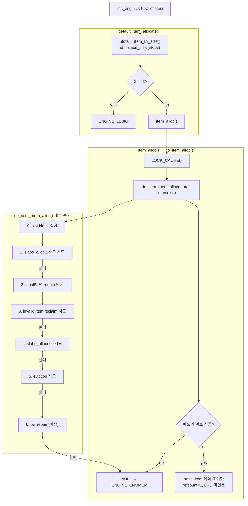

# arcus-memcached 엔진 ALLOCATE 흐름

## 전체 호출 흐름

```c
mc_engine.v1->allocate(...)
  -> default_item_allocate()   // 엔진 인터페이스 진입, 크기 검증
     -> item_alloc()           // cache_lock 획득
        -> do_item_alloc()     // hash_item 헤더 초기화
           -> do_item_mem_alloc()  // 실제 메모리 확보 정책
              -> slabs_alloc() / reclaim / regain / evict / repair
```



---

## 메모리 구조: SM allocator vs Slab allocator

### 왜 두 allocator가 있나

Slab allocator는 **고정 크기 chunk** 방식이다. 크기별로 class가 나뉘고, 각 class의 chunk 크기에 맞게 메모리를 준다.

```
slab class 1: 96바이트 chunk
slab class 2: 120바이트 chunk
slab class 3: 152바이트 chunk
...
```

50바이트 아이템이 slab class 1에 들어가면 96바이트 chunk를 통째로 쓴다. **46바이트 낭비(48%)**. small item일수록 낭비 비율이 커진다. collection 내부 노드들은 크기가 제각각이라 더 심하다.

SM(Small Memory) allocator는 **가변 크기 slot** 방식으로 이 문제를 해결한다. 50바이트 아이템이 56바이트 slot만 쓴다.

### 왜 SM으로 통일하지 않나: 내부 단편화 vs 외부 단편화

- **내부 단편화**: 할당받은 공간 안에서 실제 데이터보다 큰 공간이 낭비. 고정 크기(slab)의 문제.
- **외부 단편화**: 전체 여유 공간은 충분하지만 연속된 큰 공간이 없어서 할당 실패. 가변 크기(SM)의 문제.

**Large item (예: 상품 상세 페이지 80KB)**

Slab: 같은 종류끼리 크기가 비슷해 하나의 class가 커버한다. 해제된 chunk는 즉시 동일 크기 요청에 재사용. 외부 단편화 없음.

SM으로 관리하면:
```
[80KB used | 75KB free | 82KB used | ...]
```
76KB 요청이 75KB 공간에 못 들어간다. large item은 크기가 크기 때문에 자투리 공간이 재활용되기 어렵다.

**Small item (예: btree element)**

```
btree_elem (value 10B)  → ntotal 약 40B
btree_elem (value 200B) → ntotal 약 230B
btree_elem (value 2KB)  → ntotal 약 2KB
```

Slab으로 관리하면 크기가 다양하니 class가 수십 개 필요하고, 40B element가 96B chunk를 쓴다. SM으로 관리하면:
```
[40B free | 232B used | 40B free | 2048B used | 40B free | ...]
```
40B 자투리에 다음 40B element가 들어간다. small item은 작아서 조각난 공간도 재활용될 확률이 높다.

**결론: 자투리 공간이 재활용될 확률이 기준이다.**

| | Small item | Large item |
|---|---|---|
| 내부 단편화 (slab 낭비) | 크다 → 문제 | 상대적으로 작다 → 감수 가능 |
| 외부 단편화 위험 (SM 약점) | 낮다 (작은 공간도 재활용 쉬움) | 높다 (큰 연속 공간 필요) |
| 결론 | SM 유리 | Slab 유리 |

### SM allocator 구조

256KB 블록(`SM_BLOCK_SIZE`)을 slab class 0에서 받아 그 안을 가변 크기 slot으로 쪼개 쓴다.

```
[sm_blck_t header(32B) | slot A | slot B | slot C | free slot ... ]
```

```c
#define SM_MIN_SLOT_SIZE 32      // 최소 slot 크기
#define SM_MAX_SLOT_SIZE 49152   // 최대 slot 크기 (48K)
#define SM_SLOT_UNIT_LEN 8       // 모든 크기는 8바이트 배수

// MAX_SM_VALUE_LEN = SM_MAX_SLOT_SIZE - sizeof(sm_tail_t)
// 이 값 이하인 아이템은 SM allocator에서 할당
```

각 slot은 head(`sm_slot_t`)와 tail(`sm_tail_t`)을 가진다. tail이 slot 끝에 있는 이유는 해제 시 앞쪽 인접 slot이 free인지 역방향으로 확인하기 위해서다.

**할당**: 요청 크기를 8바이트 단위로 올리고 → 맞는 free slot 찾기 → slot이 요청보다 크면 나머지를 잘라 free list에 돌려보냄 → 없으면 새 256KB 블록 할당.

**해제**: 인접 free slot과 합치기(coalescing). 블록 전체가 비면 slab으로 반환. Slab은 freelist에 추가만 하지만 SM은 단편화를 줄이기 위해 합친다.

### SM과 slab 간 fallback은 없다

할당 경로는 오직 `ntotal` 크기로 결정된다.

```c
// do_slabs_alloc 내부
if (size <= MAX_SM_VALUE_LEN) {
    return do_smmgr_alloc(size);  // SM, id 무시. NULL이면 그냥 NULL
}
p = &slabsp->slabclass[id];  // ntotal이 클 때만
```

- `ntotal <= MAX_SM_VALUE_LEN` → 무조건 SM
- `ntotal > MAX_SM_VALUE_LEN` → 무조건 slab

SM이 꽉 차서 NULL이 반환되면 slab으로 가는 게 아니라, reclaim/eviction 루프가 small LRU에서 아이템을 해제해 SM 공간을 확보한 뒤 다시 SM에서 시도한다.

---

## LRU 구조

### LRU 큐 종류

- **LRU_CLSID_FOR_SMALL (= 0)**: small item 전용. SM allocator에서 할당된 아이템을 크기 구분 없이 하나의 큐로 통합 관리.
- **slab class별 LRU (1, 2, 3...)**: large item 전용. 각 slab class마다 별도 큐.

### LRU에 들어가는 것 vs 안 들어가는 것

LRU에는 **hash_item** 단위만 들어간다.

```
LRU_CLSID_FOR_SMALL 큐
  ├─ 작은 KV hash_item (ntotal <= MAX_SM_VALUE_LEN)
  └─ collection hash_item (IS_COLL_ITEM, list/btree/set/map 전체 대표)

slab class N 큐
  └─ 큰 KV hash_item (ntotal > MAX_SM_VALUE_LEN)
```

collection 내부 노드(`list_elem_item`, `btree_elem_item` 등)는 **어떤 LRU에도 없다**. `do_item_link`가 호출되지 않는다. eviction 단위가 collection 전체(hash_item)이기 때문이다. collection이 evict되면 내부 노드도 같이 해제된다.

```
LRU_CLSID_FOR_SMALL 큐
  └─ hash_item (list 전체 대표) ← LRU에 있음
        └─ list_elem_item [0]
        └─ list_elem_item [1]  ← LRU에 없음
        └─ list_elem_item [2]
```

---

## do_item_mem_alloc() 상세

### 0단계: clsid, lruid 결정

```c
if (clsid == LRU_CLSID_FOR_SMALL) {
    clsid_based_on_ntotal = slabs_clsid(ntotal);
    lruid                 = LRU_CLSID_FOR_SMALL;
} else {
    clsid_based_on_ntotal = clsid;
    if (ntotal <= MAX_SM_VALUE_LEN) {
        lruid = LRU_CLSID_FOR_SMALL;
    } else {
        lruid = clsid;
    }
}
```

`clsid`(caller 입력)로부터 두 값이 파생된다:

- **`lruid`**: 공간 확보 시 어느 LRU에서 희생양을 찾을지
- **`clsid_based_on_ntotal`**: 실제 slab 할당에 쓸 class 번호 (SM 할당에서는 무시됨)

**caller 유형별 동작:**

| caller | clsid 값 | 분기 |
|---|---|---|
| collection 노드 (`coll_list.c` 등) | `LRU_CLSID_FOR_SMALL` (= 0, 플래그) | 첫 번째 분기 |
| 일반 KV 아이템 (`do_item_alloc`) | `slabs_clsid(ntotal)` (1, 2...) | else 분기 |

collection 노드 allocator는 `LRU_CLSID_FOR_SMALL`을 플래그로 명시적으로 넘긴다. 이 플래그의 의미: "공간 확보 시 small LRU에서 희생양을 찾아라." `do_item_alloc`은 이 개념을 모르고 slab class만 계산해서 넘긴다. 그래서 else 분기에서 `ntotal` 크기로 `lruid`를 판단한다.

`LRU_CLSID_FOR_SMALL`을 0으로 그대로 `clsid_based_on_ntotal`에 쓰면 `slabclass[0]`(SM 블록 256KB 단위용)을 쓰게 되어 잘못된다. 그래서 `slabs_clsid(ntotal)`로 올바른 slab class를 내부에서 계산한다.

**실제 할당 경로 정리:**

| 케이스 | 실제 할당 | lruid | clsid_based_on_ntotal |
|---|---|---|---|
| small KV 아이템 | SM | LRU_CLSID_FOR_SMALL | slab class (무시됨) |
| large KV 아이템 | slab class N | slab class N | slab class N |
| collection 노드 (ntotal 작음) | SM | LRU_CLSID_FOR_SMALL | slabs_clsid(ntotal) (무시됨) |
| collection 노드 (ntotal 큼) | slab | LRU_CLSID_FOR_SMALL | slabs_clsid(ntotal) (사용됨) |

### 1단계: slabs_alloc() 바로 시도

```c
it = slabs_alloc(ntotal, clsid_based_on_ntotal);
if (it != NULL) {
    it->slabs_clsid = 0;
    return (void*)it;
}
```

빈 자리가 있으면 reclaim/eviction 없이 바로 반환. 가장 이상적인 경로.

### 2단계: small이면 regain 먼저

```c
if (config->evict_to_free && lruid == LRU_CLSID_FOR_SMALL) {
    int current_ssl = slabs_space_shortage_level();
    if (current_ssl > 0) {
        (void)do_item_regain(current_ssl, current_time, cookie);
    }
}
```

SM allocator는 공간 부족 수준을 0~100(`space_shortage_level`)으로 추적한다. 0이면 여유롭고 100이면 거의 꽉 찬 상태. small item이고 압박이 있으면 본격적인 할당 시도 전에 small LRU tail을 미리 정리한다.

**reclaim vs regain vs eviction:**

셋 다 메모리를 확보하는 수단이지만 목적, 대상, 타이밍이 다르다.

- **reclaim** (`do_item_reclaim`): 특정 죽은 아이템 하나를 골라 **지금 할당하려는 아이템에 직접 재사용**. large/small 둘 다 발생하지만 동작이 다르다.
  - large item: 같은 slab class라 chunk 크기가 같으니 그 메모리 블록을 그대로 씀 (해제 없음)
  - small item: SM slot을 해제하고 새 slot을 다시 받음 (해제 후 재할당)
- **regain** (`do_item_regain`): **small item에서만** 발생. small LRU tail을 쭉 스캔해서 아이템들을 한꺼번에 정리해 SM pool에 공간을 확보. 정리된 공간이 현재 할당에 직접 쓰이는 게 아니라 이후 `slabs_alloc()` 호출이 성공할 확률을 높임. lazy expiration 잔재 청소가 주목적이며, `space_shortage_level`이 높으면 살아있는 아이템도 축출.
- **eviction**: 할당이 끝까지 실패했을 때 마지막 수단으로 살아있는 아이템을 강제 축출.

타이밍도 다르다:

```
1. slabs_alloc() 바로 시도
2. regain  ← 할당 실패 전 선제 정리 (small item + 압박 있을 때만)
3. reclaim ← 실패 후 죽은 아이템 하나씩 직접 재활용 (large/small 둘 다)
4. slabs_alloc() 재시도
5. eviction ← 마지막 수단, 살아있는 아이템도 희생
```

### 3단계: invalid item reclaim

```c
if (search->refcount == 0 && !do_item_isvalid(search, current_time)) {
    it = do_item_reclaim(search, ntotal, clsid_based_on_ntotal, lruid);
}
```

`lowMK`~`curMK` 구간을 스캔해 invalid item을 재활용한다. LRU 전체를 매번 훑지 않기 위한 구조.

**do_item_reclaim() 내부 동작:**

코드 상 핵심 차이는 반환하는 포인터가 같냐 다르냐다:

```c
// large item (lruid != LRU_CLSID_FOR_SMALL)
slabs_adjust_mem_requested(it->slabs_clsid, ITEM_ntotal(it), ntotal);
do_item_unlink(it, ITEM_UNLINK_INVALID);
it->slabs_clsid = 0;
return it;           // ← 같은 포인터 반환. chunk를 그대로 새 아이템으로 씀

// small item (lruid == LRU_CLSID_FOR_SMALL)
do_item_unlink(it, ITEM_UNLINK_INVALID);
it = slabs_alloc(ntotal, clsid);   // ← SM pool에서 새 슬롯 할당
return it;           // ← 다른 포인터 반환
```

- large: slab은 같은 class 안에서 모든 chunk가 고정 크기 → 죽은 아이템의 chunk를 그대로 새 아이템에 덮어쓸 수 있다. 별도 해제/할당 없음.
- small: SM은 가변 크기 슬롯 → 죽은 아이템 슬롯이 100바이트, 새 아이템이 200바이트면 맞지 않는다. 따라서 반드시 죽은 슬롯을 pool에 돌려보내고(`do_item_unlink` → SM free), 새 크기에 맞는 슬롯을 pool에서 받아야(`slabs_alloc`) 한다.

"reclaim"이라는 이름은 특정 죽은 아이템을 **골라서 치우는 행위** 전체를 가리킨다. large는 그 자리를 직접 받고, small은 pool을 통해 간접적으로 받는다. 둘 다 "죽은 아이템을 표적으로 삼아 공간을 확보한다"는 점에서 같은 이름을 쓴다.

### 4단계: slabs_alloc() 재시도

reclaim/invalidate로 공간이 생겼을 수 있으니 다시 시도한다.

### 5단계: eviction

```c
if (!config->evict_to_free) { return NULL; }  // eviction 비활성화면 OOM

search = itemsp->tails[lruid];
// tail(오래된 것)부터 탐색
// 유효한 item → do_item_evict() → slabs_alloc() 재시도
// invalid item → do_item_reclaim()
// refcount > 0 → LRU에서만 잠시 분리
```

### 6단계: tail repair (비상)

refcount leak으로 인해 오래된 item이 tail에 계속 남아있는 비정상 상황 대응. 정상 경로가 아닌 안전장치.

### 성공 시 마무리

`do_item_mem_alloc()`은 raw 메모리 블록만 반환한다(`slabs_clsid = 0`). `do_item_alloc()`이 이 블록을 실제 hash_item으로 완성한다:

```c
it->slabs_clsid = id;
it->next = it->prev = it;  // LRU 미연결 상태
it->h_next = 0;            // 해시 테이블 미연결 상태
it->refcount = 1;          // caller가 소유
```

이 시점의 item은 메모리만 확보된 상태로, 해시 테이블에도 LRU에도 없다. 이후 `store` 단계에서 `do_item_link()`가 호출되어 비로소 캐시에 등록된다.

---

## sticky item도 reclaim될 수 있는 이유

sticky item은 "영원히 불멸"이 아니다. 유효한 동안 eviction으로부터 강하게 보호되지만, 이미 invalid 상태가 되면 reclaim 대상이 된다.

```c
if (search->refcount == 0 && !do_item_isvalid(search, current_time)) {
    it = do_item_reclaim(search, ntotal, clsid_based_on_ntotal, lruid);
}
```

즉 sticky item이라도 refcount==0이고 expired/flushed/prefix invalid이면 reclaim된다.

---

## 보조 함수 정리

| 함수 | 역할 |
|---|---|
| `slabs_alloc()` | SM 또는 slab에서 새 메모리 블록 확보 |
| `do_item_reclaim()` | invalid item 제거 후 공간 재활용 |
| `do_item_invalidate()` | invalid item unlink (공간 즉시 재활용 없이 정리만) |
| `do_item_evict()` | 유효한 item 강제 축출 |
| `do_item_regain()` | small LRU tail 선제 정리 (lazy expiration 잔재 청소) |
| `do_item_repair()` | 비정상적으로 오래 잠긴 tail item 강제 복구 |
