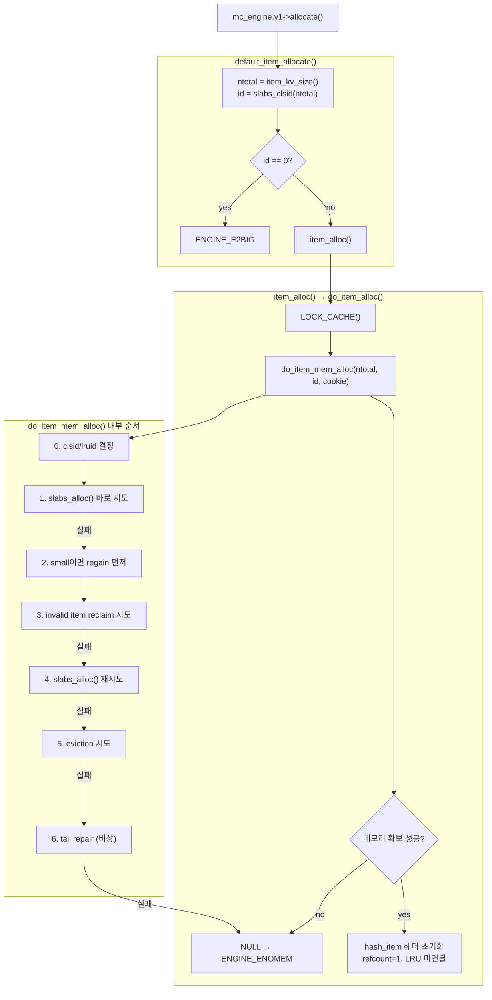

# arcus-memcached 엔진 ALLOCATE 흐름

## 전체 호출 흐름

```c
mc_engine.v1->allocate(...)
  -> default_item_allocate()   // 엔진 인터페이스 진입, 크기 검증
     -> item_alloc()           // cache_lock 획득
        -> do_item_alloc()     // hash_item 헤더 초기화
           -> do_item_mem_alloc()  // 실제 메모리 확보 정책
              -> slabs_alloc() / reclaim / regain / evict / repair
```



---

## 메모리 구조 / LRU 구조

SM allocator, Slab allocator 구조와 LRU 큐 종류는 [memory-model.md](memory-model.md)에 정리되어 있다.

이 문서에서 필요한 핵심만 요약하면:

- `ntotal <= MAX_SM_VALUE_LEN` → SM allocator (가변 크기 slot) → small LRU (id=0)
- `ntotal > MAX_SM_VALUE_LEN` → Slab allocator (고정 크기 chunk) → slab class별 LRU
- collection hash_item은 ntotal 무관하게 무조건 small LRU. 내부 노드는 어떤 LRU에도 없음.
- SM과 slab 간 fallback은 없다. SM이 꽉 차면 reclaim/eviction으로 SM 공간을 확보한 뒤 재시도한다.

---

## do_item_mem_alloc() 상세

### 0단계: clsid, lruid 결정

```c
if (clsid == LRU_CLSID_FOR_SMALL) {
    clsid_based_on_ntotal = slabs_clsid(ntotal);
    lruid                 = LRU_CLSID_FOR_SMALL;
} else {
    clsid_based_on_ntotal = clsid;
    if (ntotal <= MAX_SM_VALUE_LEN) {
        lruid = LRU_CLSID_FOR_SMALL;
    } else {
        lruid = clsid;
    }
}
```

`clsid`(caller 입력)로부터 두 값이 파생된다:

- **`lruid`**: 공간 확보 시 어느 LRU에서 희생양을 찾을지
- **`clsid_based_on_ntotal`**: 실제 slab 할당에 쓸 class 번호 (SM 할당에서는 무시됨)

**caller 유형별 동작:**

| caller | clsid 값 | 분기 |
|---|---|---|
| collection 노드 (`coll_list.c` 등) | `LRU_CLSID_FOR_SMALL` (= 0, 플래그) | 첫 번째 분기 |
| 일반 KV 아이템 (`do_item_alloc`) | `slabs_clsid(ntotal)` (1, 2...) | else 분기 |

collection 노드 allocator는 `LRU_CLSID_FOR_SMALL`을 플래그로 명시적으로 넘긴다.
이 플래그의 의미: "공간 확보 시 small LRU에서 희생양을 찾아라."
`do_item_alloc`은 이 개념을 모르고 slab class만 계산해서 넘긴다. 그래서 else 분기에서 `ntotal` 크기로 `lruid`를 판단한다.

`LRU_CLSID_FOR_SMALL`을 0으로 그대로 `clsid_based_on_ntotal`에 쓰면 `slabclass[0]`(SM 블록 256KB 단위용)을 쓰게 되어 잘못된다.
그래서 `slabs_clsid(ntotal)`로 올바른 slab class를 내부에서 계산한다.

**실제 할당 경로 정리:**

| 케이스 | 실제 할당 | lruid | clsid_based_on_ntotal |
|---|---|---|---|
| small KV 아이템 | SM | LRU_CLSID_FOR_SMALL | slab class (무시됨) |
| large KV 아이템 | slab class N | slab class N | slab class N |
| collection 노드 (ntotal 작음) | SM | LRU_CLSID_FOR_SMALL | slabs_clsid(ntotal) (무시됨) |
| collection 노드 (ntotal 큼) | slab | LRU_CLSID_FOR_SMALL | slabs_clsid(ntotal) (사용됨) |

### 1단계: slabs_alloc() 바로 시도

```c
it = slabs_alloc(ntotal, clsid_based_on_ntotal);
if (it != NULL) {
    it->slabs_clsid = 0;
    return (void*)it;
}
```

빈 자리가 있으면 reclaim/eviction 없이 바로 반환. 가장 이상적인 경로.

### 성공 시 마무리

`do_item_mem_alloc()`은 raw 메모리 블록만 반환한다(`slabs_clsid = 0`).
`do_item_alloc()`이 이 블록을 실제 hash_item으로 완성한다:

```c
it->slabs_clsid = id;
it->next = it->prev = it;  // LRU 미연결 상태
it->h_next = 0;            // 해시 테이블 미연결 상태
it->refcount = 1;          // caller가 소유
```

이 시점의 item은 메모리만 확보된 상태로, 해시 테이블에도 LRU에도 없다.
이후 `store` 단계에서 `do_item_link()`가 호출되어 비로소 캐시에 등록된다.

---

`do_item_mem_alloc()`에서 메모리를 확보하는 세 가지 수단.
셋 다 LRU에서 item을 제거해 공간을 만든다는 점은 같지만, 목적과 타이밍이 다르다.

---

## 한눈에 비교

| | regain | reclaim | eviction |
|---|---|---|---|
| 시점 | slabs_alloc() 시도 전 선제 실행 | slabs_alloc() 실패 후 | reclaim도 실패하면 마지막 수단 |
| 대상 | small LRU TAIL (오래된 것부터) | LRU 중간 구간 (lowMK ~ curMK ~ HEAD) | LRU TAIL (오래된 것부터) |
| valid item 처리 | **축출** (space_shortage 심하면) | 건드리지 않음 | **강제 축출** |
| 할당 직접 제공 | 아님 (공간만 확보, 이후 slabs_alloc이 사용) | 맞음 (reclaim한 메모리를 바로 반환) | valid item 축출 후 slabs_alloc 재시도 |
| 적용 대상 | small item 전용 | large/small 둘 다 | large/small 둘 다 |
| 최대 시도 횟수 | space_shortage_level 값만큼 | step1 10번 + step2 20번 | 200번 |

---

## 전체 실행 순서

```
do_item_mem_alloc()
    |
    1. regain         (small item + SM 압박 있을 때만 선제 실행)
    |
    2. slabs_alloc()  1차 시도
    |
    3. reclaim        (실패 시 LRU 중간 구간에서 invalid item 재활용)
    |   step 1: lowMK ~ curMK 재검사 (최대 10번)
    |   step 2: curMK ~ HEAD 신규 탐색 (최대 20번)
    |
    4. slabs_alloc()  2차 시도
    |
    5. eviction       (실패 시 TAIL부터 강제 축출, 최대 200번)
    |
    6. tail repair    (비상용, large item 전용, refcount 누수 의심 item 강제 해제)
```

---

## regain

SM allocator의 공간이 부족할 조짐(`space_shortage_level > 0`)이 있을 때,
본격적인 할당 시도 전에 small LRU TAIL을 미리 정리해 SM 여유를 확보한다.

```c
if (config->evict_to_free && lruid == LRU_CLSID_FOR_SMALL) {
    int current_ssl = slabs_space_shortage_level();
    if (current_ssl > 0) {
        (void)do_item_regain(current_ssl, current_time, cookie);
    }
}
```

조건:
- `evict_to_free` 설정이 켜져 있어야 함
- small item(`lruid == LRU_CLSID_FOR_SMALL`)일 때만

```
// do_item_regain 내부 (pseudo)
TAIL부터 space_shortage_level 횟수만큼 탐색:
    refcount == 0 이면:
        valid   → evict (강제 축출)
        invalid → invalidate (해제만)
    refcount > 0 이면:
        LRU에서만 제거 (메모리는 건드리지 않음)
        refcount가 0이 되면 나중에 do_item_release()가 LRU에 다시 연결
```

regain은 메모리를 직접 반환하지 않는다.
정리된 공간이 SM pool로 돌아가고, 이후 `slabs_alloc()`이 그 공간을 쓰게 된다.

---

## reclaim

`slabs_alloc()` 실패 후, LRU에서 invalid item을 찾아 그 메모리를 직접 재활용한다.
reclaim은 찾은 메모리를 바로 호출자에게 반환한다.

### LRU 구조와 마커

```
TAIL(oldest)                                                   HEAD(newest)
    |                                                               |
    v                                                               v
TAIL -- [exptime=0] -- lowMK -- [zone 1] -- curMK -- [zone 2] -- HEAD
                          |----  step 1 --->|----  step 2  --->|
```

- TAIL ~ lowMK: exptime=0인 영구 item. 절대 만료 안 되므로 스캔 범위 밖
- lowMK ~ curMK (zone 1): step 2가 이미 지나간 구간. 그 사이 TTL이 끝났을 수 있어 재검사
- curMK ~ HEAD (zone 2): 아직 한 번도 탐색 안 한 새 구간

### 마커 초기화 / 업데이트

| 시점 | 동작 |
|---|---|
| 최초 expirable item 추가 | `lowMK = curMK = it` (1회만) |
| 마커가 가리키는 item 제거 | dangling 방지: `lowMK/curMK = it->prev` |
| step 1 — lowMK 위치가 exptime==0 | `lowMK = lowMK->prev` (HEAD 방향 1칸 전진) |
| step 2 — 매 iteration | `curMK = curMK->prev` (HEAD 방향 1칸 전진) |

### step 1 (최대 10번)

```
lowMK부터 curMK 직전까지 탐색:
    죽어있으면 (refcount==0 이고 invalid):
        reclaim 시도 → 성공하면 바로 반환
    살아있으면:
        lowMK 자신이 exptime==0 이면 lowMK를 HEAD 방향으로 한 칸 밀기
        다음 item으로 이동
```

lowMK가 HEAD 방향으로 밀리는 조건이 `search == lowMK`인 이유:
경계 item 자체가 영구 item일 때만 밀어야 하기 때문이다.
중간 item이 exptime==0이라고 lowMK를 점프시키면, 그 사이 expirable item들이
스캔 범위에서 영구히 빠져버린다.

### step 2 (최대 20번)

```
curMK부터 HEAD 방향으로 탐색:
    curMK를 HEAD 방향으로 한 칸 전진시키고
    현재 item이 죽어있으면:
        reclaim 시도 → 성공하면 바로 반환

curMK가 HEAD 도달(NULL)하면:
    curMK = lowMK 로 리셋 (다음 사이클에서 처음부터 다시)
```

### 왜 두 마커인가

step 1은 최대 10번, step 2는 최대 20번으로 제한되어 있다.
한 번의 할당 시도에서 LRU 전체를 훑지 않고, 다음 할당 시도 때 curMK가
이어서 진행하므로 전체 LRU는 여러 번의 할당에 걸쳐 커버된다.
모든 공간을 보지 않더라도 효율적으로 reclaim 후보를 찾을 수 있는 이유다.

---

## eviction

reclaim까지 실패한 뒤 `slabs_alloc()` 2차 시도도 실패하면 진입한다.
살아있는 item도 강제로 내쫓는 마지막 수단.

```c
if (!config->evict_to_free) {
    do_item_stat_outofmemory(lruid);
    return NULL;  // eviction 비허용 설정이면 그냥 실패
}
```

`evict_to_free = false`면 eviction 없이 바로 NULL 반환.

```
TAIL부터 최대 200번 탐색:
    refcount == 0 이면:
        valid   → evict 후 slabs_alloc() 재시도
        invalid → reclaim (여기서도 한 번 더 시도)
        성공하면 반환
    refcount > 0 이면:
        누가 쓰는 중 → 메모리는 못 가져감
        LRU에서만 제거 (다음 탐색 때 다시 걸리지 않도록)
```

reclaim과의 차이:
- reclaim: LRU 중간(lowMK)에서 시작, valid item 건드리지 않음, 최대 30번
- eviction: TAIL에서 시작, valid item도 강제 축출, 최대 200번

---

## tail repair (비상용)

eviction도 실패하고 `lruid != LRU_CLSID_FOR_SMALL`(large item)일 때만 진입.

```c
if (search->refcount != 0 &&
    search->time + TAIL_REPAIR_TIME < current_time) {
    do_item_repair(search, lruid);  // refcount 강제로 0으로 만들고 해제
    it = slabs_alloc(...);
}
```

`refcount > 0`인데 마지막 접근 시각이 `TAIL_REPAIR_TIME`(3시간) 이상 된 item을
refcount 누수 버그로 간주하고 강제 해제한다.
코드 주석에도 "매우 드문 버그 대비용"이라고 명시되어 있다.
small item에는 적용하지 않는다.

---

## sticky item reclaim 조건

sticky item은 `exptime = (rel_time_t)(-1)` = 0xFFFFFFFF로 저장된다. `do_item_isvalid()`의 TTL 검사:

```c
if (it->exptime != 0 && it->exptime <= current_time) ...
```

이 조건이 절대 true가 되지 않으므로 **TTL로 만료되는 일은 없다**.

sticky item은 일반 LRU(`heads[]`/`tails[]`)가 아니라 별도 큐(`sticky_heads[]`/`sticky_tails[]`)에 있다. 일반 reclaim 루프(lowMK/curMK 탐색)는 일반 LRU만 훑으므로 정상적으로는 sticky item에 닿지 않는다.

`ENABLE_STICKY_ITEM` 블록에서 sticky item을 따로 reclaim하는 경로가 있는데, 이 경로는 `sticky_curMK != NULL`일 때만 실행된다. `sticky_curMK`는 **flush_all 처리 중에만** `sticky_tails[i]`로 세팅된다.

```
flush_all 전: sticky_curMK == NULL → ENABLE_STICKY_ITEM 블록 스킵 → sticky item 건드리지 않음
flush_all 후: sticky_curMK != NULL → do_item_isvalid()==false인 sticky item reclaim
```

prefix 무효화로 인해 invalid가 된 sticky item은 이 경로로는 정리되지 않는다. 대신 해당 key를 다시 조회할 때 `do_item_get()`에서 lazy하게 unlink된다.

**결론: sticky item이 `do_item_mem_alloc()`의 reclaim 경로에서 정리되는 건 flush_all 이후에만 해당한다.**

---

## 보조 함수 정리

| 함수 | 역할 |
|---|---|
| `slabs_alloc()` | SM 또는 slab에서 새 메모리 블록 확보 |
| `do_item_reclaim()` | invalid item 제거 후 공간 재활용 |
| `do_item_invalidate()` | invalid item unlink (공간 즉시 재활용 없이 정리만) |
| `do_item_evict()` | 유효한 item 강제 축출 |
| `do_item_regain()` | small LRU tail 선제 정리 (lazy expiration 잔재 청소) |
| `do_item_repair()` | 비정상적으로 오래 잠긴 tail item 강제 복구 |
