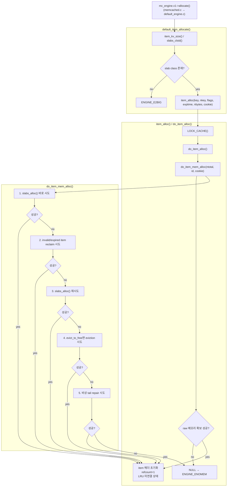

# arcus-memcached 엔진 ALLOCATE 흐름



---

## 한 줄 요약

`do_item_mem_alloc()`은 단순 `malloc` 함수가 아니라, **새 slab 할당 → invalid item 재활용 → eviction → 비상 repair**까지 포함한 default engine의 메모리 확보 정책 핵심 함수다.

즉 `allocate()`는 단순히 "빈 메모리 있으면 하나 준다"가 아니라, 메모리 압박 상황에서 **어떤 공간을 다시 쓸지**까지 판단하는 경로다.

슬랩 메모리, LRU, small LRU 같은 배경 개념은 별도 문서인 [메모리 모델](./memory-model.md)에서 따로 정리했다.

---

## 전체 호출 흐름

`set`의 1단계에서 `memcached.c`는:

```c
mc_engine.v1->allocate(mc_engine.v0, c, &it, key, nkey, vlen,
                       htonl(flags), realtime(exptime), req_cas_id);
```

를 호출한다.

default engine 기준으로 이 호출은 다음 경로를 탄다.

```c
mc_engine.v1->allocate(...)
  -> default_item_allocate(...)
     -> item_alloc(...)
        -> do_item_alloc(...)
           -> do_item_mem_alloc(...)
              -> slabs_alloc() / reclaim / evict / repair
```

즉 읽는 순서는:

1. `default_item_allocate()`에서 엔진 인터페이스 진입
2. `item_alloc()`에서 락 경계 진입
3. `do_item_alloc()`에서 item 헤더 초기화
4. `do_item_mem_alloc()`에서 실제 raw 메모리 확보 정책 수행

이다.

---

## default_item_allocate()

`default_engine.c`의 `default_item_allocate()`는 엔진 인터페이스 레벨의 allocate 구현체다.

핵심 코드는:

```c
uint32_t ntotal = item_kv_size(nkey, nbytes);
unsigned int id = slabs_clsid(ntotal);
if (id == 0) {
    return ENGINE_E2BIG;
}

it = item_alloc(key, nkey, flags, exptime, nbytes, cookie);
if (it != NULL) {
    item_set_cas(it, cas);
    *item = it;
    ret = ENGINE_SUCCESS;
} else {
    ret = ENGINE_ENOMEM;
}
```

여기서 하는 일은 단순하다.

1. key/value 전체 크기 `ntotal` 계산
2. 이 크기를 담을 수 있는 slab class 찾기
3. class가 없으면 너무 큰 item이므로 `ENGINE_E2BIG`
4. `item_alloc()` 호출
5. 성공하면 CAS를 세팅하고 반환

중요한 점은 이 함수가 **실제 캐시 등록을 하지 않는다는 것**이다.

이 단계에서 만들어진 item은:

- 메모리만 확보된 상태
- 아직 해시 테이블에 없음
- 아직 LRU에도 없음
- 아직 key lookup으로 보이지 않음

즉 "캐시에 들어간 item"이 아니라, **나중에 store에 넘길 준비가 된 미완성 item**이다.

---

## item_alloc()

`items.c`의 `item_alloc()`은 매우 얇은 래퍼다.

```c
LOCK_CACHE();
it = do_item_alloc(key, nkey, flags, exptime, nbytes, cookie);
UNLOCK_CACHE();
```

여기서 중요한 것은 **할당도 cache_lock 아래에서 이뤄진다**는 점이다.

이유는 뒤쪽에서 `do_item_mem_alloc()`이:

- LRU를 훑고
- reclaim / eviction / invalidate를 하고
- tail item을 건드릴 수도 있기 때문

이다.

즉 이 경로는 단순 allocator 호출이 아니라, 캐시 공유 구조를 건드릴 수 있는 경로다.

---

## do_item_alloc()

`do_item_alloc()`은 두 역할을 맡는다.

1. `do_item_mem_alloc()`로 raw 메모리 블록 확보
2. 그 블록을 실제 `hash_item` 형태로 초기화

핵심 코드는:

```c
size_t ntotal = item_kv_size(nkey, nbytes);
unsigned int id = slabs_clsid(ntotal);
...
it = do_item_mem_alloc(ntotal, id, cookie);
if (it == NULL)  {
    return NULL;
}
it->slabs_clsid = id;

it->next = it->prev = it; /* unlinked from LRU */
it->h_next = 0;
it->refcount = 1;         /* caller owns one reference */
it->iflag = config->use_cas ? ITEM_WITH_CAS : 0;
it->nkey = nkey;
it->nbytes = nbytes;
it->flags = flags;
memcpy((void*)item_get_key(it), key, nkey);
it->exptime = exptime;
it->pfxptr = NULL;
```

이 함수의 포인트는:

- `do_item_mem_alloc()`은 아직 "그냥 메모리 블록"을 가져오는 단계
- `do_item_alloc()`이 그 블록을 실제 item으로 완성하는 단계

라는 것이다.

특히 여기서:

- `next = prev = it`
  아직 LRU에 연결되지 않았음을 뜻하는 특수 상태
- `h_next = 0`
  아직 해시 체인에도 연결되지 않았음
- `refcount = 1`
  호출자가 이 새 item을 하나 들고 시작함

이라는 점이 중요하다.

즉 새 item은 만들어지는 순간부터 "호출자가 소유한 unlinked 객체"다.

---

## do_item_mem_alloc()

이 함수가 실제 메모리 확보 정책의 중심이다.

핵심만 먼저 말하면 순서는 이렇다.

1. 새 slab 메모리를 바로 할당 시도
2. invalid/expired/flushed item 재활용 시도
3. 정리 후 다시 slab 할당 시도
4. 그래도 안 되면 eviction 시도
5. 아주 예외적인 경우 tail repair 시도
6. 끝까지 실패하면 `NULL`

즉 이 함수는 단순 allocator가 아니라 **"어떻게든 item 하나가 들어갈 자리를 만드는 정책 함수"**다.

### 기본 변수

```c
hash_item *it = NULL;
int tries;
hash_item *search;
hash_item *previt = NULL;
rel_time_t current_time = svcore->get_current_time();
```

의미는 이렇다.

- `it`
  최종적으로 확보한 메모리 블록
- `tries`
  스캔/회수 루프의 탐색 횟수 제한
- `search`
  LRU를 따라 탐색 중인 현재 item
- `previt`
  LRU를 뒤로 거슬러 올라가기 위한 이전 item
- `current_time`
  expiration / flush / validity 판단용 현재 시각

---

## `clsid_based_on_ntotal`과 `lruid`

함수 초반에는 `clsid_based_on_ntotal`과 `lruid`를 정한다.

```c
if (clsid == LRU_CLSID_FOR_SMALL) {
    clsid_based_on_ntotal = slabs_clsid(ntotal);
    lruid                 = clsid;
} else {
    clsid_based_on_ntotal = clsid;
    if (ntotal <= MAX_SM_VALUE_LEN) {
        lruid = LRU_CLSID_FOR_SMALL;
    } else {
        lruid = clsid;
    }
}
```

여기서:

- `clsid_based_on_ntotal`
  실제 메모리를 어느 slab class에서 할당할지를 뜻하는 변수
- `lruid`
  reclaim / eviction 대상을 어느 LRU 그룹에서 찾을지를 뜻하는 변수

---

## 1. slabs_alloc() 바로 시도

가장 먼저 하는 일은 가능하면 새 slab 블록을 바로 받는 것이다.

```c
it = slabs_alloc(ntotal, clsid_based_on_ntotal);
if (it != NULL) {
    it->slabs_clsid = 0;
    return (void*)it;
}
```

이게 가장 이상적인 경우다.

- free slab 공간이 있으면
- reclaim도 eviction도 없이
- 그냥 새 블록을 하나 받아서 반환

즉 "빈 자리가 있으면 제일 먼저 그걸 쓴다"는 정책이다.

---

## 2. small memory shortage면 regain 먼저

small LRU에서는 공간 부족이 심할 때 `do_item_regain()`을 먼저 실행한다.

```c
if (config->evict_to_free && lruid == LRU_CLSID_FOR_SMALL) {
    int current_ssl = slabs_space_shortage_level();
    if (current_ssl > 0) {
        (void)do_item_regain(current_ssl, current_time, cookie);
    }
}
```

이건 본격적인 할당 실패나 eviction 루프에 들어가기 전에, small memory 압박을 완화하려는 선제 정리 단계다.

`do_item_regain()` 자체를 보면 small LRU tail에서 시작해 최대 `count`개 정도를 뒤에서부터 훑는다.

```c
search = itemsp->tails[clsid];
while (search != NULL) {
    previt = search->prev;
    if (search->refcount == 0) {
        if (do_item_isvalid(search, current_time)) {
            do_item_evict(search, clsid, current_time, cookie);
        } else {
            do_item_invalidate(search, clsid, true);
        }
        nregains += 1;
    } else {
        item_unlink_q(search);
    }
    search = previt;
    if ((--tries) == 0) break;
}
```

읽는 포인트는 이렇다.

1. 대상은 small LRU tail 쪽이다  
   `clsid = LRU_CLSID_FOR_SMALL` 기준으로 tail부터 본다. 즉 오래된 small item들부터 정리 대상으로 삼는다.

2. `refcount == 0`인 item만 실제로 회수한다  
   누군가 쓰고 있는 item은 바로 없앨 수 없기 때문이다.

3. 유효한 item이면 `do_item_evict()`  
   아직 살아 있는 item이지만 공간 부족 완화를 위해 희생시킨다.

4. 이미 무효한 item이면 `do_item_invalidate()`  
   expired / flushed / invalid prefix 상태라면 그냥 unlink해서 정리한다.

5. `refcount > 0`이면 LRU에서만 잠시 분리한다  
   바로 free할 수는 없지만, tail 쪽에 붙어 있으면 계속 reclaim/evict 후보 탐색을 방해할 수 있으므로 일단 `item_unlink_q(search)`로 LRU에서만 빼둔다. 이 item은 나중에 refcount가 0이 되면 `do_item_release()` 경로에서 다시 적절히 처리된다.

즉 `do_item_regain()`은:

- 새 메모리 블록을 직접 만들어내는 함수라기보다
- small LRU tail을 짧게 정리해서
- 이후 `slabs_alloc()`이나 reclaim/eviction이 더 잘 되게 만드는

**사전 정리 함수**에 가깝다.

왜 small memory에서만 먼저 이걸 하냐고 보면, small item은 수가 많고 tail 쪽에 오래된 객체가 많이 쌓일 가능성이 높아서 메모리 부족 시 이런 선제 정리의 효과가 크기 때문이다.

---

## 3. invalid item reclaim 시도

그 다음은 sticky LRU와 일반 LRU에서 invalid item을 찾아 재활용한다.

공통 조건은 이렇다.

```c
if (search->refcount == 0 && !do_item_isvalid(search, current_time)) {
    it = do_item_reclaim(search, ntotal, clsid_based_on_ntotal, lruid);
}
```

즉 reclaim 대상은:

- `refcount == 0`
  아무도 사용 중이 아니고
- `!do_item_isvalid(...)`
  expired / flushed / invalid prefix 등으로 더 이상 유효하지 않은 item

이다.

여기서 `do_item_reclaim()`은 쉽게 말하면:

- invalid item을 제거하고
- 그 공간을 다시 사용 가능한 블록으로 돌리는 것

이다.

### lowMK -> curMK 스캔

일반 LRU에서는 `lowMK`부터 `curMK`까지 두 단계로 나눠 invalid item을 찾는다.

이 구조의 목적은 LRU 전체를 매번 처음부터 끝까지 훑지 않기 위해서다.

- `lowMK`
  재활용 후보 스캔의 낮은 경계
- `curMK`
  현재까지 진행한 스캔 위치

즉 Arcus는 LRU를 조금씩 나눠 훑으며 reclaim 대상을 찾는다.

특히 `exptime == 0`인 영구 item은 invalid가 되지 않으므로, `lowMK`를 위로 밀어올려 다음부터 덜 보게 한다.

---

## 4. 정리 후 slabs_alloc() 재시도

invalid item reclaim이나 invalidate가 일어났을 수 있으므로, 그 다음엔 다시 한 번 `slabs_alloc()`를 시도한다.

```c
it = slabs_alloc(ntotal, clsid_based_on_ntotal);
```

즉 reclaim 경로는 결국 "정리하고 나서 새 블록을 다시 받을 수 있나?"를 확인하는 준비 작업이다.

---

## 5. 그래도 안 되면 eviction

여전히 `it == NULL`이면 eviction 단계로 들어간다.

```c
if (!config->evict_to_free) {
    do_item_stat_outofmemory(lruid);
    return NULL;
}
```

먼저 `evict_to_free`가 꺼져 있으면 여기서 바로 포기한다.  
즉 메모리가 부족해도 기존 item을 쫓아내지 않는 정책이라면 그냥 OOM이다.

켜져 있으면 tail 쪽에서 희생양을 찾는다.

```c
search = itemsp->tails[lruid];
while (search != NULL) {
    if (search->refcount == 0) {
        if (do_item_isvalid(search, current_time)) {
            do_item_evict(search, lruid, current_time, cookie);
            it = slabs_alloc(ntotal, clsid_based_on_ntotal);
        } else {
            it = do_item_reclaim(search, ntotal, clsid_based_on_ntotal, lruid);
        }
        if (it != NULL) break;
    } else {
        item_unlink_q(search);
    }
    search = previt;
}
```

경우를 나누면:

- 유효한 item이면 `do_item_evict()`
  정상 item을 희생시켜 공간 확보
- 이미 invalid한 item이면 `do_item_reclaim()`
  그냥 재활용
- `refcount > 0`이면
  지금 누군가 사용 중이므로 free할 수 없고, LRU에서만 잠시 분리

즉 eviction 단계는:

- tail부터 오래된 item을 보면서
- 쫓아낼 수 있는 것은 evict하고
- 이미 죽은 item은 reclaim하고
- 잠긴 item은 건너뛰는

과정이다.

---

## 6. 마지막 비상 수단: tail repair

그래도 실패하고 small LRU도 아니면, 마지막으로 tail repair를 시도한다.

```c
if (search->refcount != 0 &&
    search->time + TAIL_REPAIR_TIME < current_time) {
    do_item_repair(search, lruid);
    it = slabs_alloc(ntotal, clsid_based_on_ntotal);
}
```

이건 정상 경로가 아니라, 주석 그대로 아주 드문 refcount leak 대응용 안전장치다.

의미는:

- refcount가 0이 아닌데
- tail에 너무 오래 남아 있는 item이 있으면
- 비정상적으로 잠긴 것으로 보고 강제로 repair

하는 것이다.

즉 시스템이 영원히 메모리 부족에 빠지는 것을 막기 위한 최후 수단이다.

---

## 성공 시 마무리

성공하면 반환 직전에:

```c
it->slabs_clsid = 0;
return (void *)it;
```

를 수행한다.

이건 아직 item 초기화가 끝난 상태가 아니라는 뜻이다.

실제로 바로 뒤 `do_item_alloc()`가:

```c
it->slabs_clsid = id;
it->next = it->prev = it;
it->h_next = 0;
it->refcount = 1;
...
```

로 이 raw 블록을 실제 item 객체로 완성한다.

즉:

- `do_item_mem_alloc()`
  raw 메모리 블록 확보
- `do_item_alloc()`
  그 블록을 진짜 item으로 초기화

라고 역할을 나눠 보면 된다.

---

## 보조 함수 감각 정리

- `slabs_alloc(...)`
  slab allocator에서 새 블록 확보
- `do_item_reclaim(...)`
  invalid item을 제거하고 그 공간을 재활용
- `do_item_invalidate(...)`
  invalid item을 unlink해서 정리
- `do_item_evict(...)`
  유효한 item을 강제로 축출
- `do_item_repair(...)`
  비정상적으로 오래 잠긴 tail item을 복구성 제거

---

## 마지막 정리

`do_item_mem_alloc()`은 단순 `malloc` 함수가 아니다.

- 새 공간이 있으면 바로 쓰고
- 없으면 expired/flushed item을 재활용하고
- 그래도 없으면 eviction하고
- 마지막에는 비정상 tail까지 repair하는

**메모리 확보 정책의 핵심 함수**다.

그래서 `set`의 `allocate()` 경로를 이해하려면 `default_item_allocate()`보다 한 단계 더 내려가서, 결국 `do_item_mem_alloc()`이 어떤 우선순위로 공간을 확보하는지를 보는 것이 중요하다.
