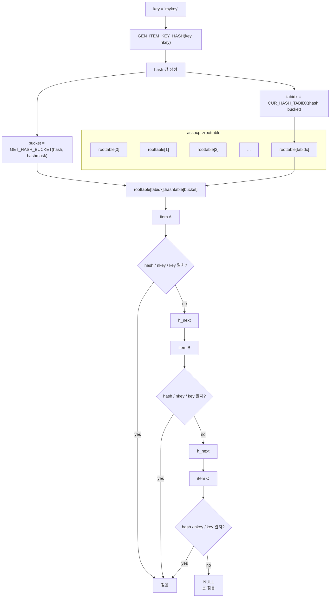
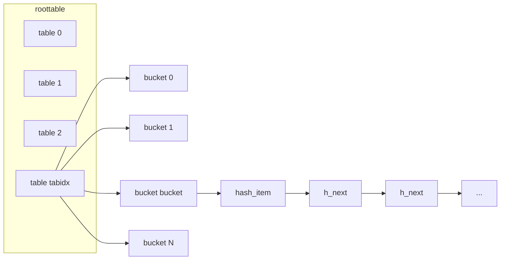

# arcus-memcached 엔진 GET 해시 조회 구조

`assoc_find()`가 실제로 어떤 구조를 따라 item을 찾는지 그림으로 정리한 문서다.

기준 소스:

- `engines/default/assoc.c`
- `engines/default/assoc.h`

---

## 전체 구조



핵심은 전체 item을 훑는 게 아니라:

1. `tabidx`로 해시 테이블 조각 하나를 고르고
2. 그 안에서 `bucket` 하나를 고르고
3. 그 버킷 체인만 `h_next`로 순차 탐색한다는 점이다.

여기서 `bucket`은 hash의 하위 비트로, `tabidx`는 hash의 그 다음 비트 구간으로 계산된다.

---

## 메모리 관점에서 보면



여기서 `bucket`은 "같은 해시 슬롯"이고, `h_next`는 그 슬롯에 충돌해서 같이 들어온 item들의 연결 리스트다.

즉:

- `tabidx`는 어느 테이블 조각을 볼지 결정
- `bucket`은 그 조각 안에서 어느 슬롯을 볼지 결정
- `h_next`는 그 슬롯 안의 충돌 후보들을 따라가는 링크

---

## 실제 계산식

소스의 핵심 매크로와 함수는 아래와 같다.

```c
#define GET_HASH_BUCKET(hash, mask)        ((hash) & (mask))
#define GET_HASH_TABIDX(hash, shift, mask) (((hash) >> (shift)) & (mask))
```

평상시에는 `CUR_HASH_TABIDX()`가 사실상 아래와 같은 값을 돌려준다.

```c
bucket = hash & hashmask;
tabidx = (hash >> hashpower) & rootmask;
```

즉:

- hash의 하위 비트는 `bucket`
- 그 다음 비트 구간은 `tabidx`

로 쓰인다.

그래서 `tabidx`는 "해시값으로 어느 구간인지 먼저 본다"는 직관이 맞지만, 더 정확히는 **roottable 안의 어느 hash table을 선택할지 정한다**고 이해하는 편이 좋다.

---

## 확장 중에는 왜 더 복잡해지나?

Arcus는 해시 테이블 확장 중에 모든 bucket을 한 번에 옮기지 않고, 진행 상태(`exp_bucket`, `exp_tabidx`)를 보면서 점진적으로 재배치한다.

그래서 `CUR_HASH_TABIDX()`는 단순히 `rootmask`만 쓰지 않고:

- 아직 확장되지 않은 bucket이면 `prevmask`
- 이미 확장된 bucket이면 `rootmask`
- 현재 확장 중인 bucket이면 `exp_tabidx`와 비교

를 통해 어느 table을 봐야 하는지 고른다.

즉 `tabidx`는 정적인 값이 아니라, **현재 expansion 상태까지 반영한 조회 대상 table index**다.

---

## 비교 순서가 중요한 이유

```c
if ((hash == it->khash) && (nkey == it->nkey) &&
    (memcmp(key, item_get_key(it), nkey) == 0)) {
    break;
}
```

비교는 다음 순서로 진행된다.

1. `hash` 비교
2. `nkey` 비교
3. `memcmp(key)` 비교

이 순서의 목적은 비싼 문자열 비교를 최대한 뒤로 미루는 것이다.

- `hash`가 다르면 바로 탈락
- `nkey`가 다르면 역시 바로 탈락
- 둘 다 맞을 때만 실제 key 바이트 비교

그래서 `hash_item`이 `khash`를 들고 있는 건 단순 캐시가 아니라, 조회 hot path를 줄이기 위한 최적화다.

---

## 왜 굳이 `roottable`까지 나누나?

단일 거대한 해시 배열 하나만 두는 대신, Arcus는 `roottable` 아래에 여러 hash table을 둔다. `assoc.h`를 보면:

- `hashsize`: 각 hash table의 bucket 수
- `rootsize`: 현재 hash table 개수
- `roottable`: hash table들의 배열

구조다.

이렇게 해 두면 해시 확장 시 전체 구조를 한 번에 갈아엎는 대신, table 단위로 점진 확장하고 조회 시에도 expansion 상태에 따라 올바른 table을 선택할 수 있다.

- 먼저 `tabidx`로 큰 범위를 줄인다
- 그 다음 `bucket`으로 후보를 더 줄인다
- 마지막으로 충돌 체인만 돈다

즉 "구간을 먼저 찾고, 그 구간 안에서 순차 탐색"이라는 이해는 맞다. 다만 그 구간은 단순 인덱스 범위라기보다 "선택된 해시 테이블 조각"에 더 가깝다.
