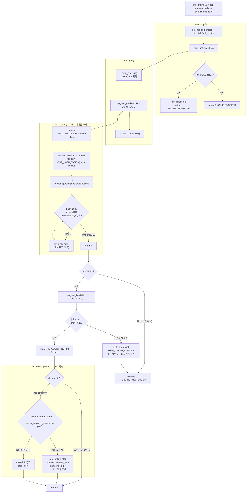

# arcus-memcached 엔진 GET 흐름



---

## default_get()

`mc_engine.v1->get()`로 진입하면 `default_engine.c`의 `default_get()`이 호출된다.

`mc_engine.v0`, `mc_engine.v1` 구조 자체가 헷갈리면 [엔진 인터페이스 구조 정리](./engine-interface.md)를 먼저 보는 편이 좋다.

```c
VBUCKET_GUARD(engine, vbucket);

ACTION_BEFORE_READ(cookie, key, nkey);
*item = item_get(key, nkey);
if (*item != NULL) {
    hash_item *it = get_real_item(*item);
    if (IS_COLL_ITEM(it)) { /* collection item */
        item_release(it);
        *item = NULL;
        return ENGINE_EBADTYPE;
    }
    return ENGINE_SUCCESS;
} else {
    return ENGINE_KEY_ENOENT;
}
```

`default_get()`은 크게 두 덩어리로 읽으면 된다.

1. 입구 처리
   `VBUCKET_GUARD`, `ACTION_BEFORE_READ`, `item_get()` 호출
2. 결과 해석
   `item_get()` 반환값을 보고 `ENGINE_KEY_ENOENT`, `ENGINE_EBADTYPE`, `ENGINE_SUCCESS` 중 하나로 정리

> [!NOTE]
> `default_get()`의 첫 줄에서 `ENGINE_HANDLE* handle`을 바로 `struct default_engine *engine = get_handle(handle);`로 바꾸는 이유는, 서버가 엔진을 **공통 인터페이스 타입**으로 넘기기 때문이다. 서버는 엔진 내부 구현을 모르고 `ENGINE_HANDLE*`만 넘기지만, default 엔진 구현체 내부에서는 `assoc`, `slabs`, `config`, `server` 같은 실제 내부 필드가 필요하다. 그래서 함수에 들어오자마자 "이 공통 핸들은 사실 `struct default_engine`의 앞부분이다"라고 보고 구현체 타입으로 다시 캐스팅해 사용하는 것이다.

### 1. 입구 처리

#### `VBUCKET_GUARD(engine, vbucket)`

이 요청이 현재 엔진이 처리해야 할 vbucket인지 먼저 확인한다. 처리 대상이 아니면 실제 조회로 들어가지 않고 바로 `ENGINE_NOT_MY_VBUCKET`를 반환한다.

즉 의미는:

- "이 partition은 내가 맡은 게 맞나?"
- 아니면 바로 거절

이다.

> [!NOTE]
> `vbucket`은 key 공간을 나눈 **논리 파티션 번호**다. "이 key를 어느 엔진/노드가 책임질지"를 구분하는 용도로 쓰인다. 해시 테이블 내부 조회에 쓰는 `bucket`과는 다른 개념이다. `bucket`이 해시 슬롯이라면, `vbucket`은 요청 라우팅과 소유권 판단을 위한 파티션 번호에 가깝다.
>
> 이 검사를 하는 이유는 "요청이 이 서버까지 도착했다"와 "이 서버가 그 파티션의 active 담당자다"가 항상 같은 뜻은 아니기 때문이다. 클라이언트가 오래된 라우팅 정보를 들고 있거나, failover / rebalance 중이면 잘못된 노드로 요청이 들어올 수 있다.
>
> `VBUCKET_GUARD`에서 걸리면 엔진은 다른 노드로 직접 포워딩하지 않고, 그냥 `ENGINE_NOT_MY_VBUCKET`를 반환한다. 즉 재라우팅이나 재시도는 엔진 밖의 상위 계층 책임이다.

#### `ACTION_BEFORE_READ(cookie, key, nkey)`

읽기 전에 실행되는 훅 포인트다. default engine에서는 현재 빈 매크로라서 아무 일도 하지 않는다.

```c
#define ACTION_BEFORE_READ(c, k, l)
```

즉 지금 구현에서는 no-op이지만, 엔진 레벨에서 읽기 전 로깅이나 확장 동작을 끼워 넣을 수 있도록 자리를 남겨둔 셈이다.

#### `*item = item_get(key, nkey)`

여기서 실제 캐시 조회 함수로 넘어간다.

- 해시 테이블 조회
- TTL / flush / prefix 유효성 검사
- `refcount++`
- 필요 시 LRU 갱신

을 거쳐 item 포인터를 반환한다.

즉 `default_get()` 입구 처리는:

1. 내가 처리할 요청인지(vbucket) 확인하고
2. 읽기 전 훅을 거친 뒤
3. `item_get()`으로 실제 조회를 수행하는 부분

### 2. 결과 해석

#### `if (*item != NULL)`

조회 결과가 있는지 확인한다.

- `NULL`이면 miss
- `NULL`이 아니면 일단 item을 찾은 상태

#### `hash_item *it = get_real_item(*item)`

인터페이스 타입인 `item*`를 default engine 내부 구현체 타입인 `hash_item*`로 다시 캐스팅한다.

#### `if (IS_COLL_ITEM(it))`

찾은 item이 일반 KV가 아니라 collection item인지 확인한다. `get` 명령은 KV item에만 유효하므로, collection item이면 타입 오류로 처리해야 한다.

```c
if (IS_COLL_ITEM(it)) { /* collection item */
    item_release(it);
    *item = NULL;
    return ENGINE_EBADTYPE;
}
```

여기서:

- `item_release(it)`는 `item_get()`에서 올린 `refcount`를 다시 내려주는 것
- `*item = NULL`은 상위 레이어가 이 포인터를 더 이상 쓰지 않게 하는 것
- `ENGINE_EBADTYPE`은 "키는 있지만 `get` 대상 타입이 아니다"라는 뜻

#### `return ENGINE_SUCCESS`

collection item이 아니면 정상적인 KV item이므로 성공이다. 이 뒤 상위 레이어가 item의 value를 응답으로 전송한다.

#### `return ENGINE_KEY_ENOENT`

`item_get()`이 `NULL`을 반환했다면 최종적으로 key를 찾지 못한 것이므로 miss 처리한다.

즉 `default_get()`은 `item_get()` 결과를 받아서:

- 없으면 `ENGINE_KEY_ENOENT`
- collection이면 `ENGINE_EBADTYPE`
- 일반 KV면 `ENGINE_SUCCESS`

로 정리해 반환하는 함수라고 보면 된다.

---

## item_get() — 락 경계

```c
hash_item *item_get(const void *key, const uint32_t nkey)
{
    hash_item *it;
    LOCK_CACHE();
    it = do_item_get(key, nkey, DO_UPDATE);
    UNLOCK_CACHE();
    return it;
}
```

`cache_lock` 하나가 해시 테이블, LRU 리스트, refcount를 모두 보호한다. `do_item_get()` 전체가 이 락 안에서 실행된다.

실제 구현은 `engines/default/items.c`에 있고, `item_release()`도 같은 `cache_lock` 아래에서 동작한다. 즉 조회 시 refcount를 올리고, 서버 레이어가 사용을 마친 뒤 다시 refcount를 내리는 생명주기 전체가 같은 락 규칙을 따른다.

### GET에도 왜 락이 필요한가?

겉으로 보면 `get`은 읽기라서 락이 없어도 될 것처럼 보이지만, Arcus의 `item_get()`은 단순 조회가 아니다. `do_item_get()` 안에서는:

- 해시 테이블 탐색
- 만료 item unlink
- `refcount++`
- 필요 시 LRU 위치 갱신

까지 함께 일어난다.

즉 `get`도 내부적으로는 **공유 자료구조를 수정하는 경로**이기 때문에 락이 필요하다.

### 그럼 다른 요청은 다 못 읽나?

정확히는 "다른 프로세스"보다 **같은 memcached 서버 안의 다른 worker thread**가 이 구간에 동시에 들어오지 못하게 막는 것이다.

`cache_lock`은 `pthread_mutex_t`이므로:

- 이 락을 잡은 thread 하나만 item/assoc/LRU 관련 공유 구조를 만질 수 있고
- 다른 worker thread는 같은 락을 잡으려 할 때 잠시 대기한다

즉 한 thread가 `item_get()` 안에서 `cache_lock`을 잡고 있으면, 다른 thread는 같은 엔진의 캐시 메타데이터를 동시에 읽고/수정하지 못한다.

이렇게 하는 이유는 예를 들어:

- 한 thread가 item을 조회하는 동안
- 다른 thread가 같은 item을 unlink/free 하거나
- LRU를 동시에 조작하는 race

를 막기 위해서다.

> [!NOTE]
> 조회와 해제가 동시에 올 수는 있지만, 둘 다 같은 `cache_lock`을 잡고 들어오기 때문에 **누가 먼저 락을 잡았는지에 따라 순서가 직렬화**된다.
>
> - 내가 먼저 락을 잡으면: `assoc_find -> 유효성 검사 -> refcount++`까지 안전하게 끝낸 뒤 락을 푼다.
> - 다른 thread가 먼저 락을 잡으면: 그쪽이 unlink/free 같은 상태 변경을 먼저 끝내고, 나는 나중에 들어와 이미 없어진 상태를 보게 된다.
>
> 즉 "조회 도중 해제"가 동시에 뒤섞이는 게 아니라, 같은 락 아래에서 한쪽이 먼저 상태를 확정하고 다른 쪽이 그 결과를 보게 되는 구조다.

### item_get()은 실제로 무엇을 하나?

`item_get()` 자체는 작업을 많이 하지 않고, **락을 잡고 `do_item_get()`을 호출하는 얇은 래퍼**에 가깝다.

즉 역할을 한 줄로 요약하면:

- `item_get()` = 락 경계
- `do_item_get()` = 실제 GET 핵심 로직

---

## do_item_get() — 실제 GET 핵심 로직

```c
hash_item *do_item_get(const char *key, const uint32_t nkey, bool do_update)
{
    hash_item *it = assoc_find(key, nkey, GEN_ITEM_KEY_HASH(key, nkey));
    if (it) {
        rel_time_t current_time = svcore->get_current_time();
        if (do_item_isvalid(it, current_time)) {
            ITEM_REFCOUNT_INCR(it);
            DEBUG_REFCNT(it, '+');
            if (do_update) {
                do_item_update(it, false);
            }
        } else {
            do_item_unlink(it, ITEM_UNLINK_INVALID);
            it = NULL;
        }
    }
    return it;
}
```

이 함수가 실제로 GET의 핵심이다. 순서를 보면:

1. `assoc_find()`로 key를 찾고
2. 찾았으면 `do_item_isvalid()`로 TTL/flush/prefix 유효성을 검사하고
3. 유효하면 `refcount++`
4. 필요하면 `do_item_update()`로 LRU 갱신
5. 유효하지 않으면 `do_item_unlink()` 후 `NULL`

즉 `do_item_get()`은 단순 lookup 함수가 아니라:

- 조회
- 유효성 판정
- 참조 보호
- LRU 관리

를 한 번에 묶어 둔 함수다.

### do_item_get() 한 줄씩 읽기

#### `hash_item *it = assoc_find(...)`

가장 먼저 해시 테이블에서 key를 찾는다. 이 단계의 `assoc_find()`는 정말 lookup만 담당한다.

- key가 있는지 찾기
- 충돌 체인 따라가기

만 할 뿐,

- TTL 검사
- `refcount++`
- LRU 갱신

은 하지 않는다.

즉 이 줄의 의미는 "해시 구조 안에 이 key가 있나?"다.

#### `if (it)`

찾았을 때만 그다음 처리를 한다. 못 찾았으면 `NULL` 그대로 반환하고 끝난다.

즉 `assoc_find()`가 실패한 경우는:

- key가 원래 없거나
- 이미 누가 삭제했거나
- 이미 해시 테이블에서 unlink된 경우

라고 보면 된다.

#### `rel_time_t current_time = svcore->get_current_time()`

현재 시간을 한 번 읽어 둔다. 이 값은 바로 뒤 두 판단에 공통으로 쓰인다.

- `do_item_isvalid()`에서 TTL / flush / prefix validity 검사
- `do_item_update()`에서 LRU 갱신 여부 판단

즉 GET 한 번 안에서 같은 시점 기준으로 판정하려고 현재 시각을 먼저 구하는 것이다.

#### `if (do_item_isvalid(it, current_time))`

해시 테이블에서 찾았다고 바로 성공은 아니다. 지금도 유효한 item인지 다시 확인한다.

여기서 보는 것은:

- TTL 만료
- `flush_all`로 무효화되었는지
- prefix invalid인지

다.

즉 "해시 테이블에 아직 남아 있다"와 "이번 GET 시점에 유효하다"는 같은 뜻이 아니다.

#### `ITEM_REFCOUNT_INCR(it)`

유효하면 먼저 `refcount`를 올린다.

이 순서가 중요한 이유는, 이제 이 item을 호출자 쪽으로 돌려줄 예정이므로 다른 thread가 중간에 free하지 못하게 먼저 pin 해야 하기 때문이다.

즉 순서는:

1. 찾았다
2. 유효하다
3. 이제 내가 쓸 것이니 `refcount++`

로 읽으면 된다.

#### `if (do_update) { do_item_update(it, false); }`

그다음 필요하면 LRU를 갱신한다.

`do_update`가 켜져 있으면:

- 이번 read를 최근 접근으로 반영할지 판단하고
- 너무 최근에 이미 갱신한 게 아니면 LRU 앞쪽으로 옮긴다

즉 refcount로 "이 item은 내가 잡았다"를 먼저 확정한 뒤, eviction 정책을 위한 접근 흔적을 반영하는 흐름이다.

#### `else { do_item_unlink(...); it = NULL; }`

찾긴 찾았는데 유효하지 않으면, 그 자리에서 invalid item으로 처리한다.

```c
do_item_unlink(it, ITEM_UNLINK_INVALID);
it = NULL;
```

왜 바로 unlink하냐면 Arcus가 lazy expiration 구조이기 때문이다. 별도 청소 스레드가 주기적으로 다 치우는 게 아니라, 누가 다시 건드렸을 때 "만료됐네" 하고 그 자리에서 정리한다.

그리고 `it = NULL`로 바꾸는 이유는 호출자 입장에서는 최종적으로 miss처럼 보이게 하기 위해서다.

즉:

- 해시 테이블에는 남아 있었을 수 있지만
- 이번 GET 기준으로는 miss

가 된다.

한 줄로 요약하면, `do_item_get()`은 "찾고 -> 유효성 검사하고 -> 유효하면 보호(refcount)하고 필요하면 LRU를 갱신하고 -> 무효하면 그 자리에서 unlink하는 함수"다.

아래 섹션들은 이 `do_item_get()`의 각 단계를 주제별로 풀어 쓴 것이다.

### 1. `assoc_find()` — 해시 테이블 조회

[해시 조회 구조 다이어그램 보기](./engine-get-hash-lookup.md)

```c
uint32_t bucket = GET_HASH_BUCKET(hash, assocp->hashmask);
uint32_t tabidx = CUR_HASH_TABIDX(hash, bucket);

it = assocp->roottable[tabidx].hashtable[bucket];
while (it) {
    if ((hash == it->khash) && (nkey == it->nkey) &&
        (memcmp(key, item_get_key(it), nkey) == 0)) {
        break;
    }
    it = it->h_next;
}
```

해시 테이블은 단일 배열이 아니라 **해시 테이블의 배열**(`roottable`)이다. `tabidx`로 어느 테이블인지 고르고, `bucket`으로 슬롯을 찾은 뒤 `h_next` 체인을 따라 탐색한다.

정확히는:

- `bucket = hash & hashmask`
- `tabidx = (hash >> hashpower) & rootmask`

형태로 계산된다. 다만 **hash expansion 중에는** `CUR_HASH_TABIDX()`가 `prevmask`, `rootmask`, `exp_bucket`, `exp_tabidx`를 함께 보고 어느 테이블을 볼지 결정한다. 즉 `tabidx`는 단순한 "구간 번호"라기보다, 현재 확장 상태를 반영한 **실제 해시 테이블 선택 결과**에 가깝다.

비교 순서에도 주목할 것: `hash` → `nkey` → `memcmp(key)`. 해시값과 길이를 먼저 비교해 `memcmp` 호출을 최대한 줄인다. `hash_item`이 `khash` 필드에 해시값을 미리 저장해두는 이유가 여기 있다.

---

### 2. `do_item_isvalid()` — lazy expiration

```c
if (it->exptime != 0 && it->exptime <= current_time) {
    return false; /* expired */
}
if (config->oldest_live != 0 &&
    config->oldest_live <= current_time && it->time <= config->oldest_live) {
    return false; /* flushed by flush_all */
}
if (prefix_isvalid(it, current_time) == false) {
    return false;
}
return true;
```

만료 여부를 세 가지 조건으로 검사한다:
1. **TTL 만료**: `exptime != 0 && exptime <= current_time`
2. **flush_all**: `flush_all` 명령이 실행된 시점보다 이전에 접근된 item
3. **prefix 무효**: prefix가 만료됐거나 삭제된 경우

유효하지 않으면 `do_item_unlink(ITEM_UNLINK_INVALID)`로 그 자리에서 해시 테이블과 LRU에서 제거한다. 별도 스레드가 주기적으로 청소하는 게 아니라 **조회 시점에 만료를 확인하고 제거**하는 구조다.

> [!NOTE]
> 이게 Arcus의 lazy expiration 특성이다. TTL이 지난 item도 누가 다시 조회하지 않으면 바로 사라지지 않을 수 있다. 즉 "만료 시각이 됨"과 "실제로 메모리에서 정리됨"은 같은 순간이 아니다.
>
> 여기서 "정리된다"는 말은 먼저 **해시 테이블과 LRU에서 unlink되어 더 이상 조회/관리되지 않는 상태**가 된다는 뜻에 가깝다. 실제 메모리 해제는 `refcount`가 0이 되었을 때 뒤이어 일어난다. 즉 `do_item_unlink()`가 곧바로 `free()`를 의미하는 것은 아니다.

---

### 3. `ITEM_REFCOUNT_INCR()` — 참조 카운트

item을 반환하기 전에 `refcount`를 증가시킨다. 서버 레이어(`memcached.c`)가 item을 사용하는 동안 엔진이 해당 메모리를 해제하지 못하게 막는 장치다. 서버가 응답 전송을 마치면 `item_release()`를 호출해 `refcount`를 감소시키고, 0이 되면 그때 메모리를 해제할 수 있다.

여기서 중요한 점은 **"캐시에 연결되어 있는가(ITEM_LINKED)"** 와 **"누군가 지금 이 메모리를 쓰고 있는가(refcount)"** 가 별개라는 것이다.

- `ITEM_LINKED`가 켜져 있으면 해시 테이블/LRU에 연결되어 있어 새 조회가 가능하다.
- `refcount > 0`이면 이미 어떤 요청이 이 item 포인터를 잡고 사용 중이다.

그래서 item이 TTL 만료나 delete, eviction으로 **unlink** 되더라도, 아직 어떤 요청이 응답 전송에 쓰는 중이면 바로 `free()`할 수 없다. 반대로 캐시에 계속 linked 상태여도, 지금 쓰는 요청이 없으면 `refcount`는 0일 수 있다.

> [!NOTE]
> `get`에서 `refcount++`를 하는 이유는 "조회 성공" 자체를 기록하려는 게 아니라, **응답 전송이 끝날 때까지 item 메모리를 pin 하기 위해서**다. 서버는 item을 찾은 뒤 value를 바로 복사하지 않고, 그 item 메모리를 가리키는 채로 응답을 만든다. 이때 다른 경로에서 TTL 만료, delete, replace, eviction이 일어나도, 현재 요청이 쓰는 메모리는 `item_release()` 전까지 살아 있어야 한다.

#### refcount == 0은 언제 확인하나?

`refcount`를 백그라운드에서 계속 감시하는 스레드가 있는 건 아니다. Arcus는 **상태 변화가 발생하는 함수 경계에서 즉석으로 검사**한다.

대표적인 시점은 두 군데다.

1. `do_item_unlink()`
   item을 해시 테이블/LRU에서 제거한 직후 `if (it->refcount == 0) do_item_free(it);`를 확인한다.
2. `do_item_release()`
   요청이 item 사용을 마치고 `refcount--` 한 직후 `if (it->refcount == 0)`를 확인한다.

즉 "캐시에서 제거될 때" 또는 "마지막 사용자가 손을 뗄 때" free 가능 여부를 판단한다.

---

### 4. TTL 경계에서 GET은 어떻게 동작하나?

기준은 `do_item_get()` 안의 `do_item_isvalid(it, current_time)` 검사 시점이다.

- 검사 시점에 아직 TTL이 안 지났으면 `get`은 성공한다.
- 검사 시점에 이미 TTL이 지났으면 `do_item_unlink(ITEM_UNLINK_INVALID)` 후 miss 처리된다.

즉 `get`은 **응답 전송 완료 시점**이 아니라 **유효성 검사 시점** 기준으로 성공/실패가 갈린다.

예를 들어:

- `99.999초`에 `do_item_get()`이 유효 판정을 내리고 `refcount++`
- `100.000초`에 TTL 만료
- `100.001초`에 응답 전송 중

이라면 이 요청은 이미 item을 잡았기 때문에 값을 정상적으로 받는다. 반면 그 뒤에 새로 들어온 `get`은 expired로 보고 실패할 수 있다.

#### getattr는 왜 조금 다르게 느껴지나?

`item_getattr()`도 내부적으로는 `do_item_get(key, nkey, DO_UPDATE)`를 호출해서 똑같이 유효성 검사를 하고 `refcount++` 한다. 하지만 실제 구현은 락 안에서 attribute를 읽어 `attr_data`에 복사한 뒤 곧바로 `do_item_release(it)`를 호출한다.

즉:

- `get`은 item/value 메모리를 응답 전송 동안 계속 들고 갈 수 있다.
- `getattr`는 필요한 속성만 복사해 온 뒤 item을 바로 release한다.

그래서 `getattr`는 "전송 도중 TTL이 지났다"는 상황이 실질적으로 덜 중요하다. 이미 검사 시점에 유효했다면 attribute는 읽어 왔고, 그 결과를 응답으로 보내면 된다.

---

### 5. `do_item_update()` — LRU 갱신

```c
} else if (it->time < (current_time - ITEM_UPDATE_INTERVAL)) {
    item_unlink_q(it);
    it->time = current_time;
    item_link_q(it);
}
```

`ITEM_UPDATE_INTERVAL`은 60초다. 접근할 때마다 LRU 맨 앞으로 올리는 게 아니라, **마지막 접근 이후 60초가 지났을 때만** 갱신한다. 매번 LRU 리스트를 수정하면 비용이 크기 때문.

이 갱신을 하는 이유는 나중에 **eviction이 필요할 때 최근에 접근한 item이 뒤로 밀려나지 않게 하기 위해서**다. 즉 `do_item_update()`는 "이 item은 최근에 다시 사용됐으니 eviction 후보에서 멀어져야 한다"는 정보를 LRU 순서에 반영하는 역할이다.

실제 호출은 `do_item_get()` 안에서 `do_item_update(it, false)` 형태로 이루어진다. 여기서 `false`는 force update가 아니라는 뜻이고, 그래서 `ITEM_UPDATE_INTERVAL` 조건을 만족할 때만 LRU를 만진다.

`item_unlink_q()`로 현재 위치에서 빼고, `it->time`을 현재 시각으로 갱신한 뒤 `item_link_q()`로 `heads[clsid]`에 다시 연결한다.

> [!NOTE]
> 여기서 목적과 최적화 조건을 분리해서 보는 게 중요하다.
>
> - **목적**: 최근에 다시 읽힌 item을 LRU head 쪽으로 옮겨서 eviction 후보에서 멀리 두는 것
> - **60초 조건**: 그 LRU 재배치를 GET마다 매번 하면 비용이 크므로, 일정 시간(`ITEM_UPDATE_INTERVAL`)이 지난 경우에만 다시 수행하는 것
>
> 즉 "60초가 지나야 올린다" 자체가 목적은 아니다. 원래 목적은 최근 사용 item을 eviction 후보에서 멀리 두는 것이고, 60초 조건은 그 작업을 너무 자주 하지 않기 위한 최적화다.

---

## TTL이 만료된 item은 언제 메모리에서 사라지나?

lazy expiration이라 **조회가 없으면 만료됐어도 메모리에 남아있다.** 실제 정리는 세 가지 경로로 일어난다:

**1. 조회 시 — `do_item_get()`**

해당 key를 누군가 다시 조회하면 `do_item_isvalid()` 검사에서 걸려 그 자리에서 제거된다.

**2. 신규 할당 시 — `do_item_mem_alloc()`**

슬랩에서 새 item을 할당할 때 메모리가 부족하면, LRU 리스트의 `lowMK`~`curMK` 구간을 스캔해서 만료된 item을 재활용(reclaim)한다.

```c
search = itemsp->lowMK[lruid];
while (search != NULL && search != itemsp->curMK[lruid]) {
    if (search->refcount == 0 && !do_item_isvalid(search, current_time)) {
        it = do_item_reclaim(search, ntotal, clsid, lruid);
        if (it != NULL) break;
    }
}
```

여기서도 안 되면 LRU tail에서 유효한 item을 eviction해서 공간을 확보한다.

**3. scrubber — 수동 트리거**

`item_scrubber_main()`이 해시 테이블 전체를 스캔해서 만료/stale item을 제거하는 백그라운드 스레드가 있지만, 자동으로 주기적으로 도는 게 아니라 **명시적으로 트리거해야** 한다.

| 상황 | 처리 |
|---|---|
| 해당 key 재조회 | `do_item_get()`에서 즉시 unlink |
| 신규 item 할당 시 메모리 부족 | `do_item_mem_alloc()`에서 LRU 구간 재활용 |
| scrubber 실행 | 해시 테이블 전체 스캔 후 제거 |
| 아무 일도 없음 | **메모리에 계속 남아있음** |

캐시 서버라는 특성상 "메모리가 꽉 차면 eviction 과정에서 어차피 처리된다"는 설계 철학이 깔려 있다.

---

## 말로 설명하는 정리본

"Arcus 엔진에서 GET이 들어오면 먼저 `default_get()`이 `item_get()`을 호출해서 item을 찾는다. `item_get()`은 `cache_lock`을 잡고 `do_item_get()`을 실행하는데, 여기서 해시 테이블 조회, TTL 유효성 검사, refcount 증가, 필요하면 LRU 갱신까지 한 번에 처리한다.

해시 테이블 조회는 `assoc_find()`가 담당하고, `roottable` 안에서 `tabidx`와 `bucket`을 계산해서 해당 체인만 따라간다. 그래서 전체를 다 뒤지는 게 아니라, 해시로 후보를 많이 줄인 다음 `h_next` 체인만 본다.

item을 찾았다고 바로 성공은 아니고, `do_item_isvalid()`로 TTL 만료나 `flush_all`, prefix invalid를 검사한다. 여기서 이미 만료됐으면 그 자리에서 `do_item_unlink(ITEM_UNLINK_INVALID)`로 캐시 구조에서 제거하고 miss 처리한다. Arcus는 이런 lazy expiration 구조라서, 누가 다시 조회할 때 만료를 확인하고 정리하는 편이다.

유효하면 `refcount++`를 한다. 이건 조회 성공 횟수를 세려는 게 아니라, 지금 이 요청이 응답 전송에 이 item 메모리를 사용할 거라서 free되지 않게 pin 하는 의미다. 그래서 item이 나중에 TTL 만료나 eviction으로 unlink되더라도, 아직 응답 전송 중이면 바로 free하지 않고 `item_release()`로 마지막 참조가 내려갈 때까지 기다린다.

그리고 `do_update`가 켜져 있으면 `do_item_update()`로 LRU도 갱신한다. 다만 GET마다 무조건 앞으로 옮기면 비용이 크니까, 마지막 갱신 후 60초가 지났을 때만 LRU head 쪽으로 다시 올린다. 이건 나중에 eviction이 필요할 때 최근에 읽힌 item이 덜 밀려나도록 하기 위한 동작이다.

마지막으로 `default_get()`은 반환된 item이 일반 KV인지, 컬렉션 item인지 확인한다. GET은 KV에만 유효하니까 컬렉션이면 `ENGINE_EBADTYPE`, 일반 item이면 `ENGINE_SUCCESS`, 못 찾았으면 `ENGINE_KEY_ENOENT`를 반환한다."

---

## 워크북

아래 질문에 스스로 답해보며 GET 흐름을 제대로 이해했는지 점검해보자.

### 핵심 흐름 점검

#### 1. `mc_engine.v1->get()` 호출 이후 실제로 어떤 함수 순서로 흘러가는가?

<details>
<summary>답안 보기</summary>

> [!NOTE]
> 대략 `default_get() -> item_get() -> do_item_get() -> assoc_find() -> do_item_isvalid() -> ITEM_REFCOUNT_INCR() -> do_item_update()` 순서로 흘러간다. 마지막에는 `default_get()`이 컬렉션 item 여부를 확인하고 `ENGINE_SUCCESS`, `ENGINE_EBADTYPE`, `ENGINE_KEY_ENOENT` 중 하나를 반환한다.

</details>

#### 2. `default_get()`과 `item_get()`의 역할은 각각 무엇인가?

<details>
<summary>답안 보기</summary>

> [!NOTE]
> `default_get()`은 엔진 API 진입점으로, item을 가져온 뒤 컬렉션 item인지 확인하고 최종 엔진 반환 코드를 정한다. `item_get()`은 `cache_lock`을 잡고 `do_item_get()`을 호출하는 락 경계 역할을 한다.

</details>

#### 3. `assoc_find()`는 왜 전체 item을 선형 탐색하지 않고 `tabidx`, `bucket`, `h_next`를 쓰는가?

<details>
<summary>답안 보기</summary>

> [!NOTE]
> 전체 item을 전부 뒤지면 느리기 때문이다. 해시값으로 먼저 `tabidx`와 `bucket`을 골라 탐색 범위를 줄이고, 같은 bucket에 충돌한 후보들만 `h_next` 체인으로 따라가면 된다.

</details>

#### 4. `do_item_get()` 안에서 "조회" 외에 같이 처리되는 일은 무엇이 있는가?

<details>
<summary>답안 보기</summary>

> [!NOTE]
> TTL/flush/prefix 유효성 검사, invalid item unlink, `refcount++`, 그리고 필요 시 `do_item_update()`를 통한 LRU 갱신까지 함께 처리한다.

</details>

### 유효성 검사 점검

#### 1. `do_item_isvalid()`가 확인하는 조건 세 가지는 무엇인가?

<details>
<summary>답안 보기</summary>

> [!NOTE]
> TTL 만료 여부, `flush_all`에 의해 무효화되었는지, prefix가 무효한지 세 가지를 확인한다.

</details>

#### 2. TTL이 지났다고 해서 item이 즉시 `free()`되지 않는 이유는 무엇인가?

<details>
<summary>답안 보기</summary>

> [!NOTE]
> TTL 만료는 우선 item을 invalid/unlink 상태로 만드는 것이고, 실제 메모리 해제는 `refcount == 0`일 때만 가능하기 때문이다. 아직 어떤 요청이 그 item 메모리를 쓰고 있으면 바로 free할 수 없다.

</details>

#### 3. lazy expiration이라고 부르는 이유를 자신의 말로 설명해보자.

<details>
<summary>답안 보기</summary>

> [!NOTE]
> TTL이 지났다고 즉시 백그라운드에서 제거하는 게 아니라, 누가 다시 조회하거나 메모리 재활용이 필요할 때 그제야 만료를 확인하고 정리하기 때문이다.

</details>

#### 4. `get` 요청이 들어왔을 때 miss가 되는 시점은 "전송 완료 시점"인가, "유효성 검사 시점"인가?

<details>
<summary>답안 보기</summary>

> [!NOTE]
> 유효성 검사 시점이다. `do_item_get()` 안에서 `do_item_isvalid()`를 확인할 때 이미 만료라면 그 자리에서 miss 처리된다.

</details>

### refcount 점검

#### 1. `get`에서 `refcount++`를 하는 이유는 무엇인가?

<details>
<summary>답안 보기</summary>

> [!NOTE]
> 응답 전송이 끝날 때까지 item 메모리를 안전하게 붙잡아 두기 위해서다. 조회 성공 직후 다른 경로에서 unlink가 일어나더라도 현재 요청이 쓰는 메모리를 바로 free하지 못하게 막는다.

</details>

#### 2. `ITEM_LINKED` 상태와 `refcount > 0` 상태는 왜 다른 개념인가?

<details>
<summary>답안 보기</summary>

> [!NOTE]
> `ITEM_LINKED`는 캐시 구조에 연결되어 새 조회가 가능한 상태를 뜻하고, `refcount > 0`은 지금 누군가 그 메모리를 사용 중임을 뜻한다. 캐시에서 제거됐어도 사용 중일 수 있고, 캐시에 남아 있어도 현재 사용자는 없을 수 있다.

</details>

#### 3. item이 unlink된 뒤에도 메모리가 남아 있을 수 있는 이유는 무엇인가?

<details>
<summary>답안 보기</summary>

> [!NOTE]
> unlink는 해시 테이블/LRU에서 제거하는 것이고, 메모리 해제는 아니다. 아직 `refcount > 0`이면 어떤 요청이 그 item을 사용 중이므로 free를 미룬다.

</details>

#### 4. `refcount == 0`은 백그라운드에서 계속 감시하는가, 아니면 특정 함수 경계에서 확인하는가?

<details>
<summary>답안 보기</summary>

> [!NOTE]
> 백그라운드 감시가 아니라 `do_item_unlink()`나 `do_item_release()` 같은 함수 경계에서 즉석으로 확인한다.

</details>

### LRU 점검

#### 1. `do_item_update()`는 왜 필요한가?

<details>
<summary>답안 보기</summary>

> [!NOTE]
> 최근에 다시 읽힌 item을 LRU 앞쪽으로 옮겨서, 나중에 eviction이 필요할 때 덜 버려지게 하기 위해 필요하다.

</details>

#### 2. 왜 GET마다 매번 LRU head로 옮기지 않고 `ITEM_UPDATE_INTERVAL`을 두는가?

<details>
<summary>답안 보기</summary>

> [!NOTE]
> 매번 LRU를 수정하면 비용이 크고 락 안에서의 작업량도 늘어나기 때문이다. 그래서 일정 시간 이상 지난 경우에만 갱신해서 비용을 줄인다.

</details>

#### 3. 최근에 읽힌 item을 LRU 앞쪽으로 올리는 것이 eviction과 어떤 관계가 있는가?

<details>
<summary>답안 보기</summary>

> [!NOTE]
> LRU tail 쪽이 eviction 후보가 되므로, 최근에 읽힌 item을 앞쪽으로 올려두면 메모리 부족 시 덜 희생된다.

</details>

#### 4. `do_item_update()`는 item의 존재 여부를 바꾸는가, 아니면 LRU 안에서의 위치만 바꾸는가?

<details>
<summary>답안 보기</summary>

> [!NOTE]
> 존재 여부를 바꾸는 게 아니라 LRU 안에서의 위치만 바꾼다. item을 삭제하거나 invalid 처리하는 역할은 아니다.

</details>

### 상황형 질문

#### 1. 어떤 item이 `99.999초`에는 유효하고 `100초`에 TTL 만료라면, `99.999초`에 시작한 `get`은 성공할까 실패할까?

<details>
<summary>답안 보기</summary>

> [!NOTE]
> 성공할 수 있다. `do_item_get()`의 유효성 검사 시점에는 아직 유효했기 때문에 item을 잡고 `refcount++` 한 뒤 응답을 진행할 수 있다.

</details>

#### 2. 어떤 item이 이미 TTL 만료 상태인데 아직 아무도 재조회하지 않았다면, 해시 테이블과 메모리에는 어떤 상태로 남아 있을 수 있을까?

<details>
<summary>답안 보기</summary>

> [!NOTE]
> lazy expiration이므로 아직 해시 테이블/LRU에 남아 있을 수 있고, 메모리도 그대로 남아 있을 수 있다. 다음 조회나 reclaim, scrubber 같은 경로에서 정리될 수 있다.

</details>

#### 3. `getattr`는 왜 `get`보다 "전송 도중 TTL 만료" 문제를 덜 신경 써도 되는가?

<details>
<summary>답안 보기</summary>

> [!NOTE]
> `getattr`는 item을 오래 들고 응답을 만드는 게 아니라, 락 안에서 attribute를 읽어 복사한 뒤 바로 release하기 때문이다.

</details>

#### 4. item이 TTL 만료로 unlink되었는데도 `free()`되지 않았다면, 어떤 상황을 의심해볼 수 있을까?

<details>
<summary>답안 보기</summary>

> [!NOTE]
> 아직 어떤 요청이나 내부 코드가 그 item을 참조 중이라 `refcount > 0`인 상황을 의심할 수 있다.

</details>

### 직접 설명 연습

아래 문장을 빈칸 없이 직접 말로 설명해보자.

#### 1. "Arcus 엔진 GET은 먼저 `_____`에서 시작해서 `_____`를 통해 item을 찾는다."

<details>
<summary>예시 답안 보기</summary>

> [!NOTE]
> `default_get()`에서 시작해서 `item_get()`와 `do_item_get()`을 통해 item을 찾는다.

</details>

#### 2. "item을 찾은 뒤 바로 반환하지 않고 `_____`로 TTL/flush/prefix를 검사한다."

<details>
<summary>예시 답안 보기</summary>

> [!NOTE]
> `do_item_isvalid()`로 TTL/flush/prefix를 검사한다.

</details>

#### 3. "유효하면 `refcount++`를 하는 이유는 `_____` 때문이다."

<details>
<summary>예시 답안 보기</summary>

> [!NOTE]
> 응답 전송이 끝날 때까지 item 메모리를 안전하게 pin 해야 하기 때문이다.

</details>

#### 4. "TTL 만료 item이 바로 free되지 않을 수 있는 이유는 `_____` 때문이다."

<details>
<summary>예시 답안 보기</summary>

> [!NOTE]
> unlink와 free가 다르고, 아직 `refcount > 0`인 참조자가 남아 있을 수 있기 때문이다.

</details>

#### 5. "LRU 갱신은 eviction 시 `_____`를 덜 버리기 위해 필요하다."

<details>
<summary>예시 답안 보기</summary>

> [!NOTE]
> 최근에 접근한 item을 덜 버리기 위해 필요하다.

</details>
