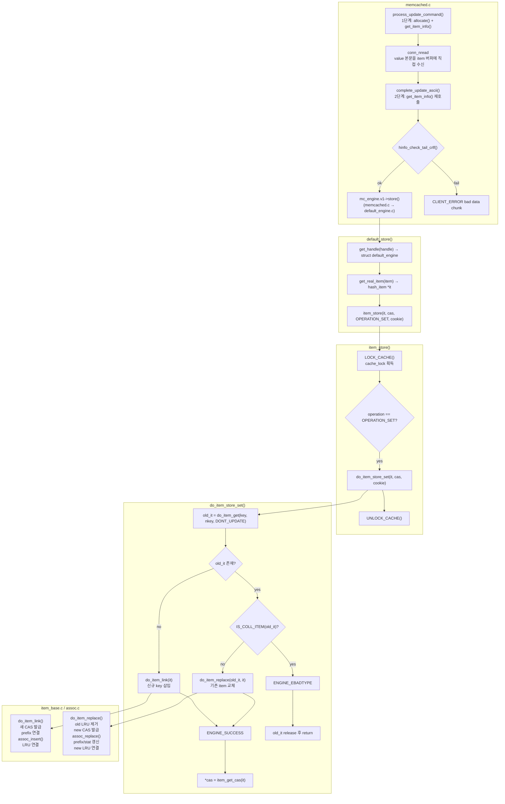

# arcus-memcached 엔진 SET 흐름



---

## 한 줄 요약

`set`은 서버 레이어에서 **item 메모리를 먼저 만들고 value를 채운 뒤**, 엔진 레이어에서 **같은 key가 있으면 replace, 없으면 link**로 반영된다.

즉 의미상으로는:

- 없으면 새로 넣기
- 있으면 덮어쓰기

이고, 이 로직의 핵심은 `engines/default/items.c`의 `do_item_store_set()`에 있다.

---

## 전체 호출 흐름

ASCII `set mykey 0 0 5\r\nhello\r\n` 요청은 크게 두 단계로 흘러간다.

1. 서버가 item을 할당하고 value를 받을 준비를 한다.
2. value를 다 받은 뒤 엔진에 저장을 요청한다.

실제 함수 흐름만 뽑으면:

```c
process_command_ascii()
  -> process_update_command(..., OPERATION_SET, false)
     -> mc_engine.v1->allocate(...)
     -> mc_engine.v1->get_item_info(...)   // value 버퍼 주소 확인
     -> conn_nread로 전환

value 본문 수신 완료

complete_update_ascii()
  -> mc_engine.v1->get_item_info(...)      // hinfo 재확인
  -> hinfo_check_tail_crlf(...)
  -> mc_engine.v1->store(...)
     -> default_store()
     -> item_store(..., OPERATION_SET, ...)
     -> do_item_store_set()
```

중요한 점은, `allocate()` 시점에는 아직 해시 테이블에 들어가지 않았고, `store()`가 호출되는 시점에야 비로소 캐시에 반영된다는 것이다.

이 문서는 아래 순서로 읽으면 흐름이 자연스럽다.

1. 서버 레이어의 2단계 처리
2. `default_store()` / `item_store()`
3. `do_item_store_set()`의 `link` / `replace`
4. `assoc_replace()`와 `_hashitem_before()`
5. `do_item_get()` / `do_item_release()` / LRU

---

## 1단계: process_update_command()

`set`이 들어오면 `memcached.c`의 `process_command_ascii()`가 `process_update_command(..., OPERATION_SET, false)`를 호출한다.

여기서 하는 일은:

- key / flags / exptime / vlen 파싱
- `vlen += 2`로 `\r\n`까지 포함한 길이 계산
- `mc_engine.v1->allocate()`로 item 메모리 확보
- `mc_engine.v1->get_item_info()`로 value 버퍼 위치 확인
- `c->item`, `c->store_op` 저장
- `conn_nread` 상태로 전환

즉 이 단계는 "저장"이 아니라 **받아둘 item 그릇을 만드는 단계**다.

### `mc_engine.v1->allocate()`는 어디로 가나?

`process_update_command()` 안의:

```c
ret = mc_engine.v1->allocate(mc_engine.v0, c, &it, key, nkey, vlen,
                             htonl(flags), realtime(exptime), req_cas_id);
```

는 엔진 인터페이스의 `allocate` 함수 포인터를 호출하는 것이다.

default engine이 로드된 상태라면 이 호출은 결국 `default_engine.c`의 `default_item_allocate()`로 연결된다.

흐름만 뽑으면:

```c
memcached.c
  -> mc_engine.v1->allocate(...)
     -> default_item_allocate(...)
        -> item_alloc(...)
```

즉:

- `mc_engine.v1->allocate(...)`
  서버가 엔진 인터페이스를 통해 "item 하나 만들어 달라"고 요청하는 호출
- `default_item_allocate()`
  default engine 쪽 allocate 구현체
- `item_alloc()`
  실제 item 메모리 확보를 담당하는 하위 레이어

라고 보면 된다.

`default_item_allocate()`의 역할은:

1. 현재 key/value 크기에 맞는 slab class가 존재하는지 확인
2. `item_alloc()` 호출
3. 성공하면 CAS를 세팅하고 item 포인터를 돌려줌

이다.

즉 여기서는 아직 캐시에 넣지 않고, **새 item 객체를 만들기만 한다**는 점이 중요하다.

이 시점의 item은:

- 메모리는 존재하지만
- 해시 테이블에도 없고
- LRU에도 없고
- 아직 key lookup으로 찾을 수도 없다

는 상태다.

그래서 `allocate()`는 "저장"이라기보다 **저장을 위한 빈 item 준비**에 가깝다.

`default_item_allocate()` 아래의 `item_alloc() -> do_item_alloc() -> do_item_mem_alloc()` 경로는 메모리 확보 정책까지 포함해 내용이 길어지므로, 별도 문서인 [Engine ALLOCATE](./engine-allocate.md)에서 따로 정리했다.

### 왜 여기서 `get_item_info()`를 하나?

할당된 item 안에서 value가 들어갈 버퍼 주소를 알아내기 위해서다.

서버 코드는 엔진 내부의 `hash_item` 구조를 직접 알지 못한다. 그래서 엔진에게:

- "이 item의 key/value 메타 정보를 표준 형식으로 알려줘"

라고 묻고, 그 결과를 `c->hinfo`로 받는다.

그 후 `ritem_set_first()`가 `c->hinfo` 안의 value 포인터를 이용해:

- `c->ritem` = 실제 수신 버퍼 주소
- `c->rlbytes` = 앞으로 읽어야 할 바이트 수

를 세팅한다.

즉 첫 번째 `get_item_info()`의 목적은:

- **value를 어디에 써야 하는지 알기 위해서**

이다.

---

## 바디 수신

`conn_nread` 상태에서는 소켓에서 들어오는 value 본문을 `c->ritem`이 가리키는 위치에 그대로 쓴다.

즉:

- 별도 임시 버퍼에 받았다가 복사하는 게 아니라
- item 내부 value 버퍼에 직접 수신한다

는 점이 핵심이다.

`set mykey 0 0 5\r\nhello\r\n`라면 실제로는 `hello\r\n` 7바이트가 item 버퍼에 채워진다.

---

## 2단계: complete_update_ascii()

value 수신이 완료되면 `complete_update_ascii()`가 호출된다.

일반 KV `set`에서는 여기서:

1. `get_item_info()`를 다시 호출하고
2. `hinfo_check_tail_crlf()`로 value 끝의 `\r\n`을 검증하고
3. `mc_engine.v1->store()`를 호출한다

### 왜 `get_item_info()`를 또 하나?

핵심은 "아이템을 바꾸려고 해서"가 아니라, **서버가 다시 item 내부 데이터에 접근해야 하기 때문**이다.

이 시점에 서버는:

- value 버퍼를 다시 표준 인터페이스로 확인해야 하고
- 그 버퍼 끝에 `\r\n`이 맞는지 검사해야 한다

따라서 `get_item_info()`를 다시 불러 `c->hinfo`를 채운 뒤 `hinfo_check_tail_crlf()`를 수행한다.

즉 두 번째 `get_item_info()`의 목적은 **검증을 위해 item 내용을 다시 표준 뷰로 꺼내기 위해서**다.

> [!NOTE]
> 여기서 `get_item_info()`는
> - 서버가 엔진 내부 item을 직접 볼 수 없기 때문에
> - item의 key/value 메타 정보에 접근해야 할 때 호출하는 인터페이스
>
> 라고 이해하는 편이 맞다.

---

## default_store()

`mc_engine.v1->store()`는 default engine 기준으로 `default_engine.c`의 `default_store()`로 들어간다.

```c
static ENGINE_ERROR_CODE
default_store(ENGINE_HANDLE* handle, const void *cookie,
              item* item, uint64_t *cas, ENGINE_STORE_OPERATION operation,
              uint16_t vbucket)
{
    struct default_engine *engine = get_handle(handle);
    hash_item *it = get_real_item(item);
    ENGINE_ERROR_CODE ret;
    VBUCKET_GUARD(engine, vbucket);

    ACTION_BEFORE_WRITE(cookie, item_get_key(it), it->nkey);
    ret = item_store(it, cas, operation, cookie);
    ACTION_AFTER_WRITE(cookie, engine, ret);
    return ret;
}
```

이 함수는 실제 저장 의미를 직접 구현하지 않고:

- 공통 핸들을 `struct default_engine *`로 바꾸고
- `item*`를 내부 타입 `hash_item*`로 바꾸고
- `item_store()`에 위임하는

얇은 래퍼 역할을 한다.

---

## item_store()

`items.c`의 `item_store()`는 락을 잡고 operation별 분기를 탄다.

`set`의 경우:

```c
LOCK_CACHE();
switch (operation) {
  case OPERATION_SET:
       ret = do_item_store_set(item, cas, cookie);
       break;
  ...
}
UNLOCK_CACHE();
```

즉 실제 `set` semantics는 `do_item_store_set()`에 있다.

여기서 `cache_lock`을 잡는 이유는 해시 테이블, LRU, refcount, prefix/stat 갱신이 모두 공유 자료구조 변경이기 때문이다.

---

## do_item_store_set()

`set`의 핵심 구현은 매우 단순하다.

```c
old_it = do_item_get(item_get_key(it), it->nkey, DONT_UPDATE);
if (old_it) {
    if (IS_COLL_ITEM(old_it)) {
        stored = ENGINE_EBADTYPE;
    } else {
        do_item_replace(old_it, it);
        stored = ENGINE_SUCCESS;
    }
    do_item_release(old_it);
} else {
    stored = do_item_link(it);
}
if (stored == ENGINE_SUCCESS) {
    *cas = item_get_cas(it);
}
```

핵심만 보면:

- 기존 key가 있으면
  - collection item이면 타입 오류
  - 일반 KV면 `do_item_replace()`로 교체
- 기존 key가 없으면 `do_item_link()`로 신규 삽입

즉 `set`은 내부적으로:

- **있으면 replace**
- **없으면 link**

다.

### `link` vs `replace`

| 구분 | link | replace |
| --- | --- | --- |
| 언제 | 기존 key가 없을 때 | 기존 key가 이미 있을 때 |
| 대상 | 새 item을 처음 캐시에 등록 | old item 자리를 new item으로 교체 |
| 해시 테이블 | 새 엔트리 추가 | 같은 key 위치의 포인터를 old → new로 교체 |
| LRU | 새 item을 LRU에 연결 | old를 LRU에서 빼고 new를 다시 연결 |

`replace`는 old item 메모리를 제자리에서 고치는 방식이 아니다. `set` 경로에서 이미 새 item을 `allocate()`해서 value까지 채워둔 뒤, 최종 저장 단계에서 그 새 item을 기존 key 위치에 갈아끼운다.

---

## do_item_link() — 신규 삽입

기존 key가 없을 때는 `do_item_link()`가 호출된다.

여기서 일어나는 일은:

1. 새 CAS 발급
2. prefix 정보 연결
3. hash 계산 후 `assoc_insert()`로 해시 테이블 등록
4. LRU 큐 연결
5. 통계 갱신

즉 "새 item을 캐시에 등장시키는 작업 전체"를 담당한다.

해시 테이블 등록은 `assoc.c`의 `assoc_insert()`가 맡는다. bucket을 계산해 해당 체인의 맨 앞에 item을 꽂는 전형적인 hash chaining 방식이다.

---

## do_item_replace() — 기존 item 교체

기존 key가 있을 때는 `do_item_replace(old_it, new_it)`가 호출된다.

핵심 순서는:

1. old item을 LRU에서 제거
2. new item에 새 CAS 발급
3. old item의 key hash를 new item이 이어받음
4. `assoc_replace()`로 해시 체인에서 old를 new로 치환
5. prefix / 통계 정보 갱신
6. old item 정리
7. new item을 LRU에 다시 연결

즉 `replace`는 "old를 지우고 새로 insert"라기보다, **해시 테이블과 LRU 안에서 old를 new로 바꿔 끼우는 작업**에 가깝다. `assoc_replace()`는 그중 해시 테이블 쪽 교체를 담당한다.

### `do_item_replace()`를 코드 순서대로 보면

```c
item_unlink_q(old_it);

item_set_cas(new_it, get_cas_id());
new_it->iflag |= ITEM_LINKED;
new_it->time = svcore->get_current_time();
new_it->khash = old_it->khash;

assoc_replace(old_it, new_it);
old_it->iflag &= ~ITEM_LINKED;

new_it->pfxptr = old_it->pfxptr;
old_it->pfxptr = NULL;

do_item_stat_replace(old_it, new_it);

if (old_it->refcount == 0) {
    do_item_free(old_it);
}

item_link_q(new_it);
```

읽는 포인트는 다음 네 가지다.

1. `item_unlink_q(old_it)`
   old item을 LRU에서 먼저 뺀다.
   이 함수는 old item을 해시 테이블에서 제거하는 게 아니라, LRU doubly linked list에서만 떼어낸다.

2. `assoc_replace(old_it, new_it)`
   해시 체인에서 old item 포인터를 new item 포인터로 바꾼다.
   즉 key lookup 결과가 이제 old가 아니라 new를 가리키게 된다.

3. `pfxptr`, stat, CAS 이전
   old item이 들고 있던 prefix 맥락과 통계 맥락을 new item으로 넘긴다.
   그리고 새 CAS를 부여해 "새 버전의 item"이라는 점을 반영한다.

4. `item_link_q(new_it)`
   마지막으로 new item을 LRU 맨 앞에 다시 연결한다.
   즉 교체가 끝난 새 item이 최신 접근 객체처럼 LRU에 편입된다.

### 왜 `item_unlink_q()`와 `item_link_q()`를 둘 다 하나?

`replace`는 단순히 value만 덮어쓰는 작업이 아니라, **old item 객체를 new item 객체로 교체하는 작업**이기 때문이다.

LRU는 item 객체 포인터들로 연결된 doubly linked list라서:

- old item은 기존 위치에서 빼야 하고
- new item은 새 객체이므로 다시 리스트에 연결해야 한다

즉:

- `item_unlink_q(old_it)`는 old 노드를 LRU 리스트에서 제거
- `item_link_q(new_it)`는 new 노드를 LRU 리스트 head에 삽입

하는 역할이다.

### 왜 `assoc_replace()`가 필요한가?

해시 테이블도 old item 포인터를 들고 있기 때문이다.

lookup 관점에서 보면:

- 교체 전: key -> old_it
- 교체 후: key -> new_it

가 되어야 한다.

그래서 `assoc_replace()`는 해당 key가 달려 있던 해시 체인 위치에서 old를 new로 바꿔 끼운다.

```c
new_it->h_next = old_it->h_next;
*before = new_it;
old_it->h_next = NULL;
```

즉 체인을 새로 다시 만드는 게 아니라, **같은 자리에서 연결 대상만 교체**하는 식이다.

### 그럼 old item은 언제 free 되나?

여기서 중요한 점은 `do_item_replace()`가 old item을 LRU와 해시 테이블에서 제거하더라도, **바로 free까지 하는 것은 아니라는 것**이다.

이유는 `old_it`를 현재 상위 호출자가 아직 들고 있기 때문이다.

`do_item_store_set()`는 먼저:

```c
old_it = do_item_get(item_get_key(it), it->nkey, DONT_UPDATE);
```

로 old item을 가져오는데, 이때 `do_item_get()`이 `ITEM_REFCOUNT_INCR(it)`를 수행해서 참조 카운트를 올린다.

즉 `old_it`는:

- 캐시 구조 안의 객체이기도 하고
- 현재 함수가 들고 있는 참조 대상이기도 하다

그래서 `do_item_replace()` 안에서는 old item을:

- LRU에서 빼고
- 해시 테이블에서 new item으로 대체하고
- `ITEM_LINKED` 플래그를 끄지만

**아직 누군가가 참조 중일 수 있으므로 곧바로 free하면 안 된다.**

이 때문에 `do_item_replace()` 안의 free는:

```c
if (old_it->refcount == 0) {
    do_item_free(old_it);
}
```

처럼 "정말 아무 참조도 없을 때만" 수행된다.

실제 `set` 경로에서는 보통 곧바로 free되지 않고, 상위 함수가 마지막으로:

```c
do_item_release(old_it);
```

를 호출할 때 refcount가 감소한다.

그 뒤 `do_item_release()`는:

- refcount가 0이고
- 이미 `ITEM_LINKED`도 꺼져 있으면

그 시점에 `do_item_free(old_it)`를 수행한다.

즉 old item의 생명주기는 이렇게 보면 된다.

1. `do_item_get()`가 old item을 찾아 refcount를 올린다
2. `do_item_replace()`가 old item을 캐시 구조에서 제거한다
3. 하지만 상위 함수가 아직 old item 포인터를 들고 있으므로 메모리는 남아 있다
4. 마지막 `do_item_release(old_it)`에서 refcount가 0이 되면 그때 free된다

즉 Arcus는 **캐시 구조에서 제거하는 것**과 **실제 메모리를 해제하는 것**을 분리해서 처리한다.

### `assoc_replace()`는 해시 체인에서 뭘 하나?

`assoc_replace()`의 핵심은 old item 자체를 수정하는 것이 아니라, **old item을 가리키고 있던 링크를 new item으로 교체하는 것**이다.

코드는 이렇게 생겼다.

```c
hash_item **before = _hashitem_before(item_get_key(old_it), old_it->nkey, old_it->khash);

new_it->h_next = old_it->h_next;
*before = new_it;
old_it->h_next = NULL;
```

여기서 중요한 점은 `before`의 타입이 `hash_item **`라는 것이다.

이건 "old item 이전 노드"를 가리키는 게 아니라, **old item을 가리키고 있는 포인터 슬롯의 주소**를 가리킨다.

예를 들어 해시 체인이:

```text
bucket_head -> A -> old_it -> C -> NULL
```

처럼 생겼다면 `before`는 `&A->h_next`가 된다.

만약 old item이 체인 맨 앞이라면:

```text
bucket_head -> old_it -> C -> NULL
```

이 경우 `before`는 `&bucket_head`가 된다.

그래서 `*before = new_it` 한 줄로:

- old가 중간에 있든
- old가 맨 앞에 있든

같은 방식으로 교체할 수 있다.

순서를 해석하면:

1. `new_it->h_next = old_it->h_next`
   new item 뒤에 old item의 다음 체인을 그대로 붙인다

2. `*before = new_it`
   old를 가리키던 링크를 new로 바꾼다

3. `old_it->h_next = NULL`
   old를 체인에서 완전히 분리한다

즉 결과는:

```text
bucket_head -> A -> old_it -> C -> NULL
```

가

```text
bucket_head -> A -> new_it -> C -> NULL
```

로 바뀌는 것이다.

한 줄로 말하면, `assoc_replace()`는 해시 체인을 새로 만드는 게 아니라 **같은 자리에서 old 포인터를 new 포인터로 갈아끼우는 함수**다.

### `_hashitem_before()`는 뭘 찾는 함수인가?

`assoc_replace()`를 이해하려면 `_hashitem_before()`의 반환값을 어떻게 해석해야 하는지가 중요하다.

이 함수는 old item 자신을 반환하는 게 아니라, **old item을 가리키고 있는 포인터 슬롯의 주소**를 반환한다.

즉 찾는 대상은:

- `old_it`

가 아니라

- `&bucket_head`
- 또는 `&prev->h_next`

같은 값이다.

그래서 반환 타입도 `hash_item *`가 아니라 `hash_item **`다.

코드 모양은 이렇게 생겼다.

```c
static hash_item** _hashitem_before(const char *key, const uint32_t nkey, uint32_t hash)
{
    hash_item **pos;
    uint32_t bucket = GET_HASH_BUCKET(hash, assocp->hashmask);
    uint32_t tabidx = CUR_HASH_TABIDX(hash, bucket);

    pos = &assocp->roottable[tabidx].hashtable[bucket];
    while (*pos && ((nkey != (*pos)->nkey) || memcmp(key, item_get_key(*pos), nkey))) {
        pos = &(*pos)->h_next;
    }
    return pos;
}
```

읽는 방법은 다음과 같다.

1. `pos = &bucket_head`
   체인 맨 앞 포인터의 주소에서 시작한다

2. `*pos`는 현재 노드
   처음에는 bucket head가 가리키는 첫 item이다

3. 일치하지 않으면 `pos = &(*pos)->h_next`
   즉 "다음 노드"로 이동하는 게 아니라, **다음 노드를 가리키는 포인터의 주소**로 이동한다

4. 루프가 끝나면 `pos`는
   - 찾은 item을 가리키는 포인터 슬롯
   - 또는 못 찾았을 경우 `NULL`이 들어 있는 마지막 슬롯
   을 가리킨다

예를 들어 체인이:

```text
bucket_head -> A -> old_it -> C -> NULL
```

라면 순회 과정은 이런 느낌이다.

```text
pos = &bucket_head
*pos = A

pos = &A->h_next
*pos = old_it
```

여기서 키가 일치하면 `_hashitem_before()`는 `&A->h_next`를 반환한다.

그래서 호출 쪽에서:

```c
*before = new_it;
```

를 수행하면 곧바로:

```text
A->h_next = new_it
```

가 되어 old 자리를 new로 교체할 수 있다.

만약 old item이 체인 맨 앞이었다면 `before`는 `&bucket_head`가 되므로:

```c
*before = new_it;
```

는 곧:

```text
bucket_head = new_it
```

가 된다.

즉 `_hashitem_before()`의 핵심은 단순히 "이전 노드 찾기"가 아니다.

더 정확히는, **현재 노드를 가리키고 있는 링크 슬롯의 주소를 찾는 것**이다.

이렇게 설계한 이유는 head 케이스와 중간 노드 케이스를 같은 방식으로 처리하기 위해서다.

- head인 경우에는 `prev->h_next` 같은 것이 없으므로, 현재 노드를 가리키는 링크는 곧 `bucket_head` 자체다
- 중간 노드인 경우에는 현재 노드를 가리키는 링크가 `prev->h_next`다

즉 `_hashitem_before()`는 상황에 따라:

- `&bucket_head`
- `&prev->h_next`

를 반환하고, 호출하는 쪽은 이를 `hash_item **before`로 받아 `*before = new_it` 한 줄로 공통 처리할 수 있다.

이 설계 덕분에 `assoc_replace()`는 맨 앞 노드 교체와 중간 노드 교체를 별도 분기 없이 같은 코드로 처리할 수 있다.

---

## `get_item_info()` 타이밍 정리

질문 포인트였던 `get_item_info()`는 `set` 경로에서 두 번 호출된다.

### 첫 번째: allocate 직후

목적:

- 새 item 안의 value 버퍼 주소를 알아내기 위해

쓰임:

- `c->ritem` / `c->rlbytes` 세팅
- 이후 소켓에서 읽은 value를 item 버퍼로 직접 기록

즉 이 호출은 **수신 준비**를 위한 것이다.

### 두 번째: store 직전

목적:

- value 버퍼를 다시 표준 인터페이스로 확인하고
- `\r\n` 검증을 하기 위해

쓰임:

- `hinfo_check_tail_crlf(&c->hinfo)`

즉 이 호출은 **검증 준비**를 위한 것이다.

### 결론

`get_item_info()`는:

- "이제 아이템을 수정하려고 한다"의 신호가 아니라
- **서버가 엔진 item 내부 데이터에 접근해야 하는 순간**에 호출되는 인터페이스

라고 이해하면 된다.

---

## `do_item_get()`은 왜 중요한가?

`set`의 최종 저장 단계에서 `do_item_store_set()`는 먼저 기존 key가 있는지 확인하기 위해:

```c
old_it = do_item_get(item_get_key(it), it->nkey, DONT_UPDATE);
```

를 호출한다.

즉 `set`도 내부적으로는 먼저 "기존 item 조회"를 수행한 뒤 `replace` 또는 `link`를 결정한다.

`do_item_get()`의 구현은 짧지만 의미가 많다.

```c
hash_item *do_item_get(const char *key, const uint32_t nkey, bool do_update)
{
    hash_item *it = assoc_find(key, nkey, GEN_ITEM_KEY_HASH(key, nkey));
    if (it) {
        rel_time_t current_time = svcore->get_current_time();
        if (do_item_isvalid(it, current_time)) {
            ITEM_REFCOUNT_INCR(it);
            if (do_update) {
                do_item_update(it, false);
            }
        } else {
            do_item_unlink(it, ITEM_UNLINK_INVALID);
            it = NULL;
        }
    }
    return it;
}
```

이 함수는 크게 네 단계로 읽으면 된다.

1. `assoc_find()`로 해시 테이블에서 key 조회
2. 찾았으면 `do_item_isvalid()`로 만료/flush/prefix 무효 여부 확인
3. 유효하면 `refcount++`
4. 필요하면 `do_item_update()`로 LRU 갱신

즉 `do_item_get()`는 단순 lookup 함수가 아니라 조회, 유효성 검사, 참조 보호, 필요 시 LRU 갱신을 묶어둔 함수다.

### 왜 `refcount`를 올리나?

찾아온 item을 호출자가 잠시 들고 있어도 안전하도록 만들기 위해서다.

`do_item_get()`가 반환한 item은 이후 상위 코드가:

- 타입 검사
- replace 여부 판단
- value 접근

같은 작업을 할 동안 살아 있어야 한다.

그래서 `do_item_get()`는 item을 반환하기 전에 `ITEM_REFCOUNT_INCR(it)`를 호출해:

- "이 item은 지금 누군가가 사용 중이다"

라는 상태를 만든다.

그 후 상위 함수가 일을 마치면 `do_item_release(it)`를 호출해 참조를 내려준다. 즉 `get`은 참조를 빌려오는 것이고 `release`는 그 참조를 반납하는 것이다.

### old item 확인은 `DONT_UPDATE`, 새 item 반영은 별도 LRU 연결

`do_item_get()`의 `do_update` 인자는 조회한 item의 LRU를 갱신할지 여부를 뜻한다.

- `DO_UPDATE`
  실제 read access로 간주하고, 오래된 item이면 LRU 앞으로 당김

- `DONT_UPDATE`
  단순 존재 확인이나 내부 판단 용도라서 LRU 순서를 건드리지 않음

`set`의 `do_item_store_set()`는 먼저 old item을 확인하기 위해:

```c
old_it = do_item_get(item_get_key(it), it->nkey, DONT_UPDATE);
```

를 호출한다.

여기서 old item 조회는:

- 기존 key가 있는지 확인하고
- 있으면 교체할지 판단하려는 것

이 목적이므로 `DONT_UPDATE`를 사용한다.

즉 old item은 "읽어서 계속 사용할 대상"이 아니라 곧 교체될 수 있는 기존 객체이므로, 존재 확인만 하고 LRU 갱신은 하지 않는다.

### `DO_UPDATE`일 때는 뭘 하나?

`do_item_update(it, false)`는 item이 linked 상태일 때 현재 시간 기준으로 충분히 오래됐으면:

- `item_unlink_q(it)`
- `it->time = current_time`
- `item_link_q(it)`

를 수행해 LRU 앞쪽으로 다시 연결한다.

즉 일반적인 `get`에서는 item 접근이 LRU recency에도 반영되지만, `set`의 old item 확인은 그런 의미의 read가 아니어서 `DONT_UPDATE`를 쓴다.

반대로 실제 새 item이 캐시에 반영될 때는 LRU 갱신이 다른 경로로 일어난다.

- 기존 key가 없으면 `do_item_link(new_it)`에서 `item_link_q(new_it)`를 호출
- 기존 key가 있으면 `do_item_replace(old_it, new_it)`에서 `item_unlink_q(old_it)` 후 `item_link_q(new_it)`를 호출

즉 `set`은 old item을 확인할 때는 `DONT_UPDATE`로 LRU 수정을 막고, 실제 new item을 반영할 때는 `link/replace` 경로에서 LRU를 갱신한다고 이해하면 된다.

### `replace`와의 연결

`do_item_store_set()`에서 old item을 가져온 뒤 바로 `replace`를 수행할 수 있는 이유도 여기서 나온다.

`do_item_get(..., DONT_UPDATE)`가 반환한 순간 old item은:

- 해시 테이블에서 찾은 유효한 item이고
- refcount가 올라가 있어서
- 교체 과정 중에 안전하게 참조 가능한 상태

가 된다.

그래서 이후 `do_item_replace(old_it, new_it)`가 old item을 캐시 구조에서 제거하더라도, 상위 함수가 마지막 `do_item_release(old_it)`를 호출하기 전까지는 메모리가 안전하게 유지된다.

---

## 마지막 정리

Arcus의 단순 `set`은 먼저 서버 레이어가 `allocate()`로 item 메모리를 만들고, `get_item_info()`로 value 버퍼 위치를 확인한 뒤 그 버퍼에 value 본문을 직접 채운다. 본문 수신이 끝나면 다시 `get_item_info()`로 검증용 정보를 얻고 `store()`를 호출한다.

default engine에서는 `default_store()`가 `item_store()`에 위임하고, `item_store()`는 `OPERATION_SET`일 때 `do_item_store_set()`를 수행한다. 여기서 기존 key가 있으면 `do_item_replace()`로 old item을 new item으로 교체하고, 없으면 `do_item_link()`로 새 item을 캐시에 등록한다.

---

## 워크북

#### 1. `set`에서 `allocate()` 시점과 `store()` 시점의 차이는 무엇인가?

<details>
<summary>답안 보기</summary>

> [!NOTE]
> `allocate()` 시점은 item 메모리만 확보한 상태이고, 아직 해시 테이블이나 LRU에 들어가지 않았다. `store()` 시점이 되어야 `link` 또는 `replace`를 통해 실제 캐시에 반영된다.

</details>

#### 2. `set` 경로에서 `get_item_info()`를 왜 두 번 호출하는가?

<details>
<summary>답안 보기</summary>

> [!NOTE]
> 첫 번째는 allocate 직후 value 버퍼 주소를 알아내어 수신 버퍼(`c->ritem`)를 세팅하기 위해 호출한다. 두 번째는 store 직전에 item 내용을 다시 표준 뷰로 확인하고 `\r\n` 검증을 하기 위해 호출한다.

</details>

#### 3. `link`와 `replace`의 차이는 무엇인가?

<details>
<summary>답안 보기</summary>

> [!NOTE]
> `link`는 기존 key가 없을 때 새 item을 처음 캐시에 등록하는 것이고, `replace`는 기존 key가 있을 때 old item 자리를 new item으로 교체하는 것이다. `replace`는 old item 메모리를 직접 고치는 것이 아니라, 해시 테이블과 LRU 안에서 old를 new로 바꿔 끼우는 작업이다.

</details>

#### 4. `assoc_replace()`에서 `hash_item **before`를 쓰는 이유는 무엇인가?

<details>
<summary>답안 보기</summary>

> [!NOTE]
> 바꿔야 하는 대상이 old item 자체가 아니라, old item을 가리키고 있는 링크이기 때문이다. head인 경우에는 `&bucket_head`, 중간 노드인 경우에는 `&prev->h_next`를 같은 형태로 다루기 위해 `hash_item **`를 사용한다.

</details>

#### 5. `do_item_replace()`가 old item을 구조에서 제거한 뒤에도 바로 free하지 않을 수 있는 이유는 무엇인가?

<details>
<summary>답안 보기</summary>

> [!NOTE]
> 상위 호출자가 아직 `old_it` 참조를 들고 있을 수 있기 때문이다. `do_item_get()`가 old item을 반환할 때 refcount를 올리고, 마지막 `do_item_release(old_it)`가 호출되어 refcount가 0이 되고 `ITEM_LINKED`도 꺼져 있을 때 실제 free가 일어난다.

</details>

#### 6. 왜 old item 확인에는 `DONT_UPDATE`를 쓰고, 새 item 반영은 `link/replace` 경로에서 LRU를 갱신하는가?

<details>
<summary>답안 보기</summary>

> [!NOTE]
> old item 조회는 기존 key 존재 여부와 교체 여부를 판단하기 위한 내부 확인이므로 old item을 최근 사용된 객체처럼 LRU 앞으로 올릴 필요가 없다. 반면 실제로 캐시에 남게 되는 것은 new item이므로, new item은 `do_item_link()` 또는 `do_item_replace()`를 통해 LRU에 반영된다.

</details>
