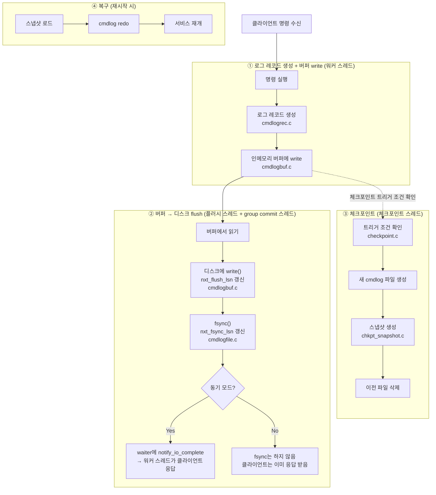

# Persistence 코드 분석

## 전체 흐름 개요



---

클라이언트에서 `set mykey 0 0 3\r\nabc\r\n`이 들어온다. 워커 스레드가 이 명령을 받아 처리한다. 아이템을 해시 테이블에 넣고, 곧바로 로그를 남겨야 한다. 서버가 죽더라도 이 명령이 실행됐음을 재시작 후에 재현할 수 있어야 하기 때문이다.

그런데 모든 명령이 로그를 남기는 건 아니다. `item_clog.c`가 먼저 판단을 내린다.

코드 곳곳에서는 `CLOG_ITEM_LINK(it)` 같은 매크로로 이 판단을 요청한다.

```c
// item_clog.h
#define CLOG_ITEM_LINK(a) \
    if (item_clog_enabled) { \
        CLOG_GE_ITEM_LINK(a); \
    }
```

`item_clog_enabled`가 false면 함수 호출 자체가 없다. persistence가 꺼진 빌드에서 오버헤드를 아예 없애는 것이다.

`CLOG_GE_ITEM_LINK` 안에서는 두 조건을 확인한다. 하나는 아이템에 `ITEM_INTERNAL` 플래그가 있는지다. `arcus:zk-ping` 같은 내부 관리용 아이템은 외부에서 보면 존재하지 않는 것이나 마찬가지라 로그를 남길 필요가 없다. 다른 하나는 설정 파일에서 `use_persistence`가 true인지다. 둘 다 통과해야 `cmdlog_generate_link_item(it)`이 호출된다.

`cmdlog_generate_*` 함수는 이런 식으로 14개가 있다.

| 로그 유형 | 해당 명령 |
|---|---|
| `link_item` | `set`, `add`, collection `create` |
| `unlink_item` | `delete`, eviction |
| `flush_item` | `flush_all` |
| `setattr` | `setattr` |
| `list_elem_insert/delete` | `lop insert/delete` |
| `map_elem_insert/delete` | `mop insert/delete` |
| `set_elem_insert/delete` | `sop insert/delete` |
| `btree_elem_insert` | `bop insert` |
| `btree_elem_delete` | `bop delete` (개별) |
| `btree_elem_delete_logical` | `bop delete` (범위) |
| `operation_range` | 다중 삭제 트랜잭션 (BEGIN/END 마커 쌍) |

`incr/decr`, `append/prepend`는 별도 유형이 없다. 내부적으로 `unlink(REPLACE)` + `link` 조합으로 기록된다. `get`, `gets` 같은 읽기 전용 명령은 데이터를 바꾸지 않으니 로그를 남기지 않는다. `ITEM_UNLINK_REPLACE`도 마찬가지다. replace 경로의 unlink는 기록하지 않고 `NORMAL`, `EVICT`, `STALE`만 통과시킨다. expire로 인한 소멸도 로그가 없다. redo 시에는 exptime만 보면 되니까.

---

게이트를 통과하면 `lrec_construct_*`가 실제 레코드를 만든다.

원문 문자열을 그대로 저장하면 어떨까. `set mykey 0 0 3\r\nabc\r\n`을 통째로 저장하면 redo 시 다시 파싱해야 한다. 대신 파싱이 끝난 구조체 형태로 저장하면 redo가 훨씬 빠르다. ARCUS는 후자를 선택했다.

모든 레코드는 8바이트 헤더 `LogHdr`로 시작한다.

```c
typedef struct _loghdr {
    uint8_t  logtype;     // 레코드 종류 (LOG_IT_LINK, LOG_BT_ELEM_INSERT, ...)
    uint8_t  updtype;     // 명령 종류 (UPD_SET, UPD_DELETE, ...)
    uint8_t  reserved[2];
    uint32_t body_length; // 뒤따르는 body 크기 (바이트)
} LogHdr;
```

헤더 뒤에 레코드 종류에 맞는 body 구조체가 붙고, 끝에 key/value 데이터가 이어진다.

`set`에 해당하는 IT_LINK 레코드를 보면 채우는 내용이 명확하다.

```c
// cmdlogrec.c:1455
int lrec_construct_link_item(LogRec *logrec, hash_item *it)
{
    cm->ittype  = GET_ITEM_TYPE(it);                  // KV=0, LIST=1, SET=2, ...
    cm->keylen  = it->nkey;
    cm->vallen  = it->nbytes;
    cm->flags   = it->flags;
    cm->exptime = CONVERT_ABS_EXPTIME(it->exptime);   // 절대 unix timestamp로 변환

    if (IS_COLL_ITEM(it)) {
        meta->ovflact = info->ovflact;  // 컬렉션 메타 저장
        meta->mflags  = info->mflags;
        meta->mcnt    = info->mcnt;
    } else {
        body->ptr.cas = item_get_cas(it);  // KV: CAS 값 저장
    }

    log->header.body_length = GET_8_ALIGN_SIZE(
        offsetof(ITLinkData, data) + naddition + cm->keylen + cm->vallen);
}
```

`CONVERT_ABS_EXPTIME`이 하는 일을 짚고 넘어가야 한다. memcached는 `current_time`이라는 전역 변수를 두고 "서버 시작 후 경과 초"를 누적한다. exptime도 "서버 시작 기준으로 몇 초 뒤"로 저장한다. 만료 체크는 `item->exptime < current_time`이고, 두 값이 같은 기준점을 공유하니 비교가 단순하다.

이게 persistence 앞에서 문제가 된다. 재시작하면 `current_time`이 0부터 다시 시작한다. 로그에 저장된 상대값을 그대로 읽으면 기준점이 바뀌었으니 만료 시각이 틀어진다. 그래서 로그에 저장할 때는 절대 unix timestamp로 변환하고, redo 시에는 `CONVERT_REL_EXPTIME`으로 다시 상대값으로 복원한다.

내부를 처음부터 절대값으로 바꾸면 이 변환이 필요 없지 않냐고 할 수 있다. 원칙적으로는 맞다. 하지만 `current_time`을 참조하는 코드가 서버 전체에 퍼져있고 memcached 프로토콜 자체도 상대값 개념으로 설계되어 있다. 내부를 바꾸는 건 큰 공사다. persistence 레이어에서만 변환하는 게 훨씬 국소적인 변경이다.

`body_length`는 8바이트 단위로 정렬한다. 레코드가 연속으로 붙을 때 다음 레코드의 시작 위치도 정렬이 유지되도록 하기 위해서다. 여기서 크기 계산에 `sizeof` 대신 `offsetof`를 쓰는 이유도 있다. `sizeof`는 구조체 trailing padding까지 포함해서 실제보다 크게 나온다. SM allocator는 8바이트 단위의 세밀한 슬롯 클래스를 사용하기 때문에 그 차이가 실제 슬롯 클래스 선택에 영향을 줄 수 있다. `offsetof`는 trailing data 필드가 시작하는 바이트 오프셋만 반환하므로 정확하다.

---

레코드가 완성되면 워커 스레드는 인메모리 링버퍼에 write한다. 디스크에는 직접 쓰지 않는다. 이 시점에 ASYNC 모드와 SYNC 모드가 갈린다.

ASYNC 모드라면 버퍼 write 직후 워커 스레드는 곧바로 클라이언트에 응답을 보낸다. waiter를 만들지도 않고, group commit 큐에 등록하지도 않는다. 플러시 스레드는 여전히 독립적으로 돌면서 버퍼를 디스크에 `write()`하고, group commit 스레드도 여전히 존재하지만 waiter 큐가 항상 비어있어 `fsync()`를 호출하지 않는다. OS가 페이지 캐시를 언제 물리 디스크에 내려쓸지는 OS의 재량이다.

성능은 높지만 대가가 있다. `write()` 후 `fsync()` 전에 서버가 죽으면 아직 물리 디스크에 내려가지 않은 로그는 사라진다. 데이터 유실 가능성을 감수하는 모드다.

SYNC 모드라면 버퍼 write 직후 `cmdlog_waiter_end()`가 호출된다.

```c
// cmdlogmgr.c
void cmdlog_waiter_end(log_waiter_t *waiter, ENGINE_ERROR_CODE *result)
{
    if (*result == ENGINE_SUCCESS && config->async_logging == false ...) {
        cmdlog_buff_flush_request(&waiter->lsn); // 플러시 스레드에 우선 처리 요청
        do_cmdlog_add_commit_waiter(waiter);      // waiter를 group commit 큐에 추가
        if (gcommit->wait_cnt == 1) {
            do_cmdlog_gcommit_thread_wakeup(gcommit, false); // 첫 waiter라면 깨움
        }
        *result = ENGINE_EWOULDBLOCK;             // 응답 보류
    }
}
```

`ENGINE_EWOULDBLOCK`을 반환하면 memcached 프레임워크가 해당 클라이언트 연결의 응답을 보류한다. 워커 스레드는 블로킹되지 않고 다른 클라이언트 요청을 계속 처리한다. 동기지만 논블로킹이다.

여기서 `log_waiter_t`가 뭔지 알아야 한다. SYNC 모드에서 한 명령의 완료를 추적하는 컨텍스트 객체다.

```c
typedef struct _log_waiter {
    struct _log_waiter *wait_next;   // group commit 큐 연결
    struct _log_waiter *free_next;   // 풀 반납용 연결
    LogSN               lsn;         // 내 레코드가 버퍼에 쓰인 위치
    uint8_t             updtype;
    bool                elem_insert_with_create;
    bool                elem_delete_with_drop;
    bool                generated_range_clog;
    const void         *cookie;      // 클라이언트 연결 식별자
} log_waiter_t;
```

`lsn`은 "내 레코드가 버퍼 어디에 쓰였는가"를 가리킨다. 나중에 group commit 스레드가 `nxt_fsync_lsn >= lsn`이 됐을 때 이 waiter의 완료를 처리한다.

`cookie`는 클라이언트 연결을 식별하는 불투명한 포인터(`void *`)다. HTTP 쿠키와 같은 어원으로 "줬다가 다시 돌려받는 조각"이라는 의미다. 엔진은 내부 구조를 모른 채로 들고 있다가 완료 시 `notify_io_complete(cookie)`로 돌려준다.

waiter 풀과 group commit 큐는 전역 구조체(`logmgr_gl`)에 있어 모든 워커 스레드가 공유한다.

---

워커 스레드가 waiter를 등록하고 응답을 보류한 사이, 플러시 스레드가 독립적으로 돌고 있다.

플러시 스레드는 서버 시작 시 생성되어 특별한 트리거 없이 폴링으로 버퍼를 감시한다.

```c
// cmdlogbuf.c - log_flush_thread_main
while (1) {
    nflush = do_log_buff_flush(false);      // 버퍼 → write() → OS 페이지 캐시
    if (nflush == 0) {
        pthread_cond_timedwait(..., 10ms);  // 쓸 게 없으면 10ms sleep
    }
}
```

`write()`는 데이터를 OS 페이지 캐시, 즉 RAM에 넣는 것까지다. 물리 디스크에 확정됐다는 보장이 없다. 전원이 꺼지면 사라질 수 있다. flush가 완료되면 `nxt_flush_lsn`을 갱신한다. "버퍼에서 write()까지 완료된 위치"다.

SYNC 모드에서 워커가 `cmdlog_buff_flush_request()`를 호출한 이유가 여기에 있다. 플러시 스레드가 자고 있을 경우 즉시 깨워 우선 처리하게 한다. 어차피 group commit 스레드가 fsync를 하려면 플러시 스레드가 먼저 write를 끝내야 하기 때문이다.

---

group commit 스레드는 플러시 스레드와 나란히 서버 시작 시 생성된다. SYNC 모드가 아닐 때는 waiter 큐가 항상 비어있어 대부분 sleep 상태지만, 스레드 자체는 항상 존재한다.

이 스레드가 관리하는 핵심 개념이 두 LSN이다.

```
nxt_flush_lsn    플러시 스레드가 갱신    write() 완료 위치 (OS 페이지 캐시 레벨)
nxt_fsync_lsn    group commit가 갱신    fsync() 완료 위치 (물리 디스크 확정 레벨)
```

`write()`는 OS 페이지 캐시까지고, `fsync()`는 OS에게 "페이지 캐시를 지금 당장 물리 디스크에 써라"를 강제하는 시스템 콜이다. 두 단계가 분리되어 있고 두 LSN이 각각 그 완료 위치를 추적한다.

group commit 스레드의 루프는 이렇게 생겼다.

```c
// cmdlogmgr.c - do_cmdlog_gcommit_thread_main
while (1) {
    if (wait_cnt == 0) {
        pthread_cond_timedwait(..., 1초);   // 큐가 비면 최대 1초 sleep
    } else {
        usleep(2000);                       // 2ms 배치 수집
        cmdlog_file_sync();                 // fsync() + nxt_fsync_lsn 갱신
        waiters = get_commit_waiters(...);  // lsn <= nxt_fsync_lsn인 waiter만 꺼냄
    }
    do_cmdlog_callback_and_free_waiters(waiters);  // 콜백 + waiter free
}
```

첫 waiter가 들어와도 바로 fsync하지 않는다. 2ms를 기다린다. 이 2ms는 두 가지 목적이 섞여 있다.

하나는 batching이다. 이 시간 동안 다른 워커들의 waiter도 큐에 쌓이고, 한 번의 fsync로 N명을 처리한다. group commit의 핵심이다.

다른 하나는 플러시 스레드에게 시간을 주는 것이다. 워커 스레드가 `cmdlog_buff_flush_request()`로 플러시 스레드를 이미 깨웠지만, 실제로 `write()`가 완료되어 `nxt_flush_lsn`이 앞당겨지는 데는 시간이 걸린다. 2ms를 기다리는 동안 플러시 스레드가 더 많이 write해두면 뒤따르는 `fsync()`의 커버 범위가 넓어진다.

단, 이 2ms는 플러시 완료를 보장하는 동기화 수단이 아니다. 2ms가 지나도 플러시가 덜 됐을 수 있고, 코드는 그냥 진행한다. partial fsync 메커니즘이 그 경우를 처리한다. 2ms는 확률적으로 두 가지 모두를 개선하는 휴리스틱이다.

큐가 비었을 때는 최대 1초 sleep한다. 완전 blocking이 아닌 이유는 서버 종료 요청(`reqstop`) 같은 상태 변수를 주기적으로 확인해야 하기 때문이다. 신호 유실에 대한 안전망이기도 하다.

fsync가 항상 모든 waiter를 한 번에 커버하는 건 아니다. group commit 스레드가 `nxt_flush_lsn`을 읽는 시점에 플러시 스레드가 아직 일부만 write한 상태일 수 있다. fsync도 그 위치까지만 완료되므로, 완료된 waiter만 꺼내고 나머지는 큐에 남긴다.

```
[round 1]
  waiter A(lsn=100), B(lsn=200) 큐에 있음
  nxt_flush_lsn=150 → fsync → nxt_fsync_lsn=150
  A만 꺼내 콜백, B는 큐에 남음

[round 2]  ← sleep 없이 바로 다음 루프
  2ms 대기 → 플러시 스레드가 그 사이 더 write
  nxt_flush_lsn=250 → fsync → nxt_fsync_lsn=250
  B 꺼내 콜백
```

`wait_cnt > 0`인 한 sleep 없이 루프를 계속 돈다.

---

이제 완료 통보를 워커 스레드에게 어떻게 전달하는지 볼 차례다.

`do_cmdlog_callback_and_free_waiters`에서 각 waiter의 cookie로 `notify_io_complete()`를 호출한다. 그런데 워커 스레드는 지금 다른 클라이언트 요청을 처리하고 있다. libevent 루프 안에서 이벤트를 기다리는 상태다. group commit 스레드가 직접 워커의 상태를 바꿀 수는 없다.

여기서 self-pipe trick이 쓰인다. 각 워커 스레드는 시작할 때 파이프를 하나 만들고 읽기 끝을 libevent에 EV_READ로 등록해둔다. `notify_io_complete()` 안에서 해당 워커 스레드의 파이프 쓰기 끝에 1바이트를 write한다.

```c
write(thr->notify_send_fd, "", 1);  // 내용은 무의미, 이벤트 발생이 목적
```

libevent가 파이프 read 이벤트를 감지하면 워커 스레드가 깨어나 `pending_io`에서 conn을 꺼내 클라이언트에 응답을 보낸다. waiter free도 이 시점에 group commit 스레드가 처리한다.

---

정리하면 SYNC 모드의 전체 흐름은 이렇다.

```
[워커 스레드]
  명령 실행 → cmdlog 레코드 생성 → 링버퍼에 write
  → waiter를 group commit 큐에 추가 + 플러시 스레드 우선 처리 요청
  → ENGINE_EWOULDBLOCK 반환 (응답 보류, 논블로킹)
  → 다른 클라이언트 요청 처리 계속

[플러시 스레드]  ← 독립적으로 폴링
  링버퍼 → write() → OS 페이지 캐시 → nxt_flush_lsn 갱신

[group commit 스레드]  ← 첫 waiter 추가 시 cond_signal로 깨어남
  2ms 대기 → fsync() → nxt_fsync_lsn 갱신
  → lsn ≤ nxt_fsync_lsn인 waiter 꺼냄
  → notify_io_complete(cookie) → waiter free
    → 워커 스레드 파이프에 1바이트 write

[워커 스레드]  ← libevent 파이프 read 이벤트 감지
  클라이언트에 응답 전송
```

세 스레드는 각자 독립적으로 돌면서 LSN과 파이프를 통해 느슨하게 연결되어 있다.

ASYNC 모드의 흐름은 훨씬 단순하다.

```
[워커 스레드]
  명령 실행 → cmdlog 레코드 생성 → 링버퍼에 write
  → 클라이언트에 즉시 응답 (waiter 없음, group commit 큐 등록 없음)

[플러시 스레드]  ← 독립적으로 폴링
  링버퍼 → write() → OS 페이지 캐시 → nxt_flush_lsn 갱신

[group commit 스레드]  ← 항상 sleep 상태
  waiter 큐가 비어있어 fsync() 호출하지 않음
  OS가 자체 스케줄에 따라 페이지 캐시를 물리 디스크에 내려씀
```

두 모드의 차이는 결국 클라이언트 응답 시점이다. SYNC는 물리 디스크 확정 후 응답하고, ASYNC는 링버퍼 write 직후 응답한다. 그 사이에서 발생하는 장애에 대한 내구성 보장 여부가 갈린다.

---

## ④ 체크포인트

> 관련 파일: `engines/default/checkpoint.c`, `engines/default/chkpt_snapshot.c`

---

## ⑤ 복구 (재시작)

> 관련 파일: `engines/default/cmdlogfile.c`, `engines/default/chkpt_snapshot.c`
