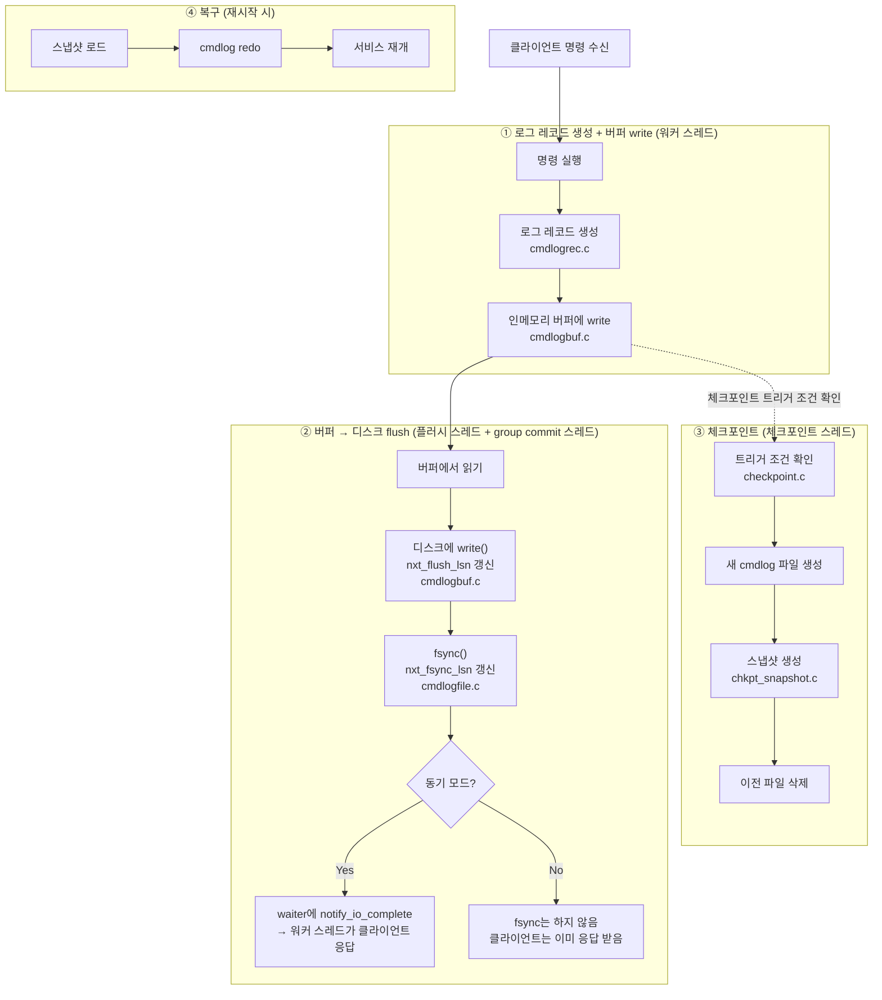

# Persistence 코드 분석

## 전체 흐름 개요



---

## ① 로그 레코드 생성 + 버퍼 write

> 관련 파일: `engines/default/cmdlogrec.c`, `engines/default/item_clog.c`, `engines/default/cmdlogbuf.c`

### 1-1. 명령과 로그 연동 (item_clog.c)

`item_clog.c`는 명령 실행과 cmdlog 생성 사이의 **게이트** 역할을 한다. 실제 로그를 만드는 게 아니라 "이 명령 로그 남겨도 돼?" 조건을 판단하고 통과하면 `cmdlogmgr.c`로 넘긴다.

**호출 방식**

코드 곳곳에서 `CLOG_ITEM_LINK(it)` 같은 매크로로 호출한다. 매크로는 `item_clog.h`에 정의되어 있다:

```c
#define CLOG_ITEM_LINK(a) \
    if (item_clog_enabled) { \
        CLOG_GE_ITEM_LINK(a); \
    }
```

`item_clog_enabled`가 false면 함수 호출 자체를 건너뛴다. persistence가 완전히 꺼진 상태에서 함수 호출 오버헤드도 없애는 거다.

**공통 조건 두 가지**

모든 `CLOG_GE_*` 함수가 아래 패턴을 따른다:

```c
void CLOG_GE_ITEM_LINK(hash_item *it)
{
    if ((it->iflag & ITEM_INTERNAL) == 0)  // ① 내부 아이템 제외
    {
        if (config->use_persistence) {     // ② persistence 켜져 있어야
            cmdlog_generate_link_item(it);
        }
    }
}
```

- `ITEM_INTERNAL`: `arcus:zk-ping` 같은 내부 아이템은 로그를 남기지 않는다
- `use_persistence`: conf에서 false면 스킵

**cmdlog가 생성되는 유형 (14가지)**

`cmdlogmgr.c`의 `cmdlog_generate_*` 함수가 14개 있고, 이게 전부다:

| 로그 유형 | 해당 명령 | 비고 |
|---|---|---|
| `link_item` | `set`, `add`, collection `create` | 아이템 신규 저장 |
| `unlink_item` | `delete`, eviction | 아이템 제거 |
| `flush_item` | `flush_all` | |
| `setattr` | `setattr` | exptime, maxcount 등 속성 변경 |
| `list_elem_insert/delete` | `lop insert/delete` | |
| `map_elem_insert/delete` | `mop insert/delete` | |
| `set_elem_insert/delete` | `sop insert/delete` | |
| `btree_elem_insert` | `bop insert` | |
| `btree_elem_delete` | `bop delete` (개별) | |
| `btree_elem_delete_logical` | `bop delete` (범위) | |
| `operation_range` | 다중 삭제 트랜잭션 | BEGIN/END 마커 쌍 |

`incr/decr`, `append/prepend`는 별도 유형이 없다. 내부적으로 기존 아이템을 unlink하고 새 아이템을 link하는 replace 경로를 타기 때문에 `unlink(REPLACE)` + `link` 조합으로 기록된다.

읽기 전용 명령(`get`, `gets`)은 데이터를 변경하지 않으므로 로그를 남기지 않는다.

**로그를 남기지 않는 특수 케이스**

- `ITEM_UNLINK_REPLACE`: replace 경로에서 unlink 시 발생. `CLOG_GE_ITEM_UNLINK`에서 걸러진다 (`NORMAL`, `EVICT`, `STALE`만 통과).
- expire로 인한 자연 소멸: 로그 없음. redo 시 exptime 기준으로 살아있는지 판단하면 되기 때문이다.
- `CLOG_GE_ITEM_UPDATE`: LRU 순서 갱신. 데이터 변경이 없어 함수 본문이 비어있다.

### 1-2. 로그 레코드 생성 (cmdlogrec.c)

### 1-3. 버퍼 write (cmdlogbuf.c)

---

## ② 버퍼 → 디스크 flush

> 관련 파일: `engines/default/cmdlogbuf.c`, `engines/default/cmdlogfile.c`, `engines/default/cmdlogmgr.c`

### 스레드 구조

persistence가 켜지면 4종류의 스레드가 동작한다.

| 스레드 | 개수 | 담당 |
|---|---|---|
| 워커 스레드 | N개 (`-t` 옵션, 기본 4) | 클라이언트 명령 처리, 버퍼 write |
| 로그 플러시 스레드 | 1개 | 버퍼 → 디스크 `write()`, `nxt_flush_lsn` 갱신 |
| group commit 스레드 | 1개 | `fsync()`, `nxt_fsync_lsn` 갱신, waiter 콜백 |
| 체크포인트 스레드 | 1개 | snapshot 생성 및 이전 파일 정리 |

group commit 스레드는 ASYNC 모드에서도 항상 생성되지만 waiter가 큐에 들어오지 않아 대부분 sleep 상태다.

### 2-1. 플러시 스레드 (cmdlogbuf.c)

플러시 스레드는 인메모리 버퍼의 내용을 디스크 파일로 `write()`한다.

`write()`는 데이터를 **OS 페이지 캐시(RAM)** 에 넣는 것까지다. 파일에 썼다는 의미이지 물리 디스크에 확정됐다는 보장은 없다. 전원이 꺼지면 사라질 수 있는 상태.

```c
// cmdlogbuf.c - log_flush_thread_main
while (1) {
    nflush = do_log_buff_flush(false);   // 버퍼 → write() → 페이지 캐시
    if (nflush == 0) {
        pthread_cond_timedwait(..., 10ms);  // 쓸 게 없으면 10ms sleep
    }
}
```

flush가 완료되면 `nxt_flush_lsn`을 갱신한다. 이 값은 "버퍼에서 write()까지 완료된 위치"다.

SYNC 모드에서 워커가 `cmdlog_buff_flush_request(&waiter->lsn)`를 호출하면 플러시 스레드가 우선적으로 해당 LSN까지 flush하도록 요청하고 자고 있으면 깨운다.

### 2-2. group commit 스레드 (cmdlogmgr.c)

group commit 스레드는 SYNC 모드에서 핵심 역할을 한다. 플러시 스레드가 `write()`를 마친 데이터를 `fsync()`로 디스크에 확정하고, 대기 중인 워커들에게 완료를 알린다.

**두 LSN의 의미**

```
write() 완료  →  nxt_flush_lsn  (플러시 스레드가 갱신, 페이지 캐시 레벨)
fsync() 완료  →  nxt_fsync_lsn  (group commit 스레드가 갱신, 디스크 확정 레벨)
```

SYNC 모드의 waiter는 "내 lsn <= nxt_fsync_lsn"이 되는 순간 완료로 처리된다.

**group commit 스레드와 waiter 큐의 관계**

waiter 큐는 단방향이다.
- **생산자**: 워커 스레드 (waiter를 큐에 추가)
- **소비자**: group commit 스레드 (waiter를 큐에서 꺼내 처리 후 free)

waiter 풀(`waiter_info`)과 group commit 큐(`group_commit`) 모두 전역 구조체(`logmgr_gl`)에 있다. 워커 스레드는 `tls_waiter`(스레드 로컬)로 현재 처리 중인 waiter를 잠깐 참조하고, `cmdlog_waiter_end`에서 큐에 넘기는 순간 손을 놓는다.

**group commit 스레드 루프**

```c
// cmdlogmgr.c - do_cmdlog_gcommit_thread_main
while (1) {
    if (wait_cnt == 0) {
        pthread_cond_timedwait(..., 1초);  // 큐가 비면 sleep
    } else {
        usleep(2000);                      // 2ms 배치 수집
        cmdlog_file_sync();                // fsync() + nxt_fsync_lsn 갱신
        waiters = get_commit_waiters(...); // fsync 완료된 waiter만 꺼냄
    }
    do_cmdlog_callback_and_free_waiters(waiters);  // 콜백 + waiter free
    // → 다시 루프 맨 위로
}
```

- **2ms 대기**: 첫 waiter가 들어오면 바로 fsync하지 않고 2ms 기다린다. 그 사이 다른 워커들의 waiter도 큐에 쌓인다. 한 번의 fsync로 N명을 처리하는 배치 최적화다.
- **1초 timedwait**: 큐가 비었을 때 완전 blocking 대신 최대 1초 sleep. 종료 요청(`reqstop`) 등 상태 변수를 주기적으로 확인하기 위한 안전망이다. signal 방식보다 변수로 상태를 관리하는 게 더 안전하고 단순하다.

**fsync가 중간까지만 됐을 때**

`get_commit_waiters`는 `lsn <= nxt_fsync_lsn`인 waiter만 꺼낸다. 플러시 스레드가 아직 write를 다 못 한 waiter는 큐에 그대로 남는다.

```
[round 1]
  waiter A(lsn=100), B(lsn=200) 큐에 있음
  nxt_flush_lsn=150 → fsync → nxt_fsync_lsn=150
  A(lsn=100 ≤ 150)만 꺼내 콜백, B는 큐에 남음

[round 2] (wait_cnt > 0이므로 sleep 없이 바로 다음 루프)
  2ms 대기 → 플러시 스레드가 그 사이 더 write
  nxt_flush_lsn=250 → fsync → nxt_fsync_lsn=250
  B(lsn=200 ≤ 250) 꺼내 콜백
```

`wait_cnt > 0`인 한 sleep 없이 루프를 계속 돈다. 큐가 비어야 비로소 `pthread_cond_timedwait`으로 sleep 상태로 돌아간다. 스레드가 종료되거나 새로 생성되지 않는다. group commit 스레드 1개가 서버가 죽을 때까지 이 루프를 반복한다.

**플러시 스레드와 group commit 스레드의 관계**

두 스레드는 독립적으로 돌지만 암묵적 순서가 있다.

```
플러시 스레드:    버퍼 → write() → 페이지 캐시 → nxt_flush_lsn 갱신
group commit:    nxt_flush_lsn 읽음 → fsync() → nxt_fsync_lsn 갱신
```

group commit 스레드가 `cmdlog_file_sync()`를 호출할 때 `nxt_flush_lsn`을 먼저 읽고, 그 위치까지만 fsync한다. 플러시 스레드가 아직 write를 못 했으면 fsync할 게 없어서 nxt_fsync_lsn이 갱신되지 않고, 해당 waiter들은 다음 라운드에서 처리된다.

**ASYNC 모드에서 group commit 스레드는 fsync를 하지 않는다.**

`cmdlog_waiter_end`가 ASYNC 모드에서 waiter를 큐에 추가하지 않으므로 `wait_cnt`가 항상 0이다. group commit 스레드는 `wait_cnt == 0` 분기만 타며 1초 sleep을 반복할 뿐 `cmdlog_file_sync()`에 진입하지 않는다. OS가 알아서 언젠가 페이지 캐시를 디스크에 내려쓰는 것에 맡긴다.

### 2-3. SYNC 모드 전체 흐름

```
워커 스레드 (여러 개)
  버퍼에 레코드 write
  → cmdlog_waiter_end() 호출
    → cmdlog_buff_flush_request() : 플러시 스레드에 우선 flush 요청
    → waiter를 group commit 큐에 추가
    → group commit 스레드 cond_signal로 깨움 (wait_cnt가 1이 된 순간)
    → ENGINE_EWOULDBLOCK 반환 → 다른 클라이언트 요청 계속 처리 (논블로킹)

플러시 스레드 (독립적으로)
  버퍼 → write() → 페이지 캐시 → nxt_flush_lsn 갱신

group commit 스레드 (cond_signal로 깨어나)
  usleep(2000) : 2ms 동안 다른 워커들 waiter도 큐에 쌓이게 둠
  cmdlog_file_sync() : fsync() → 디스크 확정 → nxt_fsync_lsn 갱신
  큐에서 lsn <= nxt_fsync_lsn인 waiter 전부 꺼냄
  각 waiter의 cookie로 notify_io_complete() 콜백

thread.c의 notify_io_complete()
  conn을 워커 스레드의 pending_io에 추가
  thr->notify_send_fd 파이프에 1바이트 write

워커 스레드 (libevent가 파이프 read 이벤트 감지)
  pending_io에서 conn 꺼냄
  클라이언트에 응답 전송
```

### 2-4. cookie

`cookie`는 memcached 엔진 API에서 클라이언트 연결을 식별하는 불투명한 포인터다. 이름의 의미는 "줬다가 다시 돌려받는 작은 조각"으로, HTTP 쿠키와 같은 어원이다.

```c
log_waiter_t {
    const void *cookie;  // void* — 엔진은 내부 구조를 모른 채로 들고만 있음
    ...
}
```

실제 타입은 `struct conn *`(클라이언트 연결 구조체)지만, 엔진 레이어는 그게 뭔지 알 필요가 없다. 완료됐을 때 `notify_io_complete(cookie)`로 그냥 돌려주면 memcached 코어가 처리한다. `void *`인 이유가 여기 있다.

### 2-5. self-pipe trick

`notify_io_complete()`가 group commit 스레드에서 워커 스레드를 깨우는 방식은 **파이프**를 이용한다.

각 워커 스레드는 시작할 때 파이프를 하나 만들고 읽기 끝(fd)을 libevent에 EV_READ로 등록해둔다:

```c
// thread.c
event_set(&me->notify_event, me->notify_receive_fd, EV_READ | EV_PERSIST, ...);
```

group commit 스레드에서 `notify_io_complete(cookie)`를 호출하면:

```c
// thread.c
if (write(thr->notify_send_fd, "", 1) != 1) { ... }  // 파이프 쓰기 끝에 1바이트
```

파이프 쓰기 끝에 1바이트가 들어오면 libevent가 읽기 끝의 read 이벤트를 감지하고 워커 스레드 이벤트 루프를 깨운다. 1바이트의 내용은 의미 없고 "이벤트가 발생했다"는 신호 자체가 목적이다.

---

## ③ 체크포인트

> 관련 파일: `engines/default/checkpoint.c`, `engines/default/chkpt_snapshot.c`

---

## ④ 복구 (재시작)

> 관련 파일: `engines/default/cmdlogfile.c`, `engines/default/chkpt_snapshot.c`
