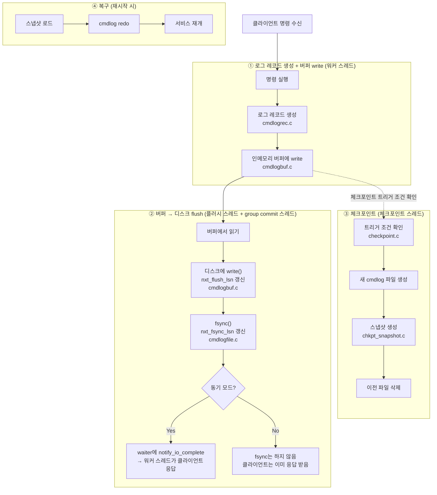

# Persistence 코드 분석

## 핵심 설계 철학

> **redo를 단순하게 유지하려면, write를 정교하게 해야 한다.**

persistence의 복잡한 로직은 대부분 **쓰는 쪽(write path)**에 몰려 있다. 읽는 쪽(redo path)은 의도적으로 단순하게 설계됐다.

쓸 때 이미 다 해결해놓는다:
- exptime을 절대 unix timestamp로 변환해서 저장 → redo 시점에 변환 불필요
- 실행 가능한 형태로 직렬화 → redo는 그냥 함수 호출만 하면 됨
- snapshot도 cmdlog와 동일한 바이너리 포맷으로 저장 → 동일한 redo 경로 재사용

그 결과 redo는 단순하다. 파일을 처음부터 끝까지 읽으면서 헤더를 보고 dispatch table로 함수를 찾아 호출하는 것이 전부다. 이 시점은 아직 워커 스레드가 뜨기 전이라 사실상 단일 스레드로 동작한다. 락 경합도 없다.

Redis AOF도 같은 철학이다. 실제 실행 가능한 커맨드를 그대로 파일에 쓰기 때문에 redo가 단순하다.

---

## 전체 흐름 개요



---

클라이언트에서 `set mykey 0 0 3\r\nabc\r\n`이 들어온다. 워커 스레드가 이 명령을 받아 처리한다. 아이템을 해시 테이블에 넣고, 곧바로 로그를 남겨야 한다. 서버가 죽더라도 이 명령이 실행됐음을 재시작 후에 재현할 수 있어야 하기 때문이다.

그런데 모든 명령이 로그를 남기는 건 아니다. `item_clog.c`가 먼저 판단을 내린다.

코드 곳곳에서는 `CLOG_ITEM_LINK(it)` 같은 매크로로 이 판단을 요청한다.

```c
// item_clog.h
#define CLOG_ITEM_LINK(a) \
    if (item_clog_enabled) { \
        CLOG_GE_ITEM_LINK(a); \
    }
```

`item_clog_enabled`가 false면 함수 호출 자체가 없다. persistence가 꺼진 빌드에서 오버헤드를 아예 없애는 것이다.

`CLOG_GE_ITEM_LINK` 안에서는 두 조건을 확인한다. 하나는 아이템에 `ITEM_INTERNAL` 플래그가 있는지다. `arcus:zk-ping` 같은 내부 관리용 아이템은 외부에서 보면 존재하지 않는 것이나 마찬가지라 로그를 남길 필요가 없다. 다른 하나는 설정 파일에서 `use_persistence`가 true인지다. 둘 다 통과해야 `cmdlog_generate_link_item(it)`이 호출된다.

`cmdlog_generate_*` 함수는 이런 식으로 14개가 있다.

| 로그 유형 | 해당 명령 |
|---|---|
| `link_item` | `set`, `add`, collection `create` |
| `unlink_item` | `delete`, eviction |
| `flush_item` | `flush_all` |
| `setattr` | `setattr` |
| `list_elem_insert/delete` | `lop insert/delete` |
| `map_elem_insert/delete` | `mop insert/delete` |
| `set_elem_insert/delete` | `sop insert/delete` |
| `btree_elem_insert` | `bop insert` |
| `btree_elem_delete` | `bop delete` (개별) |
| `btree_elem_delete_logical` | `bop delete` (범위) |
| `operation_range` | 다중 삭제 트랜잭션 (BEGIN/END 마커 쌍) |

`incr/decr`, `append/prepend`는 별도 유형이 없다. 내부적으로 `unlink(REPLACE)` + `link` 조합으로 기록된다. `get`, `gets` 같은 읽기 전용 명령은 데이터를 바꾸지 않으니 로그를 남기지 않는다. `ITEM_UNLINK_REPLACE`도 마찬가지다. replace 경로의 unlink는 기록하지 않고 `NORMAL`, `EVICT`, `STALE`만 통과시킨다. expire로 인한 소멸도 로그가 없다. redo 시에는 exptime만 보면 되니까.

---

게이트를 통과하면 `lrec_construct_*`가 실제 레코드를 만든다.

원문 문자열을 그대로 저장하면 어떨까. `set mykey 0 0 3\r\nabc\r\n`을 통째로 저장하면 redo 시 다시 파싱해야 한다. 대신 파싱이 끝난 구조체 형태로 저장하면 redo가 훨씬 빠르다. ARCUS는 후자를 선택했다.

모든 레코드는 8바이트 헤더 `LogHdr`로 시작한다.

```c
typedef struct _loghdr {
    uint8_t  logtype;     // 레코드 종류 (LOG_IT_LINK, LOG_BT_ELEM_INSERT, ...)
    uint8_t  updtype;     // 명령 종류 (UPD_SET, UPD_DELETE, ...)
    uint8_t  reserved[2];
    uint32_t body_length; // 뒤따르는 body 크기 (바이트)
} LogHdr;
```

헤더 뒤에 레코드 종류에 맞는 body 구조체가 붙고, 끝에 key/value 데이터가 이어진다.

`set`에 해당하는 IT_LINK 레코드를 보면 채우는 내용이 명확하다.

```c
// cmdlogrec.c:1455
int lrec_construct_link_item(LogRec *logrec, hash_item *it)
{
    cm->ittype  = GET_ITEM_TYPE(it);                  // KV=0, LIST=1, SET=2, ...
    cm->keylen  = it->nkey;
    cm->vallen  = it->nbytes;
    cm->flags   = it->flags;
    cm->exptime = CONVERT_ABS_EXPTIME(it->exptime);   // 절대 unix timestamp로 변환

    if (IS_COLL_ITEM(it)) {
        meta->ovflact = info->ovflact;  // 컬렉션 메타 저장
        meta->mflags  = info->mflags;
        meta->mcnt    = info->mcnt;
    } else {
        body->ptr.cas = item_get_cas(it);  // KV: CAS 값 저장
    }

    log->header.body_length = GET_8_ALIGN_SIZE(
        offsetof(ITLinkData, data) + naddition + cm->keylen + cm->vallen);
}
```

`CONVERT_ABS_EXPTIME`이 하는 일을 짚고 넘어가야 한다. memcached는 `current_time`이라는 전역 변수를 두고 "서버 시작 후 경과 초"를 누적한다. exptime도 "서버 시작 기준으로 몇 초 뒤"로 저장한다. 만료 체크는 `item->exptime < current_time`이고, 두 값이 같은 기준점을 공유하니 비교가 단순하다.

이게 persistence 앞에서 문제가 된다. 재시작하면 `current_time`이 0부터 다시 시작한다. 로그에 저장된 상대값을 그대로 읽으면 기준점이 바뀌었으니 만료 시각이 틀어진다. 그래서 로그에 저장할 때는 절대 unix timestamp로 변환하고, redo 시에는 `CONVERT_REL_EXPTIME`으로 다시 상대값으로 복원한다.

내부를 처음부터 절대값으로 바꾸면 이 변환이 필요 없지 않냐고 할 수 있다. 원칙적으로는 맞다. 하지만 `current_time`을 참조하는 코드가 서버 전체에 퍼져있고 memcached 프로토콜 자체도 상대값 개념으로 설계되어 있다. 내부를 바꾸는 건 큰 공사다. persistence 레이어에서만 변환하는 게 훨씬 국소적인 변경이다.

`body_length`는 8바이트 단위로 정렬한다. 레코드가 연속으로 붙을 때 다음 레코드의 시작 위치도 정렬이 유지되도록 하기 위해서다. 여기서 크기 계산에 `sizeof` 대신 `offsetof`를 쓰는 이유도 있다. `sizeof`는 구조체 trailing padding까지 포함해서 실제보다 크게 나온다. SM allocator는 8바이트 단위의 세밀한 슬롯 클래스를 사용하기 때문에 그 차이가 실제 슬롯 클래스 선택에 영향을 줄 수 있다. `offsetof`는 trailing data 필드가 시작하는 바이트 오프셋만 반환하므로 정확하다.

---

레코드가 완성되면 워커 스레드는 인메모리 링버퍼에 write한다. 디스크에는 직접 쓰지 않는다. 이 시점에 ASYNC 모드와 SYNC 모드가 갈린다.

ASYNC 모드라면 버퍼 write 직후 워커 스레드는 곧바로 클라이언트에 응답을 보낸다. waiter를 만들지도 않고, group commit 큐에 등록하지도 않는다. 플러시 스레드는 여전히 독립적으로 돌면서 버퍼를 디스크에 `write()`하고, group commit 스레드도 여전히 존재하지만 waiter 큐가 항상 비어있어 `fsync()`를 호출하지 않는다. OS가 페이지 캐시를 언제 물리 디스크에 내려쓸지는 OS의 재량이다.

성능은 높지만 대가가 있다. `write()` 후 `fsync()` 전에 서버가 죽으면 아직 물리 디스크에 내려가지 않은 로그는 사라진다. 데이터 유실 가능성을 감수하는 모드다.

SYNC 모드라면 버퍼 write 직후 `cmdlog_waiter_end()`가 호출된다.

```c
// cmdlogmgr.c
void cmdlog_waiter_end(log_waiter_t *waiter, ENGINE_ERROR_CODE *result)
{
    if (*result == ENGINE_SUCCESS && config->async_logging == false ...) {
        cmdlog_buff_flush_request(&waiter->lsn); // 플러시 스레드에 우선 처리 요청
        do_cmdlog_add_commit_waiter(waiter);      // waiter를 group commit 큐에 추가
        if (gcommit->wait_cnt == 1) {
            do_cmdlog_gcommit_thread_wakeup(gcommit, false); // 첫 waiter라면 깨움
        }
        *result = ENGINE_EWOULDBLOCK;             // 응답 보류
    }
}
```

`ENGINE_EWOULDBLOCK`을 반환하면 memcached 프레임워크가 해당 클라이언트 연결의 응답을 보류한다. 워커 스레드는 블로킹되지 않고 다른 클라이언트 요청을 계속 처리한다. 동기지만 논블로킹이다.

여기서 `log_waiter_t`가 뭔지 알아야 한다. SYNC 모드에서 한 명령의 완료를 추적하는 컨텍스트 객체다.

```c
typedef struct _log_waiter {
    struct _log_waiter *wait_next;   // group commit 큐 연결
    struct _log_waiter *free_next;   // 풀 반납용 연결
    LogSN               lsn;         // 내 레코드가 버퍼에 쓰인 위치
    uint8_t             updtype;
    bool                elem_insert_with_create;
    bool                elem_delete_with_drop;
    bool                generated_range_clog;
    const void         *cookie;      // 클라이언트 연결 식별자
} log_waiter_t;
```

`lsn`은 "내 레코드가 버퍼 어디에 쓰였는가"를 가리킨다. 나중에 group commit 스레드가 `nxt_fsync_lsn >= lsn`이 됐을 때 이 waiter의 완료를 처리한다.

`cookie`는 클라이언트 연결을 식별하는 불투명한 포인터(`void *`)다. HTTP 쿠키와 같은 어원으로 "줬다가 다시 돌려받는 조각"이라는 의미다. 엔진은 내부 구조를 모른 채로 들고 있다가 완료 시 `notify_io_complete(cookie)`로 돌려준다.

waiter 풀과 group commit 큐는 전역 구조체(`logmgr_gl`)에 있어 모든 워커 스레드가 공유한다.

---

워커 스레드가 waiter를 등록하고 응답을 보류한 사이, 플러시 스레드가 독립적으로 돌고 있다.

플러시 스레드는 서버 시작 시 생성되어 특별한 트리거 없이 폴링으로 버퍼를 감시한다.

```c
// cmdlogbuf.c - log_flush_thread_main
while (1) {
    nflush = do_log_buff_flush(false);      // 버퍼 → write() → OS 페이지 캐시
    if (nflush == 0) {
        pthread_cond_timedwait(..., 10ms);  // 쓸 게 없으면 10ms sleep
    }
}
```

`write()`는 데이터를 OS 페이지 캐시, 즉 RAM에 넣는 것까지다. 물리 디스크에 확정됐다는 보장이 없다. 전원이 꺼지면 사라질 수 있다. flush가 완료되면 `nxt_flush_lsn`을 갱신한다. "버퍼에서 write()까지 완료된 위치"다.

SYNC 모드에서 워커가 `cmdlog_buff_flush_request()`를 호출한 이유가 여기에 있다. 플러시 스레드가 자고 있을 경우 즉시 깨워 우선 처리하게 한다. 어차피 group commit 스레드가 fsync를 하려면 플러시 스레드가 먼저 write를 끝내야 하기 때문이다.

---

group commit 스레드는 플러시 스레드와 나란히 서버 시작 시 생성된다. SYNC 모드가 아닐 때는 waiter 큐가 항상 비어있어 대부분 sleep 상태지만, 스레드 자체는 항상 존재한다.

이 스레드가 관리하는 핵심 개념이 두 LSN이다.

```
nxt_flush_lsn    플러시 스레드가 갱신    write() 완료 위치 (OS 페이지 캐시 레벨)
nxt_fsync_lsn    group commit가 갱신    fsync() 완료 위치 (물리 디스크 확정 레벨)
```

`write()`는 OS 페이지 캐시까지고, `fsync()`는 OS에게 "페이지 캐시를 지금 당장 물리 디스크에 써라"를 강제하는 시스템 콜이다. 두 단계가 분리되어 있고 두 LSN이 각각 그 완료 위치를 추적한다.

group commit 스레드의 루프는 이렇게 생겼다.

```c
// cmdlogmgr.c - do_cmdlog_gcommit_thread_main
while (1) {
    if (wait_cnt == 0) {
        pthread_cond_timedwait(..., 1초);   // 큐가 비면 최대 1초 sleep
    } else {
        usleep(2000);                       // 2ms 배치 수집
        cmdlog_file_sync();                 // fsync() + nxt_fsync_lsn 갱신
        waiters = get_commit_waiters(...);  // lsn <= nxt_fsync_lsn인 waiter만 꺼냄
    }
    do_cmdlog_callback_and_free_waiters(waiters);  // 콜백 + waiter free
}
```

첫 waiter가 들어와도 바로 fsync하지 않는다. 2ms를 기다린다. 이 2ms는 두 가지 목적이 섞여 있다.

하나는 batching이다. 이 시간 동안 다른 워커들의 waiter도 큐에 쌓이고, 한 번의 fsync로 N명을 처리한다. group commit의 핵심이다.

다른 하나는 플러시 스레드에게 시간을 주는 것이다. 워커 스레드가 `cmdlog_buff_flush_request()`로 플러시 스레드를 이미 깨웠지만, 실제로 `write()`가 완료되어 `nxt_flush_lsn`이 앞당겨지는 데는 시간이 걸린다. 2ms를 기다리는 동안 플러시 스레드가 더 많이 write해두면 뒤따르는 `fsync()`의 커버 범위가 넓어진다.

단, 이 2ms는 플러시 완료를 보장하는 동기화 수단이 아니다. 2ms가 지나도 플러시가 덜 됐을 수 있고, 코드는 그냥 진행한다. partial fsync 메커니즘이 그 경우를 처리한다. 2ms는 확률적으로 두 가지 모두를 개선하는 휴리스틱이다.

큐가 비었을 때는 최대 1초 sleep한다. 완전 blocking이 아닌 이유는 서버 종료 요청(`reqstop`) 같은 상태 변수를 주기적으로 확인해야 하기 때문이다. 신호 유실에 대한 안전망이기도 하다.

fsync가 항상 모든 waiter를 한 번에 커버하는 건 아니다. group commit 스레드가 `nxt_flush_lsn`을 읽는 시점에 플러시 스레드가 아직 일부만 write한 상태일 수 있다. fsync도 그 위치까지만 완료되므로, 완료된 waiter만 꺼내고 나머지는 큐에 남긴다.

```
[round 1]
  waiter A(lsn=100), B(lsn=200) 큐에 있음
  nxt_flush_lsn=150 → fsync → nxt_fsync_lsn=150
  A만 꺼내 콜백, B는 큐에 남음

[round 2]  ← sleep 없이 바로 다음 루프
  2ms 대기 → 플러시 스레드가 그 사이 더 write
  nxt_flush_lsn=250 → fsync → nxt_fsync_lsn=250
  B 꺼내 콜백
```

`wait_cnt > 0`인 한 sleep 없이 루프를 계속 돈다.

---

이제 완료 통보를 워커 스레드에게 어떻게 전달하는지 볼 차례다.

`do_cmdlog_callback_and_free_waiters`에서 각 waiter의 cookie로 `notify_io_complete()`를 호출한다. 그런데 워커 스레드는 지금 다른 클라이언트 요청을 처리하고 있다. libevent 루프 안에서 이벤트를 기다리는 상태다. group commit 스레드가 직접 워커의 상태를 바꿀 수는 없다.

여기서 self-pipe trick이 쓰인다. 각 워커 스레드는 시작할 때 파이프를 하나 만들고 읽기 끝을 libevent에 EV_READ로 등록해둔다. `notify_io_complete()` 안에서 해당 워커 스레드의 파이프 쓰기 끝에 1바이트를 write한다.

```c
write(thr->notify_send_fd, "", 1);  // 내용은 무의미, 이벤트 발생이 목적
```

libevent가 파이프 read 이벤트를 감지하면 워커 스레드가 깨어나 `pending_io`에서 conn을 꺼내 클라이언트에 응답을 보낸다. waiter free도 이 시점에 group commit 스레드가 처리한다.

---

정리하면 SYNC 모드의 전체 흐름은 이렇다.

```
[워커 스레드]
  명령 실행 → cmdlog 레코드 생성 → 링버퍼에 write
  → waiter를 group commit 큐에 추가 + 플러시 스레드 우선 처리 요청
  → ENGINE_EWOULDBLOCK 반환 (응답 보류, 논블로킹)
  → 다른 클라이언트 요청 처리 계속

[플러시 스레드]  ← 독립적으로 폴링
  링버퍼 → write() → OS 페이지 캐시 → nxt_flush_lsn 갱신

[group commit 스레드]  ← 첫 waiter 추가 시 cond_signal로 깨어남
  2ms 대기 → fsync() → nxt_fsync_lsn 갱신
  → lsn ≤ nxt_fsync_lsn인 waiter 꺼냄
  → notify_io_complete(cookie) → waiter free
    → 워커 스레드 파이프에 1바이트 write

[워커 스레드]  ← libevent 파이프 read 이벤트 감지
  클라이언트에 응답 전송
```

세 스레드는 각자 독립적으로 돌면서 LSN과 파이프를 통해 느슨하게 연결되어 있다.

ASYNC 모드의 흐름은 훨씬 단순하다.

```
[워커 스레드]
  명령 실행 → cmdlog 레코드 생성 → 링버퍼에 write
  → 클라이언트에 즉시 응답 (waiter 없음, group commit 큐 등록 없음)

[플러시 스레드]  ← 독립적으로 폴링
  링버퍼 → write() → OS 페이지 캐시 → nxt_flush_lsn 갱신

[group commit 스레드]  ← 항상 sleep 상태
  waiter 큐가 비어있어 fsync() 호출하지 않음
  OS가 자체 스케줄에 따라 페이지 캐시를 물리 디스크에 내려씀
```

두 모드의 차이는 결국 클라이언트 응답 시점이다. SYNC는 물리 디스크 확정 후 응답하고, ASYNC는 링버퍼 write 직후 응답한다. 그 사이에서 발생하는 장애에 대한 내구성 보장 여부가 갈린다.

---

## ④ 체크포인트

> 관련 파일: `engines/default/checkpoint.c`, `engines/default/chkpt_snapshot.c`

`checkpoint.c`에는 이름이 비슷한 두 진입점이 있다. 헷갈리지 않도록 먼저 구분해두자.

- **체크포인트**: `chkpt_thread_main` → `do_checkpoint`. 서버 운영 중 주기적으로 스냅샷을 만드는 경로다.
- **복구**: `chkpt_recovery_analysis` → `chkpt_recovery_redo`. 재시작 시 딱 한 번, 기존 파일을 읽어 메모리를 복원하는 경로다.

두 경로는 모두 전역 단일 인스턴스인 `chkpt_anch`를 공유한다. `chkpt_st` 구조체가 체크포인트와 복구에 필요한 상태를 전부 들고 있다.

```c
typedef struct _chkpt_st {
    pthread_mutex_t lock;      // 스레드 sleep/wakeup 동기화
    pthread_cond_t  cond;

    void    *config;

    bool     sleep;            // 스레드가 지금 sleep 중인지 (wakeup 요청 시 확인)

    int64_t  prevtime;         // 직전 체크포인트 타임스탬프
                               // dual write 끝난 뒤 이 파일들을 지워야 함
                               // -1이면 지울 파일 없음

    int64_t  lasttime;         // 현재(가장 최신) 체크포인트 타임스탬프
                               // 복구 시 어떤 파일 쌍을 쓸지도 여기서 판단

    size_t   lastsize;         // 마지막 스냅샷 파일 크기
                               // 트리거 조건 계산에 사용 (pct_snapshot 비교)

    char     snapshot_path[];  // 현재 작업 중인 snapshot 파일 경로 (임시 버퍼)
    char     cmdlog_path[];    // 현재 작업 중인 cmdlog 파일 경로 (임시 버퍼)

    char    *data_path;        // 스냅샷 디렉토리 (config에서)
    char    *logs_path;        // cmdlog 디렉토리 (config에서)

    volatile uint8_t running;  // 스레드 상태 (UNSTARTED / STARTED / STOPPED)
    volatile bool    reqstop;  // 종료 요청 플래그
    volatile bool    initialized;
} chkpt_st;
```

`prevtime`과 `lasttime`의 관계가 핵심이다. 체크포인트가 성공하면 `prevtime = lasttime`, `lasttime = newtime`으로 밀린다. 이전 파일은 dual write가 끝날 때까지 살려뒀다가 `prevtime`으로 찾아서 삭제한다. `prevtime == -1`이면 지울 파일이 없다는 뜻이다. 복구 시에는 `lasttime`이 0보다 크면 유효한 스냅샷이 있다는 신호고, 0 이하면 파일이 아예 없는 첫 실행이다.

---

체크포인트가 없으면 cmdlog 파일은 서버가 살아있는 동안 끝없이 커진다. 재시작할 때 처음부터 끝까지 redo해야 하니, 서비스를 오래 운영할수록 재시작 시간이 같이 늘어난다. 체크포인트는 "지금 이 순간의 메모리 상태를 파일로 찍어두고, 그 이전 cmdlog는 버린다"는 작업이다. 이후 재시작에서는 스냅샷 + 그 이후 cmdlog만 redo하면 된다.

체크포인트 스레드는 **서버 시작 시 딱 한 번 생성**되어 서버가 살아있는 동안 계속 존재한다. 메인 프로세스가 조건을 감시하다가 스레드를 띄우는 게 아니다. 스레드가 스스로 루프를 돌면서 조건을 확인하고 실행까지 담당한다.

```c
// checkpoint.c - chkpt_thread_main
while (1) {
    1초 sleep

    5초마다 (CHKPT_CHECK_INTERVAL):
        이전 체크포인트 파일 정리 필요하면 정리
        do_checkpoint_needed() 조건 확인
            → 만족하면 do_checkpoint() 실행
}
```

1초마다 깨어나서 elapsed_time을 누적하고, 5초가 되면 조건을 확인한다. 조건을 만족하면 그 자리에서 바로 snapshot을 실행한다.

```c
// checkpoint.c - do_checkpoint_needed
cmdlog_file_size >= min_logsize
AND
cmdlog_file_size >= snapshot_file_size * (1 + pct_snapshot / 100)
```

두 조건 모두 만족해야 발동한다. `chkpt_interval_pct_snapshot`은 "마지막 스냅샷 대비 cmdlog가 몇 % 이상 커졌을 때 체크포인트할 것인가"다. 그런데 이 비율 조건만 있으면 문제가 생긴다. 서버 초기에 스냅샷이 작을 때는 cmdlog가 조금만 쌓여도 비율이 금방 채워진다. 스냅샷을 자주 찍을 필요가 없는데도 계속 발동하는 것이다. 그래서 `chkpt_interval_min_logsize`로 크기 하한을 하나 더 뒀다. cmdlog가 최소 이 크기는 돼야 비율 조건을 볼 자격이 생긴다.

체크포인트 파일은 항상 두 개가 한 쌍이다.

```
snapshot_<timestamp>   ← 메모리 전체 상태 스냅샷  (data_path/)
cmdlog_<timestamp>     ← 스냅샷 이후 변경 로그    (logs_path/)
```

`<timestamp>`는 체크포인트 시작 시각이다. 파일 이름이 곧 버전 식별자다.

체크포인트가 실제로 하는 일은 `do_checkpoint`에 있다.

```c
// checkpoint.c - do_checkpoint
1. do_chkpt_create_files(cs, newtime)       // 빈 파일 생성
2. cmdlog_file_open(cs->cmdlog_path)        // 새 cmdlog 파일 열기 (dual write 시작)
3. chkpt_snapshot_direct(CHKPT_MODE_CHKPT, ..., snapshot_path)  // 스냅샷 생성
4. cs->prevtime = cs->lasttime; cs->lasttime = newtime           // 버전 갱신
```

2번에서 새 cmdlog 파일을 열면 그 순간부터 새 로그가 새 파일에 들어가기 시작한다. 그런데 스냅샷이 끝나기 전까지는 이전 cmdlog 파일도 살아있어야 한다. 스냅샷 도중 발생한 변경은 이전 파일과 새 파일 양쪽에 동시에 기록된다. 이걸 dual write라고 한다.

스냅샷이 완료되면 이전 cmdlog는 역할을 다한다. 하지만 곧바로 지우지 않는다. `cmdlog_file_dual_write_finished()`가 true를 반환한 뒤, 즉 cmdlog 모듈이 이전 파일에 더 이상 쓰지 않는다고 확인된 뒤에야 `do_chkpt_remove_files`로 이전 파일을 지운다.

---

스냅샷 생성은 `chkpt_snapshot.c`의 `do_snapshot_action`이 담당한다.

```c
// chkpt_snapshot.c - do_snapshot_action
item_scan_open(&scan, prefix, nprefix, cmdlog_set_chkpt_scan);
while (1) {
    item_count = item_scan_getnext(&scan, item_array, erst_array, 16);
    if (item_count < 0) {   // 스캔 끝
        snapshot_func[mode].done(ss);  // SnapshotDone 마커 기록
        break;
    }
    snapshot_func[mode].dump(ss, item_array, item_count, erst_array);
}
```

해시테이블에서 아이템을 16개씩 긁어서 파일에 쓰고, 끝나면 `SnapshotDone` 마커를 붙인다.

**해시 테이블 순회 방식**

스캔은 bucket 0번부터 순서대로 진행한다. 매 루프마다 캐시 락을 잡고 16개 수집하고 해제하는 것을 반복한다. 락을 짧게 잡는 이유는 워커 스레드가 계속 요청을 처리할 수 있도록 하기 위해서다.

락을 놓는 사이에 다른 스레드가 해당 버킷의 아이템을 추가/삭제할 수 있다. 스캔 위치를 잃지 않으려고 `ph_item`이라는 더미 아이템을 현재 위치의 체인에 직접 끼워넣는다. 락을 다시 잡았을 때 ph_item 다음부터 이어서 스캔한다. 책갈피 역할이다.

```
버킷 체인: [A] → [B] → [ph_item] → [C] → [D]
                              ↑
                        락 놓는 동안 여기 꽂아둠
                        재진입 시 C부터 이어서 스캔
```

**캐시 락이 영향을 미치는 범위**

캐시 락은 해시 테이블을 보호한다. 락을 잡는 동안:
- **워커 스레드**: GET/SET 등 해시 테이블에 접근하는 요청이 대기
- **log flush thread**: ring buffer → cmdlog 파일 경로만 쓰므로 해시 테이블과 무관. 캐시 락에 전혀 영향받지 않고 계속 동작

16개 단위로 짧게 잡고 놓는 이유가 여기 있다. 워커 스레드의 대기 시간을 최소화하기 위해서다.

**dual write: 스캔 중 워커 스레드의 write 요청 처리**

`item_scan_open` 시점에 `chkpt_scanp`가 설정된다. 이 순간부터 워커 스레드들은 cmdlog를 기록할 때 `NEED_DUAL_WRITE` 매크로를 평가한다.

```c
#define NEED_DUAL_WRITE(it) \
    ((chkpt_scanp != NULL) &&
     (it == NULL || assoc_scan_in_visited_area(chkpt_scanp, it)))
```

`assoc_scan_in_visited_area`는 아이템의 해시 버킷 번호가 현재 스캔 커서보다 앞에 있는지 확인한다. 별도 flag 없이 커서 위치만으로 "이미 스캔됐는가"를 판단한다.

| 상황 | dual write 여부 |
|---|---|
| 아이템의 버킷 < 현재 스캔 커서 | 구 cmdlog + 새 cmdlog 둘 다 기록 |
| 아이템의 버킷 >= 현재 스캔 커서 | 새 cmdlog에만 기록 |

이미 snapshot에 찍힌 아이템이 변경되면 구 cmdlog에도 남겨야 한다. 만약 새 snapshot이 실패했을 때 구 snapshot + 구 cmdlog 경로로 복구해야 하기 때문이다.

`item_scan_close` 시점에 `chkpt_scanp = NULL`로 초기화되고 `cmdlog_buff_complete_dual_write`가 호출되어 새 cmdlog로 완전히 전환된다.

여기서 스냅샷이 텍스트 덤프일 것 같지만 아니다. `do_snapshot_data_dump`를 보면 cmdlog에서 쓰던 `lrec_construct_link_item`을 그대로 호출한다.

```c
// chkpt_snapshot.c - do_snapshot_data_dump
ITLinkLog log;
lrec_construct_link_item((LogRec*)&log, it);  // cmdlog와 동일한 함수
lrec_write_to_buffer((LogRec*)&log, bufptr);

if (IS_COLL_ITEM(it)) {
    for (j = 0; j < eresult->elem_count; j++) {
        SnapshotElemLog elog;
        lrec_construct_snapshot_elem((LogRec*)&elog, it, eresult->elem_array[j]);
        lrec_write_to_buffer((LogRec*)&elog, bufptr);
    }
}
```

아이템 하나당 `IT_LINK` 레코드 하나, 컬렉션이면 뒤에 element 레코드들이 이어진다. 파일 끝에는 `LOG_SNAPSHOT_DONE` 레코드.

```
[IT_LINK: mylist]
[SNAPSHOT_ELEM: element 0]
[SNAPSHOT_ELEM: element 1]
...
[IT_LINK: myset]
[SNAPSHOT_ELEM: element 0]
...
[LOG_SNAPSHOT_DONE]
```

스냅샷 파일과 cmdlog 파일은 문법이 완전히 동일하다. 둘 다 `LogHdr + body` 바이너리 레코드가 연속으로 붙은 구조다. 직관적으로는 스냅샷이 `key=foo, value=bar` 같은 상태값을 텍스트로 저장하고 복구 시 파싱할 것 같지만, ARCUS는 그렇게 하지 않는다. 스냅샷도 "이 아이템을 link하라"는 `IT_LINK` 레코드로 저장한다. 스냅샷에 있는 레코드를 그대로 실행하면 스냅샷 시점의 메모리 상태가 그대로 재현된다.

차이는 담긴 레코드 종류뿐이다.

```
snapshot:  IT_LINK, SNAPSHOT_ELEM, SNAPSHOT_DONE
cmdlog:    IT_LINK, IT_UNLINK, IT_SETATTR, IT_FLUSH, ... (14가지 전부)
```

스냅샷에 `IT_LINK`밖에 없는 이유는 스캔 시점에 메모리에 살아있는 아이템만 찍기 때문이다. 이미 삭제되거나 만료된 아이템은 메모리에 없으니 포함되지 않는다. 중간 과정의 변경 이력도 없다. "지금 존재하는 아이템을 전부 link하면 이 시점과 동일한 상태가 된다"는 발상이다.

포맷을 cmdlog와 통일했기 때문에 복구 코드에서 스냅샷과 cmdlog를 같은 `lrec_redo_from_record` 함수로 처리할 수 있다.

스냅샷은 아이템마다 직접 디스크에 쓰지 않는다. 10MB 버퍼(`SNAPSHOT_BUFFER_SIZE`)에 쌓다가 꽉 차면 `write()`하고, 모든 아이템을 다 쓴 뒤 `fsync()`로 한 번에 확정한다.

```
버퍼 꽉 참 → write()만 (OS page cache까지만 보장)
스캔 완료  → 남은 버퍼 write() + fsync() 한 번 (디스크까지 보장)
```

여기서 `write()`는 log flush thread가 ring buffer를 flush할 때 쓰는 `write()`와 동일한 시스템콜이다. OS page cache에 쓰는 것만 보장하고, 실제 디스크 동기화는 보장하지 않는다. `fsync()`가 와야 비로소 디스크까지 내려간 게 보장된다.

그래서 스냅샷 도중 서버가 죽으면 파일이 불완전하게 남는다. 마지막 `fsync()`가 불리기 전에 죽으면 파일 내용이 디스크에 일부만 반영된 채 남을 수 있다. 복구 시 `SNAPSHOT_DONE` 마커 유무로 유효성을 판단하는 이유가 바로 이것이다.

**스냅샷과 cmdlog의 경계선**

`item_scan_open`에 `cmdlog_set_chkpt_scan` 콜백을 넘기는 이유가 있다. 스캔을 시작하는 시점의 LSN을 기록해두기 위해서다. 새 cmdlog 파일은 이 LSN부터 기록을 시작한다. 재시작 시 redo는 이 LSN 이후 레코드만 처리하면 된다. 스냅샷에 이미 담긴 내용과 cmdlog가 겹치지 않도록 경계를 명확히 하는 것이다.

**유효성 검사**

복구 시 스냅샷 파일이 완전한지 확인해야 한다. 스냅샷 도중 서버가 죽었다면 `SnapshotDone` 마커가 없다.

```c
// chkpt_snapshot.c - chkpt_snapshot_check_file_validity
offset = lseek(fd, -sizeof(log), SEEK_END);  // 파일 끝에서 마커 크기만큼 앞으로
nread  = read(fd, &log, sizeof(log));
return lrec_check_snapshot_done(&log);       // 마커 있으면 0, 없으면 -1
```

파일 끝만 읽어 마커 유무를 확인한다. 마커가 없으면 불완전한 파일로 판단하고 사용하지 않는다.

**이전 파일 정리**

새 체크포인트가 완료되면 이전 `snapshot_<prevtime>`, `cmdlog_<prevtime>`을 지운다. `do_chkpt_sweep_files`는 디렉토리를 열어 `snapshot_`, `cmdlog_` 프리픽스를 가진 파일 중 현재 `lasttime`과 타임스탬프가 다른 것을 모두 지운다. 비정상 종료 등으로 남겨진 파일들도 이때 같이 청소된다.

---

## ⑤ 복구 (재시작)

> 관련 파일: `engines/default/checkpoint.c`, `engines/default/cmdlogfile.c`, `engines/default/chkpt_snapshot.c`

서버가 재시작되면 클라이언트 요청을 받기 전에 복구를 먼저 끝내야 한다. 복구는 두 단계로 나뉜다. 유효한 스냅샷을 찾는 분석 단계, 그 스냅샷과 cmdlog를 실제로 적용하는 redo 단계다.

**분석: 유효한 스냅샷 찾기**

`chkpt_recovery_analysis`가 `data_path` 디렉토리를 열어 `snapshot_` 프리픽스를 가진 파일들을 알파벳 역순으로 훑는다. 파일 이름이 `snapshot_<timestamp>` 형식이라 알파벳 역순 = 최신순이다.

```c
// checkpoint.c - chkpt_recovery_analysis
int snapshot_count = scandir(cs->data_path, &snapshotlist, filter, alphasort);
int lastidx = snapshot_count - 1;   // 가장 최신 파일부터

while (lastidx >= 0) {
    chkpt_snapshot_check_file_validity(snapshot_fd, &cs->lastsize);  // 마커 확인
    // 유효하면 lasttime 설정하고 break
    // 유효하지 않으면 lastidx-- 해서 하나 이전 파일 시도
}
```

유효성 검사는 파일 끝의 `SnapshotDone` 마커 유무만 확인한다. 마커가 없으면 스냅샷 도중 죽은 것이므로 하나 이전 파일로 물러선다. 유효한 파일을 찾으면 그 타임스탬프를 `lasttime`에 저장한다.

```c
// checkpoint.c - chkpt_recovery_analysis
cs->lasttime = atoll(strchr(ent->d_name, '_') + 1);
// "snapshot_20240101120000" → '_' 뒤 → "20240101120000"
```

`lasttime`은 메모리에 영속되는 값이 아니다. 서버가 시작할 때 `chkpt_init`에서 `-1`로 초기화되고, 그 다음 `chkpt_recovery_analysis`가 디스크에 있는 파일 이름을 읽어서 채운다. 파일 이름 자체가 버전 정보를 담고 있기 때문에 별도로 상태를 저장하지 않아도 된다. 즉 `lasttime`은 "복구에 쓸 수 있는 파일들 중 가장 최신이면서 완전한 것의 타임스탬프"다.

**redo: 스냅샷 → cmdlog 순서로 적용**

`chkpt_recovery_redo`는 `lasttime`이 채워졌으면 스냅샷과 cmdlog를 순서대로 적용한다.

```c
// checkpoint.c - chkpt_recovery_redo
if (cs->lasttime > 0) {
    chkpt_snapshot_file_apply(cs->snapshot_path);  // ① 스냅샷 redo

    sprintf(cs->cmdlog_path, CHKPT_FILE_NAME_FORMAT,
            cs->logs_path, CHKPT_CMDLOG_PREFIX, cs->lasttime);
    cmdlog_file_open(cs->cmdlog_path);              // ② lasttime으로 cmdlog 파일 경로 조립 후 열기

    cmdlog_file_apply();                            // ③ cmdlog redo
} else {
    // 파일이 아예 없는 경우 (첫 실행)
    do_checkpoint(cs);  // 빈 스냅샷 생성으로 초기화
}
```

①에서 스냅샷을 전부 redo해 체크포인트 시점의 메모리 상태를 복원한다. ②에서 `lasttime`을 이용해 같은 타임스탬프의 cmdlog 파일 경로를 직접 조립한다. 스냅샷과 cmdlog가 항상 같은 타임스탬프로 한 쌍을 이루기 때문에 별도로 찾을 필요 없이 그냥 이름을 만들면 된다. ③에서 그 cmdlog를 처음부터 끝까지 redo한다.

`lasttime`이 0 이하면 파일이 아예 없는 첫 실행이다. `do_checkpoint`를 호출해 빈 스냅샷과 빈 cmdlog 파일을 만들고 서버를 시작한다.

스냅샷을 먼저 적용해서 체크포인트 시점의 메모리 상태를 복원한 뒤, 그 이후에 쌓인 cmdlog를 이어서 적용한다. cmdlog 파일 자체가 체크포인트 당시 스캔 시작 LSN 이후부터 기록된 파일이므로 별도로 LSN 필터링을 할 필요가 없다. 파일의 시작이 곧 경계선이다.

`lasttime`이 0이면 스냅샷 파일이 아예 없는 첫 실행이다. `do_checkpoint`를 호출해 빈 스냅샷과 빈 cmdlog 파일을 만들고 서버를 시작한다.

---

**스냅샷 redo (chkpt_snapshot_file_apply)**

스냅샷 파일을 처음부터 끝까지 읽으면서 레코드 유형에 따라 처리한다.

```c
// chkpt_snapshot.c - chkpt_snapshot_file_apply
while (...) {
    read(fd, loghdr, sizeof(LogHdr));     // 헤더 읽기
    read(fd, logrec->body, body_length);  // body 읽기

    if (loghdr->logtype == LOG_IT_LINK) {
        lrec_redo_from_record(logrec);    // 아이템 복원
        last_coll_it = ...;               // 컬렉션이면 포인터 보관
    } else if (loghdr->logtype == LOG_SNAPSHOT_ELEM && last_coll_it) {
        lrec_set_item_in_snapshot_elem(logrec, last_coll_it);
        lrec_redo_from_record(logrec);    // element 복원
    } else if (loghdr->logtype == LOG_SNAPSHOT_DONE) {
        break;                            // 완료
    }
}
```

`IT_LINK` 레코드가 나오면 아이템을 해시테이블에 복원한다. 컬렉션이면 그 포인터를 `last_coll_it`에 들고 있다가 이어지는 `SNAPSHOT_ELEM` 레코드들을 같은 컬렉션에 추가한다. `SNAPSHOT_DONE`이 나오면 성공이다.

실제 복원은 `lrec_redo_from_record`가 담당한다. 이 함수는 `logtype`을 인덱스로 쓰는 dispatch table 기반 dispatcher다.

```c
// cmdlogrec.c
LOGREC_FUNC logrec_func[] = {
    { lrec_it_link_write,                lrec_it_link_redo,                lrec_it_link_print },
    { lrec_it_unlink_write,              lrec_it_unlink_redo,              lrec_it_unlink_print },
    { lrec_it_setattr_write,             lrec_it_setattr_redo,             lrec_it_setattr_print },
    { lrec_it_flush_write,               lrec_it_flush_redo,               lrec_it_flush_print },
    ...
    { lrec_operation_begin_write,        NULL,                             lrec_operation_begin_print },
    { lrec_operation_end_write,          NULL,                             lrec_operation_end_print },
    { lrec_snapshot_done_write,          NULL,                             lrec_snapshot_done_print },
};

ENGINE_ERROR_CODE lrec_redo_from_record(LogRec *logrec)
{
    if (logrec_func[logrec->header.logtype].redo != NULL) {
        return logrec_func[logrec->header.logtype].redo(logrec);
    }
    return ENGINE_SUCCESS;
}
```

`logtype` 값이 곧 배열 인덱스다. 분기문 없이 배열 접근 한 번으로 맞는 함수를 찾는다.

`LOGREC_FUNC` 구조체의 세 필드는 모두 함수 포인터다.

```c
typedef struct {
    void (*write)(LogRec *logrec, char *bufptr);  // 함수 포인터
    ENGINE_ERROR_CODE (*redo)(LogRec *logrec);    // 함수 포인터
    void (*print)(LogRec *logrec);                // 함수 포인터
} LOGREC_FUNC;
```

`int x`가 "정수를 담는 변수"이듯, `void (*write)(...)` 는 "그 시그니처를 가진 함수의 주소를 담는 변수"다. 테이블을 채울 때 함수 이름 자체가 주소다.

```c
LOGREC_FUNC logrec_func[] = {
    { lrec_it_link_write, lrec_it_link_redo, lrec_it_link_print },
    //  ↑ 함수 주소를         ↑ 함수 주소를          ↑ 함수 주소를
    //    write 필드에         redo 필드에         print 필드에 저장
};
```

중괄호 하나 `{ write, redo, print }`가 `LOGREC_FUNC` 하나다. 배열에 타입별로 한 세트씩 채우는 구조다.

호출할 때는 배열 인덱스로 행을 찾고, 필드 이름으로 함수 주소를 꺼내서 바로 호출한다.

```c
logrec_func[0].redo(logrec);
// logtype이 LOG_IT_LINK(=0)이면
// → logrec_func[0].redo에 저장된 주소 = lrec_it_link_redo
// → lrec_it_link_redo(logrec) 호출
```

`lrec_redo_from_record`가 호출되면 `logtype`에 맞는 `_redo` 함수가 실행된다. `LOG_IT_LINK`라면 `lrec_it_link_redo`가 실행되어 아이템을 해시테이블에 복원한다.

이 패턴을 dispatch table이라고 부른다. 가장 단순한 대안은 `switch`로 타입마다 분기하는 것이다.

```c
// switch 방식이었다면
switch (logrec->header.logtype) {
    case LOG_IT_LINK:   return lrec_it_link_redo(logrec);
    case LOG_IT_UNLINK: return lrec_it_unlink_redo(logrec);
    ...
}
```

타입이 17개니까 `switch`가 17줄이 된다. 그리고 `write`, `redo`, `print` 각각에 이 `switch`를 반복해서 써야 한다. 새 타입이 추가되면 세 군데를 빠짐없이 찾아가서 고쳐야 한다.

dispatch table은 이걸 뒤집는다. 한 타입에 대한 세 함수가 테이블의 한 행에 묶여있다. 새 타입을 추가할 때 테이블에 한 줄만 추가하면 된다. `redo`가 `NULL`인 것도 명시적이다. BEGIN/END와 `SNAPSHOT_DONE`은 실제로 적용할 데이터가 없는 마커라 `redo`가 없다는 의도가 테이블에서 바로 읽힌다.

C에서 이 패턴이 자주 보이는 이유는 C++의 vtable(가상함수 테이블)과 같은 발상이기 때문이다. C++에서 `class LogRecord { virtual redo() = 0; }`로 만들 걸 C에서 함수 포인터 배열로 구현한 것이다.

---

**cmdlog redo (cmdlog_file_apply)**

cmdlog를 처음부터 끝까지 읽으면서 레코드를 하나씩 redo한다. 여기서 하나 주목할 게 있다. `operation_range` 로그 유형이다. `bop delete` 같은 범위 삭제는 여러 레코드를 원자적으로 묶어야 한다. 이때 `LOG_OPERATION_BEGIN`과 `LOG_OPERATION_END`로 묶인 블록을 쓴다.

```c
// cmdlogfile.c - cmdlog_file_apply
if (loghdr->logtype == LOG_OPERATION_BEGIN) {
    pending_start_offset = seek_offset;
    pending = true;
    continue;  // redo 보류
}
if (loghdr->logtype == LOG_OPERATION_END) {
    pending_end_offset = seek_offset;
    do_redo_pending_lrec(fd, pending_start_offset, pending_end_offset);
    pending = false;
    continue;  // 블록 전체 redo 완료
}
if (pending) continue;  // BEGIN ~ END 사이: 읽되 redo는 하지 않음

lrec_redo_from_record(logrec);  // 일반 레코드: 즉시 redo
```

BEGIN과 END 사이의 레코드는 읽기만 하고 redo를 보류한다. END가 나오면 블록 전체를 한꺼번에 redo한다. 서버가 BEGIN과 END 사이에서 죽었다면 END가 파일에 없으므로 그 블록은 아예 적용되지 않는다. 절반만 적용된 범위 삭제가 남는 것을 방지하는 트랜잭션 보장이다.

파일 끝에 미처 다 쓰지 못한 레코드가 있을 수도 있다. 서버가 write 도중 죽었을 때다.

```c
// 헤더가 불완전하게 쓰인 경우
if (logfile->size - seek_offset < sizeof(LogHdr)) {
    break;  // 조용히 루프 종료
}
// body가 불완전하게 쓰인 경우
if (logfile->size - seek_offset < loghdr->body_length) {
    seek_offset = lseek(fd, -sizeof(LogHdr), SEEK_CUR);
    break;
}
```

헤더가 잘리면 그냥 멈춘다. body가 잘리면 헤더 직전으로 되돌아간 뒤 멈춘다. 어느 쪽이든 불완전한 레코드는 무시하고 그 이전까지만 적용한 것으로 처리한다.

---

### item_apply_kv_link — KV 아이템 한 개를 캐시에 심는 함수

`lrec_it_link_redo`가 dispatch table을 통해 최종적으로 호출하는 함수다. snapshot redo든 cmdlog redo든 `LOG_IT_LINK` 레코드를 만나면 결국 여기로 온다.

```
item_apply_kv_link(key, flags, exptime, nbytes, value, cas):

  캐시 락 획득

  // 이미 같은 키가 있는지 확인
  old_it = 해시 테이블에서 key 조회  (LRU 갱신 없이)

  // 새 아이템 할당
  new_it = 새 hash_item 할당(key, flags, exptime, nbytes)

  if new_it 할당 성공:
      new_it의 value 영역에 value 복사

      if old_it 존재:
          replace(old_it → new_it)   // 해시 테이블에서 old 빼고 new 끼워넣기
          old_it 참조 해제
      else:
          link(new_it)               // 해시 테이블에 새로 등록

      if 성공:
          new_it의 CAS를 로그에 저장된 값으로 덮어쓰기  ← 핵심
      new_it 참조 해제

  else:  // 메모리 부족
      if old_it 존재:
          old_it 강제 unlink  ← 일관성 유지를 위해
          old_it 참조 해제
      return ENOMEM

  캐시 락 해제
```

세 가지 포인트가 핵심이다.

**1. old_it을 먼저 조회하는 이유**

복구 중에 같은 키를 두 번 link하는 로그가 있을 수 있다. 예를 들어 `SET foo` → 체크포인트 → `SET foo` 순서라면, snapshot redo로 foo가 이미 해시 테이블에 들어간 상태에서 cmdlog redo가 같은 키를 다시 만난다. 이때 그냥 link하면 충돌이다. old_it을 먼저 확인해서 있으면 replace로 교체한다.

**2. CAS를 사후에 덮어쓰는 이유**

`do_item_alloc`은 내부적으로 CAS를 새로 생성한다. 그냥 두면 원본과 다른 CAS가 붙어버린다. 로그에 기록된 원래 CAS를 사후에 강제로 덮어써서 스냅샷 시점의 CAS 값을 그대로 복원한다. CAS는 클라이언트가 낙관적 락(optimistic lock)으로 쓰는 값이라 원본 그대로 복원되어야 한다.

**3. OOM 시 old_it도 같이 날리는 이유**

new_it 할당에 실패했는데 old_it이 살아있다면 — old_it은 복구 이전 상태의 낡은 데이터다. 그냥 두면 "복구 안 된 아이템"이 해시 테이블에 남는 모순이 생긴다. 불일치를 막기 위해 old_it도 함께 날린다. 완전 실패가 반쪽 성공보다 낫다는 판단이다.

반면 **일반 운영 중 SET → OOM**이라면 동작이 완전히 달라야 한다. old_it을 날리면 안 된다 — 클라이언트에게 실패 응답을 돌려주고 기존 값을 그대로 유지하는 게 맞다. new_it 할당 실패는 그냥 "이번 SET 요청이 실패했다"는 뜻이지, 기존 데이터를 지워야 한다는 뜻이 아니다.

```
일반 운영 중 SET → OOM:
  old_it 살아있음 → 클라이언트에게 실패 응답, old_it 그대로 유지 (데이터 보존)

recovery 중 → OOM:
  old_it 살아있음 → 틀린 값이므로 함께 삭제 (일관성 우선)
```

**개선 여지**: 현재 코드는 `item_apply_kv_link` 하나가 recovery 맥락을 가정하고 짜여 있다. 그런데 new_it 할당 전에 old_it을 먼저 해제했다면 그 공간으로 new_it 할당이 성공할 수도 있다 — 현재 방식은 old_it과 new_it이 잠깐 동시에 메모리를 점유하는 순간이 생기기 때문이다. recovery 전용 경로를 따로 분리해서 "old 먼저 해제 → new 할당 시도"로 바꾸면 불필요한 OOM을 줄일 수 있다. 다만 함수를 맥락별로 분리하면 복잡도가 올라가므로 trade-off가 있다.

**함수 재사용 관점에서 보면**

`item_apply_kv_link`는 recovery 전용 함수가 아니다. 일반 운영 중 KV 아이템을 캐시에 심는 흐름을 그대로 재사용한다. 그래서 대부분의 로직은 자연스럽게 맞아떨어진다.

단, 두 맥락이 섞이면서 생기는 지점이 있다:

| 코드 | 일반 운영 | recovery |
|---|---|---|
| `LOCK_CACHE()` | 워커 스레드 N개 경합 방지 | 단일 스레드라 불필요 — 하지만 무해 |
| old_it 조회 후 replace | SET 덮어쓰기 처리 | snapshot ↔ cmdlog 경계의 중복 키 처리 |
| CAS 덮어쓰기 | 불필요 (alloc이 새 CAS 생성하면 됨) | 원본 CAS 복원을 위해 필수 |
| OOM 시 old_it 삭제 | 잘못된 동작 (old_it 살려야 함) | 올바른 동작 (틀린 값 제거) |

락은 recovery 중에 경합이 없으니 빠르게 획득하고 해제된다 — 불필요하지만 해가 없다. 반면 CAS 덮어쓰기와 OOM 처리는 recovery 전용 판단이 섞인 부분이고, 특히 OOM 처리는 함수를 맥락별로 분리했다면 더 명확해졌을 지점이다.

모든 redo가 끝나면 서버는 정상 서비스를 시작한다.
