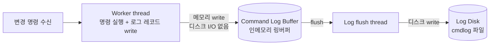
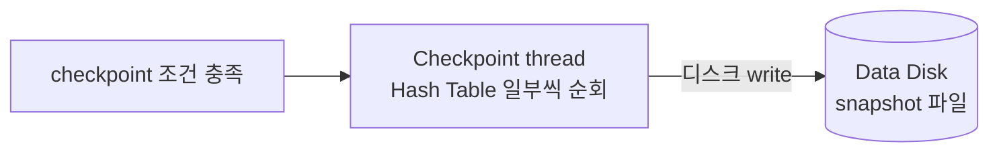
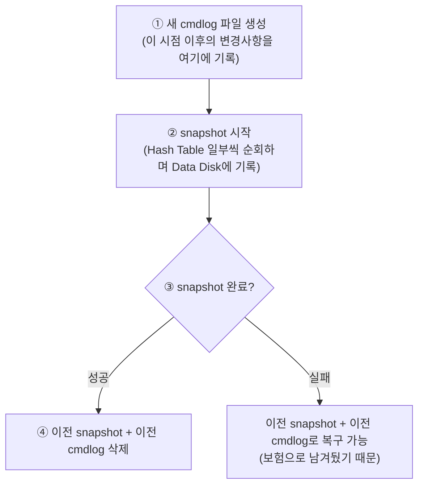
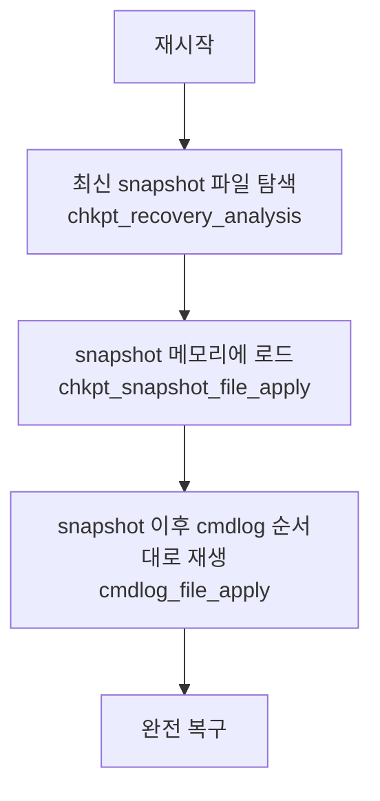

# Persistence

## 왜 필요한가

ARCUS는 인메모리 캐시 시스템이라 프로세스가 종료되면 모든 데이터가 사라진다.
Persistence는 이 문제를 해결하기 위해 데이터를 디스크에 기록해두고, 재시작 시 복구하는 기능이다.

---

## 핵심 아이디어: 두 가지 방식의 조합

ARCUS persistence는 두 가지 방식을 **동시에, 독립적으로** 운용한다.

| | 명령 로깅 | 스냅샷 |
|---|---|---|
| **무엇을 저장하나** | 변경 명령(command) 자체 | 전체 데이터의 덤프 |
| **언제 저장하나** | 변경 명령이 들어올 때마다 실시간 | 조건 충족 시 주기적으로 |
| **누가 저장하나** | 워커 스레드(버퍼 write) + 로그 플러시 스레드(디스크 write) | 체크포인트 스레드 |
| **어디에 저장하나** | Log Disk (cmdlog 파일) | Data Disk (snapshot 파일) |
| **특징** | 빠름. 워커 스레드는 메모리 쓰기만 하면 됨 | 느림. 전체 해시테이블을 순회해야 함 |

---

## 방식 1: 명령 로깅

변경 명령이 들어올 때마다 "어떤 명령이 실행됐는지"를 로그로 남기는 방식이다.

**흐름**



**포인트**

워커 스레드는 디스크에 직접 쓰지 않는다. 인메모리 링버퍼(Command Log Buffer)에만 쓰고 끝낸다. 디스크 I/O는 로그 플러시 스레드가 별도로 담당한다. 그래서 기존 성능을 거의 그대로 유지할 수 있다.

---

## 방식 2: 스냅샷

특정 시점의 전체 데이터를 통째로 파일로 덤프하는 방식이다.

**흐름**



**포인트**

워커 스레드와 완전히 무관하게 별도 스레드가 처리한다. 전체 해시테이블을 한 번에 쓰면 워커 스레드가 블로킹되니까, 조금씩 나눠서 진행한다. 주기는 cmdlog 크기가 일정 수준을 넘을 때 트리거된다.

---

## 왜 두 방식을 같이 쓰나

두 방식은 서로의 단점을 보완한다.

| | 문제점 | 보완하는 방식 |
|---|---|---|
| **명령 로깅만 있으면** | 로그가 무한정 쌓임. 복구 시 처음부터 전부 재생해야 해서 느림 | 스냅샷으로 복구 기준점을 만들어 그 이후 로그만 재생하면 됨 |
| **스냅샷만 있으면** | snapshot 직후부터 다음 snapshot 사이의 변경사항은 유실됨 | 명령 로깅으로 그 사이 변경사항을 빠짐없이 기록 |

---

## 스냅샷 방식 상세: 체크포인트 동작

체크포인트의 목적은 **데이터 복구 시간을 줄이는 것**이다. cmdlog가 무한정 쌓이면 복구 시 처음부터 전부 재생해야 해서 시간이 길어진다. 주기적으로 snapshot을 찍어 "기준점"을 갱신하면, 그 이후의 cmdlog만 재생하면 되므로 복구가 빠르다.

### 체크포인트 타임라인



### snapshot 진행 중 변경 요청이 들어오면?

체크포인트가 진행되는 동안에도 워커 스레드는 변경 요청을 병렬로 처리한다. 이때 cmdlog 기록 방식이 두 가지로 나뉜다.

| 변경 대상 아이템 상태 | 이전 cmdlog | 새 cmdlog |
|---|---|---|
| **이미 snapshot에 기록된 아이템** | 기록 O | 기록 O |
| **아직 snapshot 안 된 아이템** | 기록 O | 기록 X |

- **이전 cmdlog**에는 모든 변경사항을 다 기록한다. 체크포인트가 실패했을 때 이전 snapshot + 이전 cmdlog로 완전 복구할 수 있어야 하기 때문이다.
- **새 cmdlog**에는 "이미 snapshot에 찍힌 아이템"의 변경만 기록한다. 아직 snapshot 안 된 아이템은 곧 snapshot에 현재 상태가 담길 것이므로 굳이 새 cmdlog에 남길 필요가 없다.

### 체크포인트 완료 후 파일 상태

```
[체크포인트 완료 시점]

새 snapshot 파일  →  그 시점까지의 전체 데이터
새 cmdlog 파일   →  snapshot 이후의 변경사항만

∴ 이전 snapshot + 이전 cmdlog는 중복 → 삭제
```

---

## 복구 흐름

재시작 시 두 방식을 조합해서 복구한다.



snapshot이 "기준점", cmdlog가 "기준점 이후의 변경 이력"이다. 둘을 합치면 빈틈없이 복구된다.

---

## 주요 설정

```
use_persistence=true               # 활성화 (기본 false)
data_path=/path/to/data            # snapshot 저장 경로
logs_path=/path/to/logs            # cmdlog 저장 경로
async_logging=false                # 동기/비동기 로깅
chkpt_interval_min_logsize=256     # checkpoint 트리거: 최소 cmdlog 크기 (MB)
chkpt_interval_pct_snapshot=100    # checkpoint 트리거: 마지막 snapshot 대비 %
```

checkpoint 트리거 조건 (둘 다 만족해야 함):
```
cmdlog 크기 >= min_logsize
AND cmdlog 크기 >= snapshot 크기 × pct_snapshot%
```

예: 마지막 snapshot이 100MB이고 pct_snapshot=100이면, cmdlog가 ~200MB 될 때 checkpoint 발동.

---

## 관련 코드

| 파일 | 역할 |
|---|---|
| `engines/default/checkpoint.c` | Checkpoint thread, 트리거 조건 판단 |
| `engines/default/chkpt_snapshot.c` | Snapshot 파일 생성/적재 |
| `engines/default/cmdlogmgr.c` | Command log 관리 (group commit 등) |
| `engines/default/cmdlogfile.c` | Command log 파일 I/O |
| `engines/default/cmdlogrec.c` | 각 연산별 로그 레코드 생성 |
| `engines/default/item_clog.c` | 아이템 연산과 로그 연동 |
