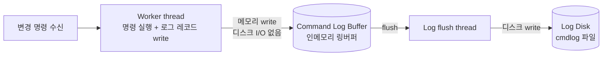
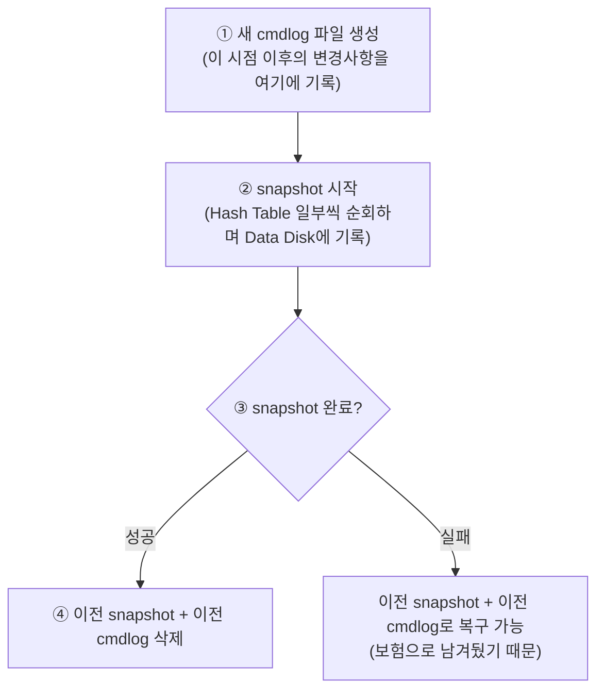
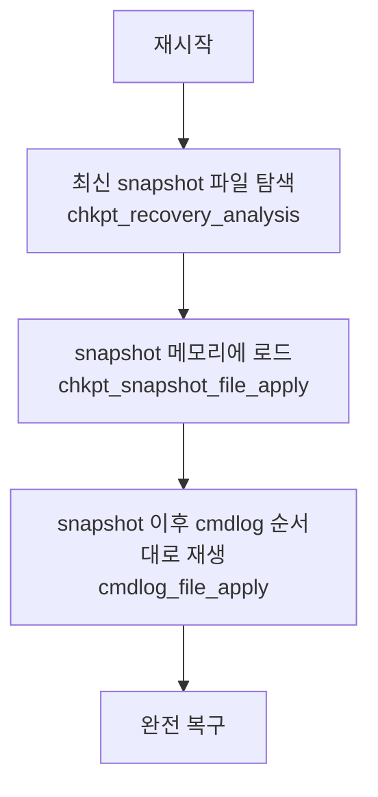

# Persistence

## 왜 필요한가

ARCUS는 인메모리 캐시 시스템이라 프로세스가 종료되면 메모리에 있던 모든 데이터가 사라진다. Persistence는 시스템을 종료했다가 다시 켜도 이전 상태를 그대로 복원할 수 있게 해주는 기능이다.

---

## 명령 로깅만으로 복구할 수 있지 않을까?

가장 단순한 아이디어는 이거다. 변경 명령이 들어올 때마다 그 명령을 로그로 남겨두고, 재시작할 때 기록된 명령을 처음부터 끝까지 전부 다시 실행하면 이전 상태와 똑같은 상태로 만들 수 있다.

이게 **명령 로깅(Command Logging)** 방식이다. 하지만 문제가 있다.

서비스를 오래 운영할수록 cmdlog가 무한정 쌓인다. 그 cmdlog를 재시작할 때마다 처음부터 전부 재생해야 하므로 데이터가 많아질수록 복구 시간이 선형으로 늘어난다.

---

## 그래서 snapshot을 같이 쓴다

이 문제를 해결하기 위해 **스냅샷(Snapshot)** 을 도입한다.

특정 시점의 데이터 상태를 그대로 파일로 찍어두는 것이다. 명령어의 나열이 아니라 그 시점에 메모리에 있던 데이터를 그대로 본뜬 것이다. 이 snapshot이 있으면 재시작할 때 cmdlog를 처음부터 재생할 필요가 없다. snapshot을 먼저 메모리에 로드해서 그 시점의 상태로 복원한 다음, 그 이후의 cmdlog만 재생하면 된다.

```
[cmdlog만 있을 때]
재시작 → cmdlog 처음부터 전부 재생 → 복구 완료
         (cmdlog가 클수록 느려짐)

[snapshot + cmdlog]
재시작 → snapshot 로드 → snapshot 이후의 cmdlog만 재생 → 복구 완료
         (항상 짧은 cmdlog만 재생하면 됨)
```

두 방식을 같이 쓰는 이유가 여기 있다. snapshot만 있으면 snapshot 사이의 변경사항이 유실되고, cmdlog만 있으면 무한정 쌓인다. 둘을 조합하면 서로의 단점을 보완한다.

| | 문제점 | 보완하는 방식 |
|---|---|---|
| **명령 로깅만 있으면** | cmdlog가 무한정 쌓임. 복구 시 처음부터 전부 재생해야 함 | snapshot으로 기준점을 만들어 그 이후 cmdlog만 재생 |
| **스냅샷만 있으면** | snapshot 사이의 변경사항 유실 | 명령 로깅으로 그 사이 변경사항을 빠짐없이 기록 |

---

## 두 방식의 흐름



워커 스레드는 디스크에 직접 쓰지 않는다. 인메모리 링버퍼(Command Log Buffer)에만 쓰고 끝낸다. 실제 디스크 I/O는 Log flush thread가 별도로 담당한다. 그래서 기존 성능을 거의 그대로 유지할 수 있다.


snapshot은 cmdlog를 복사하는 게 아니라 Hash Table을 직접 순회해서 찍는다. cmdlog는 명령어의 나열이지 현재 데이터의 상태가 아니기 때문이다. Hash Table은 이미 모든 명령이 적용된 현재 상태를 들고 있으므로, 그걸 그대로 덤프하면 그 시점의 완전한 데이터 상태를 얻을 수 있다. 전체 해시테이블을 한 번에 쓰면 워커 스레드가 블로킹되니까, 조금씩 나눠서 진행한다.

| | 명령 로깅 | 스냅샷 |
|---|---|---|
| **무엇을 저장하나** | 변경 명령(command) 자체 | 특정 시점의 데이터 상태 |
| **언제 저장하나** | 변경 명령이 들어올 때마다 실시간 | 조건 충족 시 주기적으로 |
| **누가 저장하나** | 워커 스레드(버퍼 write) + 로그 플러시 스레드(디스크 write) + group commit 스레드(fsync, sync 모드) | 체크포인트 스레드 |
| **어디에 저장하나** | Log Disk (cmdlog 파일) | Data Disk (snapshot 파일) |

---

## 명령 로깅 상세

### 동기/비동기를 이해하려면 먼저 개념 정리가 필요하다

명령 로깅에는 동기 모드와 비동기 모드가 있는데, 이걸 이해하려면 동기/비동기와 블로킹/논블로킹의 차이를 알아야 한다.

**동기(sync) vs 비동기(async)** — 작업의 완료 여부를 신경 쓰냐 마냐

- **동기**: 작업 완료를 확인하고 나서 다음 단계로 넘어감
- **비동기**: 작업을 요청만 해두고 완료 여부 상관없이 다음으로 넘어감

**블로킹(blocking) vs 논블로킹(non-blocking)** — 완료를 기다리는 동안 다른 일을 할 수 있냐 없냐

- **블로킹**: 완료될 때까지 그 자리에서 멈춤
- **논블로킹**: 완료를 기다리는 동안에도 다른 일 처리 가능

둘을 조합하면 4가지가 된다.

| | 블로킹 | 논블로킹 |
|---|---|---|
| **동기** | 요청하고 완료까지 멈춰서 기다림 | 요청하고 완료까지 다른 일 하면서 주기적으로 확인 |
| **비동기** | (잘 쓰지 않는 조합) | 요청만 해두고 완료되면 콜백/신호로 통보받음 |

동기와 블로킹이 항상 같은 말이 아니다. 동기/비동기는 **완료 보장 여부**, 블로킹/논블로킹은 **기다리는 방식**이라 서로 독립적인 개념이다.

---

### 비동기 로깅 모드

워커 스레드는 로그 버퍼에 기록하는 것까지만 하고, 디스크에 반영됐는지 확인하지 않은 채로 클라이언트에게 완료 응답을 보낸다.

```
워커 스레드: 로그 버퍼에 write → 즉시 클라이언트에 완료 응답
로그 플러시 스레드: 나중에 알아서 디스크에 flush
```

로그 버퍼에 쓰는 것만으로 완료 처리하니까 성능 부담이 거의 없다. 단, flush 전에 서버가 비정상 종료하면 그 사이의 변경사항은 유실된다.

### 동기 로깅 모드

워커 스레드는 로그 버퍼에 기록한 다음, 디스크에 fsync된 것을 확인하고 나서 클라이언트에게 완료 응답을 보낸다.

```
워커 스레드 (여러 개):
  로그 버퍼에 write → waiter를 group commit 큐에 추가 → ENGINE_EWOULDBLOCK 반환
  → 다른 클라이언트 요청 계속 처리 (논블로킹)

로그 플러시 스레드 (독립적으로):
  버퍼 → 디스크 write() → nxt_flush_lsn 갱신

group commit 스레드 (워커가 첫 번째 waiter를 넣으면 cond_signal로 깨어남):
  2ms 대기 (그 사이 다른 워커들의 waiter도 큐에 쌓임)
  → cmdlog_file_sync() → fsync() syscall (OS 페이지 캐시 → 실제 디스크 확정)
  → 큐에서 fsync 완료된 waiter 전부 꺼냄
  → 각 waiter의 cookie로 notify_io_complete() 콜백

워커 스레드 (libevent pipe 이벤트로 깨어남):
  → 클라이언트에 완료 응답 전송
```

디스크에 반영된 것을 확인할 때, 워커 스레드는 그 자리에서 멈춰서 기다리지 않는다. 워커 스레드는 `ENGINE_EWOULDBLOCK`을 반환받아 응답을 미루고, 그 사이 다른 클라이언트 요청을 처리한다. **동기지만 논블로킹**인 거다.

이때 **group commit** 패턴을 쓴다. 여러 워커 스레드가 각자 waiter를 큐에 쌓아두면, group commit 스레드가 2ms 기다리며 waiter를 모은 뒤 한 번의 fsync로 전부 처리하고 일괄로 콜백을 보낸다. 그래서 동기 모드인데도 성능이 상당히 나온다.

**스레드 구성 정리** (persistence on 기준)

| 스레드 | 개수 | 역할 |
|---|---|---|
| 워커 스레드 | N개 (`-t` 옵션, 기본 4) | 클라이언트 명령 처리, 버퍼 write |
| 로그 플러시 스레드 | 1개 | 버퍼 → 디스크 write(), nxt_flush_lsn 갱신 |
| group commit 스레드 | 1개 | fsync(), nxt_fsync_lsn 갱신, waiter 콜백 |
| 체크포인트 스레드 | 1개 | snapshot 생성 및 이전 파일 정리 |

group commit 스레드는 ASYNC 모드에서도 항상 생성되지만 waiter가 큐에 들어오지 않으므로 대부분 1초 timedwait으로 sleep 상태다.

어떤 시점에 서버가 비정상 종료하더라도, 클라이언트가 완료 응답을 받은 요청은 반드시 디스크에 기록된 상태임이 보장된다.

---

## 체크포인트 동작 상세

체크포인트는 snapshot을 찍고 이전 파일들을 정리하는 작업이다. 완료되고 나면 항상 `snapshot 1개 + cmdlog 1개` 쌍을 유지한다.

### 타임라인



snapshot을 시작하기 전에 새 cmdlog 파일을 먼저 만드는 이유가 있다. snapshot을 찍는 동안에도 변경 요청은 계속 들어오기 때문에, 그 변경사항을 어딘가에 기록해야 한다. 새 cmdlog 파일이 그 역할을 한다.

이전 snapshot + 이전 cmdlog는 체크포인트가 완전히 끝날 때까지 지우지 않는다. 진행 중에 실패하면 이전 것들로 복구해야 하기 때문이다.

### snapshot 진행 중 변경 요청이 들어오면?

체크포인트가 진행되는 동안에도 워커 스레드는 변경 요청을 병렬로 처리한다. 이때 cmdlog 기록 방식이 아이템 상태에 따라 달라진다.

| 변경 대상 아이템 상태 | 이전 cmdlog | 새 cmdlog |
|---|---|---|
| **이미 snapshot에 기록된 아이템** | 기록 O | 기록 O |
| **아직 snapshot 안 된 아이템** | 기록 O | 기록 X |

이전 cmdlog에는 모든 변경사항을 다 기록한다. 체크포인트가 실패했을 때 이전 snapshot + 이전 cmdlog로 완전 복구할 수 있어야 하기 때문이다.

새 cmdlog에는 "이미 snapshot에 찍힌 아이템"의 변경만 기록한다. 아직 snapshot 안 된 아이템은 곧 snapshot에 현재 상태가 담길 것이므로 새 cmdlog에 따로 남길 필요가 없다.

### 체크포인트 완료 후

```
새 snapshot  →  그 시점까지의 전체 데이터 상태
새 cmdlog    →  snapshot 이후의 변경사항

∴ 이전 snapshot + 이전 cmdlog는 새 snapshot에 이미 다 반영되어 있으므로 삭제
```

새 snapshot은 이전 snapshot의 데이터를 없애는 게 아니다. 이전 데이터 + 그 사이의 cmdlog 변경사항이 모두 반영된 상태가 새 snapshot에 담겨 있는 거라 중복이 되어 지우는 것이다.

---

## 복구 흐름



---

## 빌드와 설정

### 왜 컴파일 타임 옵션과 런타임 옵션이 따로 있나

persistence를 켜두면 변경 명령이 실행될 때마다 워커 스레드가 cmdlog 레코드를 생성해서 버퍼에 write하는 작업이 따라붙는다. 런타임에 `use_persistence=false`로 꺼두면 이 작업은 실행되지 않지만, 코드 상에는 매 변경 명령마다 이런 분기가 남아있다.

```c
if (use_persistence) {
    // cmdlog 생성
}
```

`--enable-persistence` 없이 빌드하면 이 코드 자체가 바이너리에서 완전히 제거된다. 분기 자체가 사라지는 거다. 현대 CPU의 분기 예측이 워낙 좋아서 실질적인 성능 차이는 미미할 것으로 보이나, ARCUS가 원래 고성능 캐시 시스템인 만큼 "persistence를 쓸 생각이 없는 사람한테까지 오버헤드를 강제하지 말자"는 목적으로 컴파일 타임 옵션이 생긴 것으로 보인다.

```
--enable-persistence 없이 빌드  →  persistence 코드 자체가 바이너리에 없음
                                    매 명령마다 if (use_persistence) 분기도 없음

--enable-persistence로 빌드     →  persistence 코드 포함
use_persistence=false           →  코드는 있지만 분기에서 항상 skip
use_persistence=true            →  실제로 동작
```

따라서 실습을 하려면 컴파일 타임과 런타임 옵션 둘 다 설정해야 한다.

```bash
./configure --prefix=/home/test/arcus --enable-persistence
make && make install
```

`make install`이 완료되면 `--prefix`로 지정한 경로에 다음 파일들이 생성된다.

```
bin/  memcached                 ← ARCUS 인스턴스 구동 바이너리
conf/ default_engine.conf       ← default 엔진 설정 파일
lib/  default_engine.so         ← default 엔진 라이브러리
      syslog_logger.so          ← logger 라이브러리
```

### 주요 설정

```
# Persistence configuration
use_persistence=true               # 활성화 (기본 false)
data_path=/home/test/arcus/ARCUS-DB     # snapshot 저장 경로
logs_path=/home/test/arcus/ARCUS-DB     # cmdlog 저장 경로
async_logging=false                # 동기/비동기 로깅 (false=동기, true=비동기)
chkpt_interval_pct_snapshot=100    # checkpoint 트리거: snapshot 대비 cmdlog 증가 비율 (%)
chkpt_interval_min_logsize=256     # checkpoint 트리거: 최소 cmdlog 크기 (MB)
```

### 설정 항목 설명

**`data_path` / `logs_path`**

snapshot 파일과 cmdlog 파일이 저장될 경로다. 같은 경로를 써도 되고 달라도 된다. 절대경로 사용을 권장한다.

**`async_logging`**

`false`면 동기 모드, `true`면 비동기 모드. 위의 명령 로깅 상세 섹션 참고.

**`chkpt_interval_pct_snapshot`**

여기서 한 가지 짚고 넘어갈 게 있다. 사용자가 설정하는 건 비율(%)뿐이고, 비교 기준이 되는 snapshot 크기는 디스크에 있는 snapshot 파일의 실제 현재 크기다. 즉 snapshot 크기는 사용자가 정하는 게 아니라 데이터가 쌓일수록 자동으로 커진다.

snapshot은 그 시점 메모리에 있는 전체 데이터를 그대로 찍은 것이니까, 데이터가 많아지면 snapshot도 그만큼 커질 수밖에 없다. 반대로 데이터가 expire되거나 삭제되면 다음 체크포인트 때 snapshot도 작아진다.

```
데이터 100개   → snapshot 10MB
데이터 1000개  → snapshot 100MB
데이터 10000개 → snapshot 1GB
```

그래서 `pct=100`의 의미를 풀어보면 이렇게 된다.

```
데이터 적음 → snapshot 10MB  → cmdlog 20MB  되면 체크포인트
데이터 많음 → snapshot 10GB  → cmdlog 20GB  되면 체크포인트
```

결국 "현재 데이터 규모의 2배만큼 변경이 일어났을 때 체크포인트"라는 뜻이다. 데이터가 크면 체크포인트 주기도 길어지고, 데이터가 작으면 주기도 짧아진다. 항상 "전체 데이터 대비 변경량"이 일정 비율 이상일 때 체크포인트가 걸리는 거다.

고정 크기로 하면 데이터 규모에 따라 너무 자주 돌거나 너무 늦게 도는 문제가 생기는데, 비율로 하면 그런 걱정 없이 데이터 규모에 자동으로 맞춰진다.

**`chkpt_interval_min_logsize`**

그런데 비율만 있으면 한 가지 문제가 생긴다. 서비스 초기처럼 데이터가 거의 없을 때는 snapshot이 아주 작아서 `pct_snapshot` 조건이 너무 쉽게 충족된다.

```
서비스 초기: snapshot = 1MB, pct=100
→ cmdlog가 2MB 되면 체크포인트 발동 → 너무 잦음
```

`min_logsize`는 이걸 막아주는 하한선이다. `pct_snapshot` 조건이 맞더라도 cmdlog가 최소 이 크기(기본 256MB)는 돼야 체크포인트가 걸린다. 데이터가 아주 적을 때 불필요하게 체크포인트가 반복되는 걸 방지하는 거다.

### 트리거 조건 (둘 다 만족해야 함)

```
cmdlog 크기 >= min_logsize (256MB)
AND
cmdlog 크기 >= snapshot 크기 × (1 + pct/100)
```

예: snapshot이 10GB이고 pct=100이면, cmdlog가 20GB 될 때 체크포인트 발동. 단 cmdlog가 256MB 미만이면 발동 안 함.

---

## 실행

### 사전 준비

snapshot과 cmdlog 파일이 저장될 디렉토리를 먼저 만들어야 한다. 아래 경로는 예시이며, 실제로는 `--prefix`로 지정한 설치 경로에 맞게 바꿔야 한다.

```bash
mkdir -p {설치경로}/ARCUS-DB
# 예: mkdir -p /home/user/arcus/ARCUS-DB
```

### 구동

```bash
{설치경로}/bin/memcached -d -v -r -p 11500 -m 500 \
  -E {설치경로}/lib/default_engine.so \
  -e config_file={설치경로}/conf/default_engine.conf
# 예: /home/user/arcus/bin/memcached -d -v -r -p 11500 -m 500 \
#       -E /home/user/arcus/lib/default_engine.so \
#       -e config_file=/home/user/arcus/conf/default_engine.conf
```

각 옵션의 의미:

| 옵션 | 의미 |
|---|---|
| `-d` | 데몬 모드로 실행 (백그라운드) |
| `-v` | verbose 모드 (로그 출력) |
| `-r` | 코어 덤프 파일 크기 제한 해제 (비정상 종료 시 디버깅용) |
| `-p 11500` | 11500 포트로 클라이언트 요청 수신 |
| `-m 500` | 캐시에 사용할 메모리 최대 500MB |
| `-E .../default_engine.so` | 사용할 엔진 라이브러리 경로 |
| `-e config_file=...` | 엔진에 전달할 설정 파일 경로 |

### 실행 확인

ARCUS는 `docker ps` 같은 전용 상태 확인 명령이 없다. standalone으로 띄운 경우엔 `ps`로 프로세스가 살아있는지 확인한다.

```bash
ps aux | grep memcached | grep -v grep
```

- `ps aux`: 모든 사용자의 프로세스를 상세 정보와 함께 출력 (`a`=모든 사용자, `u`=상세, `x`=터미널 없는 프로세스 포함)
- `| grep memcached`: memcached가 포함된 줄만 필터링
- `| grep -v grep`: grep 명령 자체도 프로세스로 잡히는데 그걸 제외 (`-v`는 해당 패턴 제외)

실행 중이라면 이렇게 나온다:

```
user  10215  ...  memcached -d -v -r -p 11500 ...
```

### 구동 후 파일 확인

구동하면 `data_path`/`logs_path`에 snapshot과 cmdlog 파일이 생성된다. 처음 구동 시 데이터가 없는 상태에서도 체크포인트를 한 번 수행해서 빈 snapshot + cmdlog 쌍을 만들어두기 때문이다.

```bash
ls -l {설치경로}/ARCUS-DB/
# -rw-r-----  1 user  staff   0  cmdlog_20260402140039
# -rw-r-----  1 user  staff  48  snapshot_20260402140039
```

### 상태 확인

telnet으로 붙어서 `stats` 명령으로 인스턴스 상태를 볼 수 있다.

```bash
telnet localhost 11500
stats             # 전체 통계
stats persistence # persistence 관련 상태만
```

> [!Tip]
> 그냥 `telnet`만 쓰면 명령어 히스토리가 기록이 안 돼서 불편하다. `rlwrap`을 쓰면 readline 지원이 추가돼서 ↑/↓ 방향키로 명령어 히스토리를 사용할 수 있다.
> 
> ```bash
> rlwrap telnet localhost 11500
> ```
> 
> macOS에서는 `brew install rlwrap`으로 설치한다.

### 데이터 삽입 및 확인

KV 아이템 하나와 BTree 아이템 하나를 만들어서 명령 로그에 기록되는 걸 확인해보자.

```
rlwrap telnet localhost 11500

# KV 아이템 저장
set mykey 0 0 3
abc
STORED

# BTree 아이템 생성
bop create scores 0 0 3
CREATED

# BTree에 엘리먼트 두 개 삽입 (bkey=10, 11)
bop insert scores 10 3
abc
STORED

bop insert scores 11 3
def
STORED
```

저장한 데이터를 다시 읽어보면:

```
get mykey
VALUE mykey 0 3
abc
END

bop get scores 10
VALUE 0 1
10 3 abc
END

bop get scores 11
VALUE 0 1
11 3 def
END
```

> [!Tip]
> telnet 세션을 종료하려면 `quit`을 입력한다.

```
quit
Connection closed by foreign host.
```

`async_logging=false`(동기 모드)로 설정했다면 명령이 수행되는 즉시 cmdlog에 기록된다. set/bop insert를 실행한 직후 cmdlog 파일 크기가 늘어난 걸 확인할 수 있다.

```bash
ls -l {설치경로}/ARCUS-DB/
# cmdlog 파일 크기가 0에서 늘어나 있음
```

### cmdlog 바이너리 파일 읽기

cmdlog는 바이너리 포맷으로 저장된다. 이 파일을 이해하려면 **이 바이트들이 어떤 구조체에 매핑되는가**를 알아야 한다.

> [!Tip]
> 터미널에선 `hexdump -C`나 `xxd`를 사용하고, vscode에선 `Hex Editor` extension을 설치하여 볼 수 있다.

**xxd로 보기**
```bash
xxd {설치경로}/ARCUS-DB/cmdlog_<타임스탬프>
```

```bash
xxd cmdlog_20260402150721
00000000: 0000 0000 2800 0000 008c 0500 0500 0000  ....(...........
00000010: 0000 0000 0000 0000 0100 0000 0000 0000  ................
00000020: 6d79 6b65 7961 6263 0d0a 0000 0000 0000  mykeyabc........
00000030: 0012 0000 2000 0000 0489 0600 0200 0000  .... ...........
00000040: 0000 0000 0000 0000 0402 ff55 0300 0000  ...........U....
00000050: 7363 6f72 6573 0d0a 0a13 0a6c 2000 0000  scores.....l ...
00000060: 0600 0000 0000 0000 0500 0000 7363 6f72  ............scor
00000070: 6573 0a00 0000 0000 0000 6162 630d 0a00  es........abc...
00000080: 0a13 0a6c 2000 0000 0600 0000 0000 0000  ...l ...........
00000090: 0500 0000 7363 6f72 6573 0b00 0000 0000  ....scores......
000000a0: 0000 6465 660d 0a00                      ..def...
```

왼쪽은 offset, 가운데는 hex값, 오른쪽은 ASCII 대응이다.

**모든 레코드는 LogHdr(8바이트)로 시작한다**

```c
// cmdlogrec.h
typedef struct _loghdr {
    uint8_t  logtype;      // 1바이트: 레코드 타입
    uint8_t  updtype;      // 1바이트: update 명령 타입
    uint8_t  reserved[2];  // 2바이트: 예약
    uint32_t body_length;  // 4바이트: 뒤따르는 body 크기
} LogHdr;
```

logtype 값은 enum으로 정의되어 있다:

```c
enum log_type {
    LOG_IT_LINK = 0,       // set (KV 저장)
    LOG_IT_UNLINK,         // delete
    LOG_IT_SETATTR,        // setattr
    LOG_IT_FLUSH,          // flush
    LOG_LIST_ELEM_INSERT,  // lop insert
    LOG_LIST_ELEM_DELETE,
    LOG_SET_ELEM_INSERT,
    LOG_SET_ELEM_DELETE,
    LOG_MAP_ELEM_INSERT,
    LOG_MAP_ELEM_DELETE,
    LOG_BT_ELEM_INSERT,    // bop insert (=10, 0x0A)
    LOG_BT_ELEM_DELETE,
    ...
};
```

**실제 해석 예시: `set mykey 0 0 3 / abc` 레코드**

```
offset 00: 00 00 00 00  28 00 00 00
           └─── LogHdr ────────────┘
           logtype=0x00             body_length=0x28=40
           → LOG_IT_LINK (set)
```

body에는 `lrec_item_common` 구조체가 먼저 온다:

```c
struct lrec_item_common {
    uint8_t  ittype;   // 아이템 타입 (KV=0)
    uint8_t  reserved;
    uint16_t keylen;   // 키 길이
    uint32_t vallen;   // 값 길이 (memcached는 \r\n 포함해서 저장)
    uint32_t flags;    // 클라이언트가 지정한 flags
    uint32_t exptime;  // 만료 시간
};
```

```
offset 08: 00 ??  05 00  05 00 00 00  00 00 00 00  00 00 00 00
           KV     keylen  vallen=5    flags=0      exptime=0
                  =5      (abc\r\n)
```

keylen=5 → "mykey" (5글자), vallen=5 → "abc\r\n" (\r\n 포함)

구조체 필드들이 끝나면 body 끝에 key + value 데이터가 연속으로 붙는다:

```
offset 20: 6D 79 6B 65 79  61 62 63 0D 0A
           m  y  k  e  y   a  b  c  \r \n
```

hex editor에서 `mykey abc`가 붙어 보이는 이유가 이거다. key와 value가 body 끝에 연속으로 저장되는 구조이기 때문.

그 뒤에 나오는 레코드들은 `logtype=0x0A=10` → `LOG_BT_ELEM_INSERT`로, `bop insert scores` 명령들이다. `scores`, `abc`, `def`가 `BtreeElemInsData` 구조로 기록된 것.

> [!Tip]
> **개발 중 레코드를 편하게 보는 방법**
> 
> `cmdlogrec.c`에 디버그 매크로가 있다:
> 
> ```c
> // engines/default/cmdlogrec.c:32
> #define DEBUG_PERSISTENCE_DISK_FORMAT_PRINT  // 주석 해제 후 재빌드
> ```
> 
> 이걸 켜면 워커 스레드가 커맨드 로그를 버퍼에 쓸 때(write)와 재시작 시 redo할 때, 각 레코드를 파싱해서 stderr로 출력해준다. persistence 기능을 개발하거나 디버깅할 때 레코드가 올바르게 기록/재생되는지 바로 확인할 수 있다.
> ```
> Check that {설치 경로}/ARCUS-DB/snapshot_20260402150721 is valid snapshot file for recovery.
> [RECOVERY - SNAPSHOT] applying snapshot file. path={설치 경로}/ARCUS-DB/snapshot_20260402150721
> [RECOVERY - SNAPSHOT] success.
> [RECOVERY - CMDLOG] applying command log file. path={설치 경로}/ARCUS-DB/cmdlog_20260402150721
> 
> [HEADER] body_length=40 | logtype=IT_LINK | updtype=STORE
> [BODY  ] keylen=5 | keystr=mykey | ittype=KV | flags=0 | exptime=0 | cas=1 | vallen=5 | valstr=abc
> 
> [HEADER] body_length=32 | logtype=IT_LINK | updtype=BT_CREATE
> [BODY  ] keylen=6 | keystr=scores | ittype=B+TREE | flags=0 | exptime=0 | ovflact=smallest_trim | mflags=2 | mcnt=3 | vallen=2 | valstr=
> 
> [HEADER] body_length=32 | logtype=BT_ELEM_INSERT | updtype=BT_ELEM_INSERT
> [BODY  ] keylen=6 | keystr=scores | bkey=(len=0, val=10) | eflag=NULL | create=NULL | vallen=5 | valstr=abc
> 
> [HEADER] body_length=32 | logtype=BT_ELEM_INSERT | updtype=BT_ELEM_INSERT
> [BODY  ] keylen=6 | keystr=scores | bkey=(len=0, val=11) | eflag=NULL | create=NULL | vallen=5 | valstr=def
> [RECOVERY - CMDLOG] success.
> ```
> 
> stderr 출력이 터미널에 보이려면 `-d`(데몬 모드) 없이 포그라운드로 실행해야 한다:
> 
> ```bash
> # -d 빼고 실행
> {설치경로}/bin/memcached -v -r -p 11500 -m 500 \
>   -E {설치경로}/lib/default_engine.so \
>   -e config_file={설치경로}/conf/default_engine.conf
> ```
> 
> 빠르게 키/값만 확인하고 싶을 땐:
> 
> ```bash
> strings {설치경로}/ARCUS-DB/cmdlog_<타임스탬프>
> ```

### memcached 종료

```bash
kill $(ps aux | grep memcached | grep -v grep | awk '{print $2}')
```

---

### memtier_benchmark를 이용한 대량 데이터 삽입 및 체크포인트 확인

> 이 실습은 [JAM2IN 블로그](https://medium.com/jam2in/arcus에서-데이터-영구-보존을-위한-persistence-기능의-개요와-사용법-61468e4cf546)를 참고했다.

memtier_benchmark는 Redis, Memcached를 위한 트래픽 생성 도구다. ARCUS가 memcached 기반이라 `--protocol=memcache_text` 옵션으로 바로 붙을 수 있다. 단, KV(`set`/`get`)만 가능하고 ARCUS 전용 collection 명령(`bop`, `lop` 등)은 지원하지 않는다.

**설치**

```bash
brew install memtier_benchmark
```

**대량 삽입**

1KB 데이터를 가진 아이템 30만 개를 삽입한다. 총 약 300MB 데이터가 쌓인다.

```bash
./memtier_benchmark -s 127.0.0.1 -p 11500 \
  --threads=10 --clients=10 --requests=3000 \
  --protocol=memcache_text \
  --data-size=1024 \
  --key-minimum=1 --key-maximum=300000 \
  --key-pattern=P:P \
  --ratio=1:0
```

| 옵션 | 의미 |
|---|---|
| `--key-minimum/maximum=1/300000` | key 범위 1~300000, 총 30만 개 삽입 |
| `--data-size=1024` | 값 크기 1KB |
| `--key-pattern=P:P` | connection별로 key 범위를 나눠 병렬 처리 |
| `--ratio=1:0` | Set:Get 비율. SET만 수행 |

**체크포인트 발동 확인**

기본 설정(`chkpt_interval_pct_snapshot=100`, `chkpt_interval_min_logsize=256`)에 따르면, cmdlog가 256MB 이상이 되면 체크포인트가 발동한다. 체크포인트가 시작되면 로그에 아래 메시지가 찍힌다:

```
Checkpoint started.
```

체크포인트가 진행되는 동안에는 ARCUS-DB 디렉토리에 파일이 두 쌍 존재한다. 새 snapshot을 찍는 중이라 아직 이전 쌍을 지우지 않은 상태이기 때문이다:

```
cmdlog_<이전타임스탬프>    270M   ← 이전 pair
snapshot_<이전타임스탬프>   48B
cmdlog_<새타임스탬프>        0    ← 새로 생성된 pair
snapshot_<새타임스탬프>     2.8M  ← 스냅샷 진행 중
```

체크포인트가 완료되면:

```
Done the snapshot action.
Checkpoint has been done.
```

이전 pair가 삭제되고 한 쌍만 남는다:

```
cmdlog_<새타임스탬프>       40B
snapshot_<새타임스탬프>    307M
```

**삽입된 아이템 수 확인**

```
stats
STAT curr_items 300002
```

- `curr_items=300002`: 현재 메모리에 살아있는 아이템 수. memtier_benchmark로 넣은 30만 개 + telnet으로 넣은 2개(`mykey`, `scores`). ZK 연동 옵션 없이 standalone으로 실행한 경우 정확히 이 값이 나온다.

---

## 관련 코드

| 파일 | 역할 |
|---|---|
| `engines/default/checkpoint.c` | Checkpoint thread, 트리거 조건 판단 |
| `engines/default/chkpt_snapshot.c` | Snapshot 파일 생성/적재 |
| `engines/default/cmdlogmgr.c` | Command log 관리 (group commit 등) |
| `engines/default/cmdlogfile.c` | Command log 파일 I/O |
| `engines/default/cmdlogrec.c` | 각 연산별 로그 레코드 생성 |
| `engines/default/item_clog.c` | 아이템 연산과 로그 연동 |
