# arcus-memcached LOP INSERT 흐름

```mermaid
flowchart TD
    A["클라이언트: 'lop insert mylist 0 5\r\nhello\r\n'"] --> B

    subgraph process_command_ascii
        B["응답 버퍼 초기화\n(msgcurr/msgused/iovused = 0)"]
        B --> C["add_msghdr(c)\n응답 봉투 준비"]
        C --> D["tokenize_command()\n'lop' / 'insert' / 'mylist' / '0' / '5' 토큰 분리"]
        D --> E{"cmd[1]=='o' && cmd[2]=='p'\n→ strcmp(cmd, 'lop') == 0"}
    end

    E -->|"process_lop_command(c, tokens, ntokens)"| F

    subgraph process_lop_command
        F["nkey = tokens[LOP_KEY_TOKEN].length\nkey = tokens[LOP_KEY_TOKEN].value\nc->coll_key = key\nc->coll_nkey = nkey"]
        F --> G{"subcommand == 'insert'?"}
        G -->|"insert"| H["index = tokens[3]\nvlen = tokens[4]\nvlen += 2"]
        H --> I{"create 옵션 있나?\nrest_ntokens >= 2"}
        I -->|"yes"| J["get_coll_create_attr_from_tokens()\nc->coll_attrp = &c->coll_attr_space"]
        I -->|"no"| K["c->coll_attrp = NULL"]
        J --> L["check_and_handle_pipe_state()"]
        K --> L
        L --> M["process_lop_prepare_nread()"]
        G -->|"get / delete / create"| N["각 subcommand 처리"]
    end

    subgraph prepare["process_lop_prepare_nread() — 1단계"]
        M --> O["mc_engine.v1->list_elem_alloc()\nelement 메모리 할당"]
        O --> P{"할당 성공?"}
        P -->|"실패"| Q["CLIENT/SERVER_ERROR 응답\nconn_swallow로 데이터 라인 버림"]
        P -->|"성공"| R["get_elem_info() → c->einfo\nelement 버퍼 주소 파악"]
        R --> S["c->coll_eitem = elem\nc->coll_op = OPERATION_LOP_INSERT\nc->coll_index = index"]
        S --> T["ritem_set_first(c, CONN_RTYPE_EINFO, vlen)\nc->ritem = element 버퍼 주소\nc->rlbytes = vlen"]
        T --> U["conn_set_state(c, conn_nread)\n리턴 — 바디 수신 대기"]
    end

    U --> V["소켓에서 vlen 바이트 수신\n'hello\\r\\n' → element의 value 버퍼로 직접 쓰기"]

    V --> W["complete_nread_ascii(c)\n→ complete_update_ascii(c)"]

    subgraph complete["complete_update_ascii() → process_lop_insert_complete()"]
        W --> X{"c->coll_eitem != NULL"}
        X -->|"yes"| Y["process_lop_insert_complete()"]
        Y --> Z["get_elem_info() → c->einfo 재확인"]
        Z --> AA{"einfo_check_tail_crlf()\nelement 끝 \\r\\n 검증"}
        AA -->|"실패"| AB["CLIENT_ERROR bad data chunk\nlist_elem_free()"]
        AA -->|"성공"| AC["mc_engine.v1->list_elem_insert()\n리스트에 element 삽입\n(c->coll_key, c->coll_index, c->coll_eitem, c->coll_attrp)"]
        AC --> AD{"insert 결과"}
        AD -->|"ENGINE_SUCCESS + created"| AE["out_string(c, 'CREATED_STORED')"]
        AD -->|"ENGINE_SUCCESS"| AF["out_string(c, 'STORED')"]
        AD -->|"ENGINE_KEY_ENOENT"| AG["out_string(c, 'NOT_FOUND')"]
        AD -->|"기타"| AH["CLIENT/SERVER_ERROR 응답\nlist_elem_free()"]
        AE --> AI["c->coll_eitem = NULL"]
        AF --> AI
    end

    AI --> AJ["conn_set_state(c, conn_new_cmd)\n다음 명령 대기"]
```



---

## process_command_ascii

`cmd[1]=='o' && cmd[2]=='p'`로 1차 필터링. `bop`, `mop`, `sop`, `lop`이 모두 `*op` 패턴이라 그 안에서 `strcmp`로 구분한다.

---

## process_lop_command

**key 저장**

```c
c->coll_key = key;
c->coll_nkey = nkey;
```

subcommand 분기 전에 key를 먼저 `conn`에 저장한다. insert든 get이든 delete든 모든 subcommand가 key를 공통으로 쓰기 때문.

토큰 구조:
```
tokens[0] = "lop"
tokens[1] = "insert"   ← SUBCOMMAND_TOKEN
tokens[2] = "mylist"   ← LOP_KEY_TOKEN (key)
tokens[3] = "0"        ← index
tokens[4] = "5"        ← vlen
```

**insert 파싱**

```c
index = tokens[LOP_KEY_TOKEN+1]  // "0"
vlen  = tokens[LOP_KEY_TOKEN+2]  // "5"
vlen += 2  // \r\n 포함
```

set과 동일하게 `vlen += 2`.

**create 옵션**

lop insert는 뒤에 `create` 옵션을 붙일 수 있다.

```
lop insert mylist 0 5                    ← 리스트 없으면 NOT_FOUND
lop insert mylist 0 5 create <maxcount> <overflowaction> <exptime>
                                         ← 리스트 없으면 자동 생성
```

`rest_ntokens >= 2`면 `create <attr>` 옵션이 있다는 뜻 → `c->coll_attrp`에 attr 저장.
없으면 `c->coll_attrp = NULL` → 리스트 없으면 엔진이 `NOT_FOUND` 반환.

---

## 1단계: process_lop_prepare_nread()

set의 `process_update_command`와 동일한 역할. 차이점 위주로:

| | set | lop insert |
|---|---|---|
| 메모리 할당 | `allocate()` — item 전체 | `list_elem_alloc()` — element 하나 |
| 메타 정보 | `get_item_info()` → `c->hinfo` | `get_elem_info()` → `c->einfo` |
| 저장 위치 | `c->item` | `c->coll_eitem` |
| ritem 타입 | `CONN_RTYPE_HINFO` | `CONN_RTYPE_EINFO` |
| 추가 저장 | `c->store_op` | `c->coll_op`, `c->coll_index` |

`c->coll_eitem`에 저장하는 게 핵심. `complete_update_ascii`에서 `c->coll_eitem != NULL`이면 컬렉션 분기로 가는 이유가 여기 있다.

---

## 바디 수신

set과 동일. element의 value 버퍼 주소(`c->ritem`)로 직접 recv. 별도 복사 없음.

---

## complete_update_ascii → process_lop_insert_complete()

`c->coll_eitem != NULL`이므로 컬렉션 분기 → `c->coll_op == OPERATION_LOP_INSERT`이므로 `process_lop_insert_complete()` 호출.

**핵심 호출**

```c
ret = mc_engine.v1->list_elem_insert(mc_engine.v0, c,
                                     c->coll_key, c->coll_nkey,
                                     c->coll_index, c->coll_eitem,
                                     c->coll_attrp, &created, 0);
```

1단계에서 `conn`에 저장해둔 값들을 전부 꺼내서 엔진에 넘긴다.

**응답**

```c
if (created) out_string(c, "CREATED_STORED");
else         out_string(c, "STORED");
```

set과 다른 점 — `created` 플래그가 있다. `create` 옵션으로 리스트가 새로 생성됐으면 `CREATED_STORED`, 기존 리스트에 삽입됐으면 `STORED`.

**실패 처리**

```c
if (ret != ENGINE_SUCCESS) {
    mc_engine.v1->list_elem_free(mc_engine.v0, c, c->coll_eitem);
}
c->coll_eitem = NULL;
```

set은 실패 시 엔진이 알아서 처리했지만, 여기서는 명시적으로 `list_elem_free()`를 호출해서 element 메모리를 해제해야 한다. 마지막에 `c->coll_eitem = NULL`로 정리.

---

## hinfo vs einfo

서버는 엔진 내부의 item/element 구조체에 직접 접근하지 못한다. 엔진마다 내부 구현이 다를 수 있기 때문. 대신 `get_item_info()` / `get_elem_info()`를 통해 표준화된 뷰를 받아서 쓴다.

**item_info (hinfo)** — KV item용

```c
typedef struct {
    uint64_t    cas;
    uint32_t    flags;
    rel_time_t  exptime;
    uint16_t    nkey;
    uint32_t    nbytes;   // value 전체 크기 (\r\n 포함)
    const void *key;      // key 문자열 포인터
    const void *value;    // value 버퍼 포인터  ← ritem이 여기를 가리킴
    ...
} item_info;
```

**eitem_info (einfo)** — 컬렉션 element용

```c
typedef struct {
    uint32_t    nbytes;   // 전체 크기
    uint16_t    nscore;   // b+tree score 크기
    uint16_t    neflag;   // b+tree eflag 크기
    const char *value;    // value 버퍼 포인터  ← ritem이 여기를 가리킴
    ...
} eitem_info;
```

list element는 단순히 value만 있어서 `score`, `eflag` 같은 필드는 쓰지 않는다. b+tree element에서 쓰는 것들.

> [!NOTE]
> `hinfo`와 `einfo` 모두 **엔진 추상화 인터페이스**다. `get_item_info()` / `get_elem_info()` 호출 후 `value` 포인터를 꺼내서 `c->ritem`에 저장하고, 소켓에서 읽은 바디를 그 주소로 직접 쓴다. 2단계에서 재확인하는 이유는 `c->hinfo` / `c->einfo`가 conn 안의 임시 저장소라 중간에 덮어써질 수 있기 때문.

---

## set과의 비교

```
[set]
process_update_command()
    allocate() → c->item
    conn_nread
→ complete_update_ascii()
    store() → STORED

[lop insert]
process_lop_prepare_nread()
    list_elem_alloc() → c->coll_eitem
    conn_nread
→ complete_update_ascii()
    c->coll_eitem != NULL
    → process_lop_insert_complete()
        list_elem_insert() → CREATED_STORED / STORED
```

2단계 비동기 구조는 동일. item 대신 eitem, store() 대신 list_elem_insert(), 응답에 CREATED_STORED가 추가된 것이 핵심 차이.