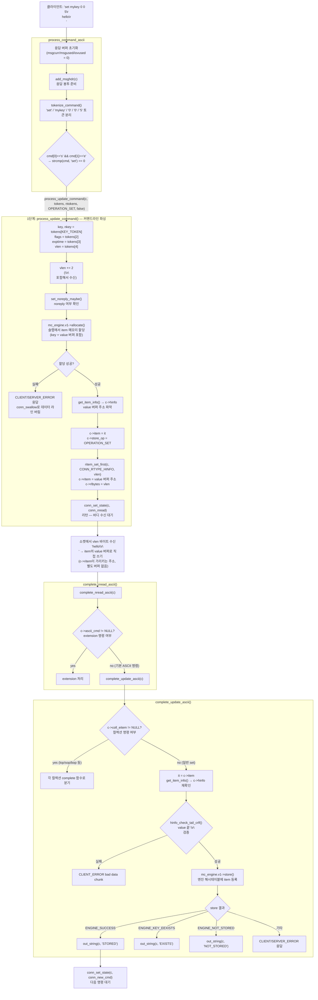

# arcus-memcached SET 흐름



---

## process_command_ascii

get과 동일하게 응답 버퍼를 초기화하고, `add_msghdr()`로 msghdr 슬롯을 확보한 뒤 `tokenize_command()`로 커맨드라인을 파싱한다.

분기 조건이 `cmd[0]=='s' && cmd[1]=='e'`인 이유는 `sop`(set 컬렉션)도 `cmd[0]=='s'`라 겹치기 때문. `sop`은 `cmd[1]=='o'`라서 두 번째 글자로 구분한다.

`process_update_command`에 `OPERATION_SET`을 넘긴다. `add`, `append`, `prepend`도 같은 함수를 쓰고 `store_op`만 달라진다.

---

## 1단계: process_update_command() — 커맨드라인 파싱

`set mykey 0 0 5` 커맨드라인만 처리하는 단계. `hello\r\n` 바디는 아직 소켓 버퍼에 있다.

**토큰 파싱**

```
tokens[1] = "mykey"  → key
tokens[2] = "0"      → flags
tokens[3] = "0"      → exptime
tokens[4] = "5"      → vlen
```

**vlen += 2**

클라이언트가 value 끝에 `\r\n`을 붙여서 보내기 때문에 2를 더한다. 실제 수신할 바이트는 `5 + 2 = 7`. 나중에 `hinfo_check_tail_crlf()`로 `\r\n` 존재를 검증한다.

**set_noreply_maybe()**

마지막 토큰이 `noreply`면 `c->noreply = true`로 세팅. `set mykey 0 0 5 noreply`처럼 쓰면 STORED 응답을 보내지 않는다.

**allocate()**

엔진한테 item 메모리 할당을 요청한다. key, value를 담을 수 있는 item 구조체를 슬랩 메모리에서 꺼내준다. `htonl(flags)`로 바이트 오더 변환, `realtime(exptime)`으로 상대 시간을 절대 시간(unix timestamp)으로 변환해서 넘긴다.

**get_item_info() → c->hinfo**

할당된 item의 내부 정보를 `c->hinfo`에 꺼낸다. 핵심은 **item 안에 있는 value 버퍼의 주소**를 얻는 것. 이 주소를 `c->ritem`에 저장해두면 소켓에서 읽은 데이터를 이 버퍼로 직접 쓸 수 있다.

**c->item, c->store_op 저장**

2단계에서 꺼내 쓸 수 있도록 conn에 item 포인터와 store 연산 종류를 보관한다.

**ritem_set_first()**

`c->ritem`을 item의 value 버퍼 주소로 세팅하고, `c->rlbytes = vlen`으로 얼마나 읽을지 설정한다.

**conn_set_state(c, conn_nread)**

상태를 `conn_nread`로 바꾸고 리턴. 1단계는 여기서 끝.

---

## 바디 수신

TCP는 패킷이 아닌 바이트 스트림이라 클라이언트가 한 번에 `send()`해도 서버의 `recv()`에 쪼개져서 도착할 수 있다. 그래서 "vlen 바이트가 다 찰 때까지" 기다리는 구조가 필요하다.

`conn_nread` 상태에서 `c->rlbytes`가 0이 될 때까지 소켓에서 읽어 `c->ritem`이 가리키는 곳, 즉 **item의 value 버퍼로 직접** 쓴다. 별도 임시 버퍼에 받았다가 복사하는 과정이 없다.

> [!NOTE]
> get도 동일하게 `process_command_ascii` 호출 전에 `conn_read` / `conn_parse_cmd` 상태에서 `\r\n`이 올 때까지 기다리는 과정이 있다. set이 2단계인 이유는 "커맨드라인 `\r\n` 대기" 이후 **바디 `vlen` 바이트 대기**가 한 번 더 필요하기 때문.

---

## complete_nread_ascii()

바디 수신이 완료되면 호출된다.

- `c->ascii_cmd != NULL` → extension 명령 처리
- `c->ascii_cmd == NULL` → `complete_update_ascii(c)` 호출 (기본 ASCII 명령)

---

## complete_update_ascii()

일반 KV와 컬렉션(lop/sop/bop/mop) **모두의 2단계 완료 지점**이다. 컬렉션 명령도 바디를 받아야 하면 똑같이 `conn_nread`로 전환하고, 완료 시 여기로 모인다.

- `c->coll_eitem != NULL` → 컬렉션 명령 분기 (lop/sop/bop/mop 각 complete 함수로)
- `c->coll_eitem == NULL` → 일반 set 처리

**get_item_info() 재확인**

1단계에서도 호출했지만 2단계에서 다시 호출한다. `c->hinfo`는 conn 구조체 안의 임시 저장소라 중간에 덮어써질 수 있기 때문. `hinfo_check_tail_crlf()`가 `hinfo` 안의 value 버퍼 포인터를 필요로 해서 안전하게 다시 채운다.

> [!NOTE]
> `c->hinfo`는 단순 캐시가 아니라 **엔진 추상화 인터페이스**다. memcached 서버는 item의 내부 구조를 직접 알지 못한다. 엔진마다 item 구조체가 다를 수 있기 때문에, `get_item_info()`를 통해 표준화된 뷰(`hinfo`)를 받아서 사용한다. 서버 코드가 엔진 내부에 직접 접근하지 않고 인터페이스를 통해서만 소통하는 것. `mc_engine.v0/v1` union이 엔진을 추상화하는 것과 같은 맥락이다.

**hinfo_check_tail_crlf()**

value 끝이 `\r\n`으로 끝나는지 검증한다. 1단계에서 `vlen += 2`로 `\r\n`까지 포함해 수신했기 때문에 여기서 검증 가능하다.

**store()**

검증 통과 후 엔진에 저장. `c->store_op`이 `OPERATION_SET`이므로 엔진이 해시테이블에 item을 등록한다. 성공하면 `c->cas`에 새 CAS 값이 채워지고 `"STORED"` 응답을 보낸다.