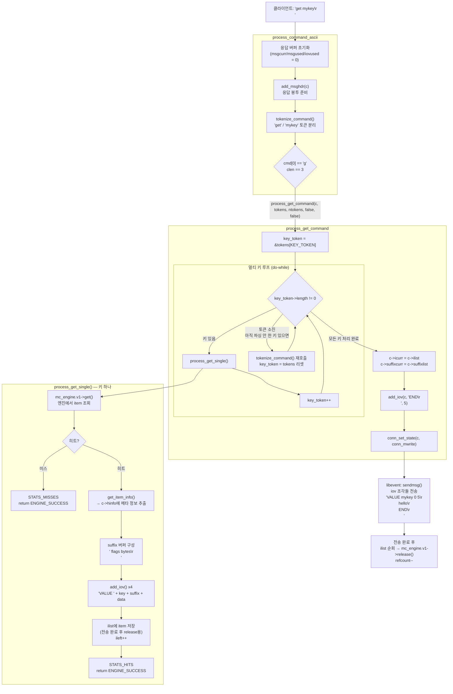

```mermaid
flowchart TD
    A["클라이언트: 'get mykey\r\n'"] --> B

    subgraph process_command_ascii
        B["응답 버퍼 초기화\n(msgcurr/msgused/iovused = 0)"]
        B --> C["add_msghdr(c)\n응답 봉투 준비"]
        C --> D["tokenize_command()\n'get' / 'mykey' 토큰 분리"]
        D --> E{"cmd[0] == 'g'\nclen == 3"}
    end

    E -->|"process_get_command(c, tokens, ntokens, false, false)"| F

    subgraph process_get_command
        F["key_token = &tokens[KEY_TOKEN]"]
        F --> G

        subgraph "멀티 키 루프 (do-while)"
            G{"key_token->length != 0"}
            G -->|"키 있음"| H["process_get_single()"]
            H --> I["key_token++"]
            I --> G
            G -->|"토큰 소진\n아직 파싱 안 한 키 있으면"| J["tokenize_command() 재호출\nkey_token = tokens 리셋"]
            J --> G
        end

        G -->|"모든 키 처리 완료"| K["c->icurr = c->ilist\nc->suffixcurr = c->suffixlist"]
        K --> L["add_iov(c, 'END\r\n', 5)"]
        L --> M["conn_set_state(c, conn_mwrite)"]
    end

    subgraph process_get_single["process_get_single() — 키 하나"]
        H --> N["mc_engine.v1->get()\n엔진에서 item 조회"]
        N --> O{"히트?"}
        O -->|"미스"| P["STATS_MISSES\nreturn ENGINE_SUCCESS"]
        O -->|"히트"| Q["get_item_info()\n→ c->hinfo에 메타 정보 추출"]
        Q --> R["suffix 버퍼 구성\n' flags bytes\r\n'"]
        R --> S["add_iov() x4\n'VALUE ' + key + suffix + data"]
        S --> T["ilist에 item 저장\n(전송 완료 후 release용)\nileft++"]
        T --> U["STATS_HITS\nreturn ENGINE_SUCCESS"]
    end

    M --> V["libevent: sendmsg()\niov 조각들 전송\n'VALUE mykey 0 5\r\nhello\r\nEND\r\n'"]
    V --> W["전송 완료 후\nilist 순회 → mc_engine.v1->release()\nrefcount--"]
```