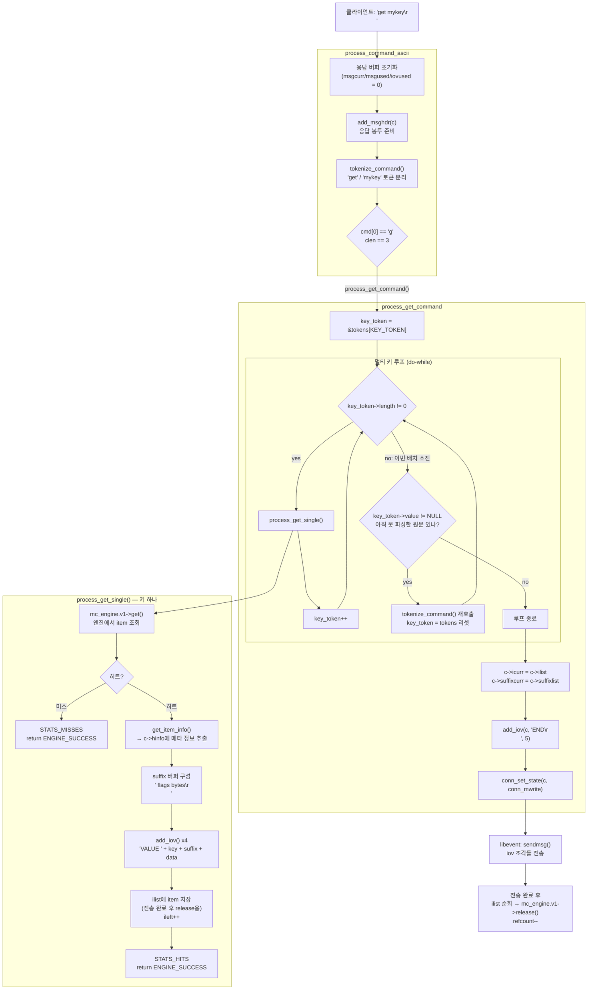

```mermaid
flowchart TD
    A["클라이언트: 'get mykey\r\n'"] --> B

    subgraph process_command_ascii
        B["응답 버퍼 초기화\n(msgcurr/msgused/iovused = 0)"]
        B --> C["add_msghdr(c)\n응답 봉투 준비"]
        C --> D["tokenize_command()\n'get' / 'mykey' 토큰 분리"]
        D --> E{"cmd[0] == 'g'\nclen == 3"}
    end

    E -->|"process_get_command()"| F

    subgraph process_get_command
        F["key_token = &tokens[KEY_TOKEN]"]
        F --> G

        subgraph "멀티 키 루프 (do-while)"
            G{"key_token->length != 0"}
            G -->|"yes"| H["process_get_single()"]
            H --> I["key_token++"]
            I --> G
            G -->|"no: 이번 배치 소진"| J{"key_token->value != NULL\n아직 못 파싱한 원문 있나?"}
            J -->|"yes"| K["tokenize_command() 재호출\nkey_token = tokens 리셋"]
            K --> G
            J -->|"no"| L["루프 종료"]
        end

        L --> M["c->icurr = c->ilist\nc->suffixcurr = c->suffixlist"]
        M --> N["add_iov(c, 'END\r\n', 5)"]
        N --> O["conn_set_state(c, conn_mwrite)"]
    end

    subgraph process_get_single["process_get_single() — 키 하나"]
        H --> P["mc_engine.v1->get()\n엔진에서 item 조회"]
        P --> Q{"히트?"}
        Q -->|"미스"| R["STATS_MISSES\nreturn ENGINE_SUCCESS"]
        Q -->|"히트"| S["get_item_info()\n→ c->hinfo에 메타 정보 추출"]
        S --> T["suffix 버퍼 구성\n' flags bytes\r\n'"]
        T --> U["add_iov() x4\n'VALUE ' + key + suffix + data"]
        U --> V["ilist에 item 저장\n(전송 완료 후 release용)\nileft++"]
        V --> W["STATS_HITS\nreturn ENGINE_SUCCESS"]
    end

    O --> X["libevent: sendmsg()\niov 조각들 전송"]
    X --> Y["전송 완료 후\nilist 순회 → mc_engine.v1->release()\nrefcount--"]
```